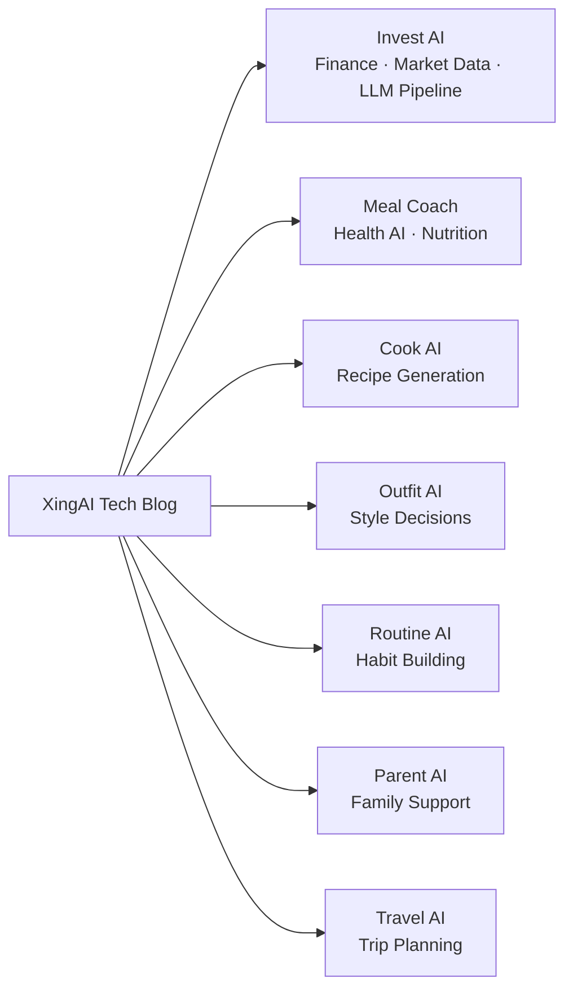

# XingAI Tech Blog

Technical deep dives, architecture decisions, and engineering notes from the [XingAI](https://xingai.app) team.

> We build focused AI decision systems for everyday life. This repo documents **how** we build them.

## Posts

| Date | Title | Project | Tags |
|------|-------|---------|------|
| 2026-05-12 | [Hosting an AI Side Project for $0: How We Picked Fly.io for V1](posts/2026-05-12-v1-hosting-fly-io.md) | Invest AI | `deployment` `fly-io` `vercel` `cost-optimization` |
| 2026-05-12 | [The Monitor That Wouldn't Stop Refreshing — A React Effect Loop Postmortem](posts/2026-05-12-monitor-render-loop.md) | Invest AI | `react` `hooks` `useeffect` `bugfix` `postmortem` |
| 2026-05-12 | [Three-Layer AI Architecture for Investment Decisions](posts/2026-05-12-three-layer-ai-architecture.md) | Invest AI | `architecture` `gemini` `openai` `hybrid-ai` |
| 2026-05-12 | [Why We Chose a Hybrid LLM Pipeline](posts/2026-05-12-hybrid-llm-pipeline.md) | Invest AI | `llm` `pipeline` `gemini` `openai` `cost` |
| 2026-05-12 | [MCP Phased Rollout: From Dashboard to Autonomous Trading](posts/2026-05-12-mcp-phased-rollout.md) | Invest AI | `mcp` `broker` `architecture` `roadmap` |

## XingAI Products

These posts cover engineering across all XingAI products:

## About

XingAI builds AI products that help people make better decisions — in health, finance, style, and daily life. Each product is a focused tool, not a chatbot.

We publish technical writing here to share what we learn: architecture trade-offs, model selection, cost optimization, and the engineering behind real AI products.

**Links:**
- [xingai.app](https://xingai.app)
- [GitHub](https://github.com/xingaiapp)
- [LinkedIn](https://www.linkedin.com/in/xingaiapp/)
- [X/Twitter](https://x.com/XingAIApp)

## License

Content is published under [CC BY 4.0](https://creativecommons.org/licenses/by/4.0/). You're free to share and adapt with attribution.
