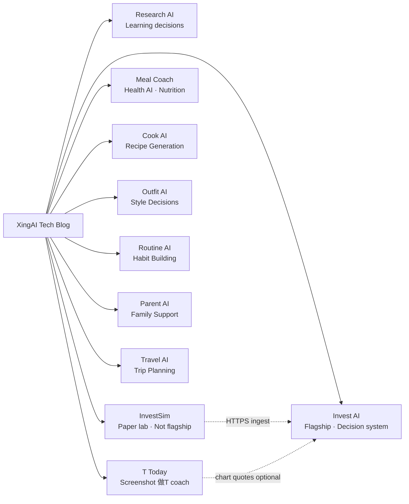

# XingAI Tech Blog

Technical deep dives, architecture decisions, and engineering notes from the [XingAI](https://xingai.app) team.

> We build focused AI decision systems for everyday life. This repo documents **how** we build them.

**Bilingual posts:** Each article is **English** (`.md`) + **中文** (`.zh.md`) — [convention](docs/BILINGUAL-POSTS.md).

**Public repo:** Review [docs/PUBLIC-SECURITY.md](docs/PUBLIC-SECURITY.md) before every push — no credentials, bypass paths, or production auth gaps in posts.

## Posts

| Date | Title | Project | Tags |
|------|-------|---------|------|
| 2026-07-18 | [After Fail-Closed: Robinhood MCP Gates, Freshness, Step-Up, and Why It Still Does Not Autotrade](posts/2026-07-18-robinhood-mcp-gates-after-fail-closed.md) · [中文](posts/2026-07-18-robinhood-mcp-gates-after-fail-closed.zh.md) | Robinhood MCP + Invest AI | `mcp` `robinhood` `execution-gates` `step-up-auth` `data-freshness` `decision-boundary` `adr` |
| 2026-07-17 | [Twelve Steps Are Not Twelve Tool Logos](posts/2026-07-17-llm-guardrails-twelve-steps-not-tool-stickers.md) · [中文](posts/2026-07-17-llm-guardrails-twelve-steps-not-tool-stickers.zh.md) | Enterprise AI POCs | `guardrails` `monitoring` `mcp` `rag` `governance` `education` `poc` |
| 2026-07-16 | [Grammar Fixes Are Not Senior Communication: A 14-Day Skill Curriculum + Decision Ledger](posts/2026-07-16-engineering-communication-curriculum-decision-ledger.md) · [中文](posts/2026-07-16-engineering-communication-curriculum-decision-ledger.zh.md) | Engineering Communication Coach | `curriculum` `decision-ledger` `workplace-english` `coaching` `adr` |
| 2026-07-14 | [From Mock Patterns to Cached Learning Data: Learn AI Gets Real Metadata](posts/2026-07-14-learn-ai-real-pattern-cache-decision-ledger.md) · [中文](posts/2026-07-14-learn-ai-real-pattern-cache-decision-ledger.zh.md) | Learn AI | `learn-ai` `cache-always` `decision-ledger` `metadata` `patterns` |
| 2026-07-14 | [The Trading UI Still Does Not Trade: Robinhood MCP Control Plane](posts/2026-07-14-robinhood-control-plane-http-api.md) · [中文](posts/2026-07-14-robinhood-control-plane-http-api.zh.md) | Robinhood MCP | `mcp` `robinhood` `control-plane` `human-in-the-loop` `agent-security` |
| 2026-07-14 | [From Honest 404 to Cached Scores: Decision Engine's First Producer](posts/2026-07-14-decision-engine-cached-ohlcv-score-export.md) · [中文](posts/2026-07-14-decision-engine-cached-ohlcv-score-export.zh.md) | Decision Engine | `decision-engine` `scoring` `cache` `cqrs` `adr` |
| 2026-07-14 | [Empty Tables, Full Issues: Fixing the Opportunity Radar Newsletter Body](posts/2026-07-14-opportunity-radar-newsletter-narrative-body.md) · [中文](posts/2026-07-14-opportunity-radar-newsletter-narrative-body.zh.md) | Opportunity Radar | `newsletter` `resend` `opportunity-radar` `github-actions` `adr` |
| 2026-07-13 | [Scope Isn't Policy: The Second Wall in claims-mcp-oauth-poc](posts/2026-07-13-mcp-auth-scope-is-not-policy-second-wall.md) · [中文](posts/2026-07-13-mcp-auth-scope-is-not-policy-second-wall.zh.md) | Enterprise AI POCs | `mcp` `oauth` `authorization` `policy-engine` `governance` `education` |
| 2026-07-13 | [MCP Auth Mechanics: Discovery, PKCE, and What Gets Checked on Every Call](posts/2026-07-13-mcp-auth-api-key-vs-oauth-pkce.md) · [中文](posts/2026-07-13-mcp-auth-api-key-vs-oauth-pkce.zh.md) | Enterprise AI POCs | `mcp` `oauth` `pkce` `authorization` `education` |
| 2026-07-13 | [Why MCP Needs OAuth, Not Just an API Key](posts/2026-07-13-mcp-oauth-vs-api-key.md) · [中文](posts/2026-07-13-mcp-oauth-vs-api-key.zh.md) | Enterprise AI POCs | `mcp` `oauth` `pkce` `authorization` `api-design` `education` |
| 2026-07-13 | [Full API Coverage First: A Claims Partner MCP POC](posts/2026-07-13-claims-partner-api-mcp-poc-full-coverage-first.md) · [中文](posts/2026-07-13-claims-partner-api-mcp-poc-full-coverage-first.zh.md) | Enterprise AI POCs | `mcp` `api-design` `insurance` `claims` `typescript` `openapi` |
| 2026-07-12 | [Same Crypto, Different Industry: A Claims MCP OAuth POC](posts/2026-07-12-claims-mcp-oauth-poc-same-auth-different-industry.md) · [中文](posts/2026-07-12-claims-mcp-oauth-poc-same-auth-different-industry.zh.md) | Enterprise AI POCs | `mcp` `oauth` `pkce` `insurance` `claims` `agent-security` `human-in-the-loop` |
| 2026-07-11 | [A Trading Gateway That Blocks Every Order (On Purpose)](posts/2026-07-11-robinhood-mcp-gateway-fail-closed.md) · [中文](posts/2026-07-11-robinhood-mcp-gateway-fail-closed.zh.md) | Robinhood MCP | `mcp` `robinhood` `agent-security` `human-in-the-loop` `governance` `adr` |
| 2026-07-11 | [Shipping the Approval Queue Dashboard (and a TypeScript 7 Wall Nobody Warned Us About)](posts/2026-07-11-agent-firewall-approval-dashboard-ships.md) · [中文](posts/2026-07-11-agent-firewall-approval-dashboard-ships.zh.md) | Agent Firewall | `agent-security` `nextjs` `typescript` `human-in-the-loop` `governance` |
| 2026-07-11 | [Turn-Scoped Taint: Making Untrusted Origin a Real Signal](posts/2026-07-11-agent-firewall-origin-provenance-adr-004.md) · [中文](posts/2026-07-11-agent-firewall-origin-provenance-adr-004.zh.md) | Agent Firewall | `agent-security` `provenance` `claude-code` `prompt-injection` `adr` `governance` |
| 2026-07-11 | [Deny + Add Rule Without Editing YAML Live](posts/2026-07-11-agent-firewall-deny-add-rule-adr-005.md) · [中文](posts/2026-07-11-agent-firewall-deny-add-rule-adr-005.zh.md) | Agent Firewall | `agent-security` `human-in-the-loop` `policy` `adr` `decision-ledger` `governance` |
| 2026-07-05 | [Your Coding Agent's Helpfulness Is the Attack Surface](posts/2026-07-05-agent-firewall-helpfulness-attack-surface.md) · [中文](posts/2026-07-05-agent-firewall-helpfulness-attack-surface.zh.md) | Agent Firewall | `agent-security` `prompt-injection` `claude-code` `human-in-the-loop` `decision-ledger` `governance` |
| 2026-07-05 | [Interview Prep Is a Decision Problem: Learn AI's One-Call Engine Architecture](posts/2026-07-05-learn-ai-one-call-engine-architecture.md) · [中文](posts/2026-07-05-learn-ai-one-call-engine-architecture.zh.md) | Learn AI | `learn-ai` `decision-system` `cache-first` `llm-cost` `engines` `patterns` |
| 2026-07-04 | [Executable Knowledge: Quality Increases Velocity](posts/2026-07-04-executable-knowledge-quality-velocity.md) · [中文](posts/2026-07-04-executable-knowledge-quality-velocity.zh.md) | Enterprise AI Design | `ai-native-engineering` `executable-knowledge` `claude-md` `skills` `mcp` `quality` `velocity` |
| 2026-07-03 | [Loop Engineering: Why Enterprise AI's Real Asset Is the Runtime](posts/2026-07-03-loop-engineering-enterprise-ai-runtime.md) · [中文](posts/2026-07-03-loop-engineering-enterprise-ai-runtime.zh.md) | Enterprise AI Design | `loop-engineering` `context-engineering` `harness-engineering` `agent-runtime` `enterprise` |
| 2026-07-03 | [Personal Memory Engine: Supabase RLS + FastAPI](posts/2026-07-03-personal-memory-supabase-rls-implementation.md) · [中文](posts/2026-07-03-personal-memory-supabase-rls-implementation.zh.md) | Invest AI | `memory` `supabase` `rls` `fastapi` |
| 2026-07-03 | [Meal AI: Decision Ledger in Next.js with No Backend](posts/2026-07-03-meal-ai-nextjs-decision-ledger-api-route.md) · [中文](posts/2026-07-03-meal-ai-nextjs-decision-ledger-api-route.zh.md) | Meal Coach AI | `decision-ledger` `nextjs` `meal-ai` |
| 2026-07-03 | [Newsletter Worker: Opportunity Radar to Resend](posts/2026-07-03-newsletter-worker-radar-to-resend.md) · [中文](posts/2026-07-03-newsletter-worker-radar-to-resend.zh.md) | Opportunity Radar | `newsletter` `resend` `worker` |
| 2026-07-03 | [Research-to-Startup Agent: Four-Artifact Pipeline](posts/2026-07-03-research-startup-agent-four-artifact-pipeline.md) · [中文](posts/2026-07-03-research-startup-agent-four-artifact-pipeline.zh.md) | Research AI | `agents` `pipeline` `startup` |
| 2026-07-01 | [XingAI Is Not a Chatbot — It's a Decision Engine](posts/2026-07-01-xingai-decision-engine-not-chatbot.md) · [中文](posts/2026-07-01-xingai-decision-engine-not-chatbot.zh.md) | XingAI Platform | `decision-system` `platform` `positioning` |
| 2026-07-01 | [Personal Memory Engine: One Profile, Every Product](posts/2026-07-01-personal-memory-engine-cross-product.md) · [中文](posts/2026-07-01-personal-memory-engine-cross-product.zh.md) | XingAI Platform | `memory` `cross-product` `supabase` |
| 2026-07-01 | [Meal AI: Worker + Cache for Health-Aware Planning](posts/2026-07-01-meal-ai-worker-cache-health-context.md) · [中文](posts/2026-07-01-meal-ai-worker-cache-health-context.zh.md) | Meal Coach AI | `worker` `cache` `meal-ai` `health` |
| 2026-06-28 | [Two Regimes, One Dashboard: Technical vs Macro (ADR-027)](posts/2026-06-28-dual-regime-technical-vs-macro-adr-027.md) · [中文](posts/2026-06-28-dual-regime-technical-vs-macro-adr-027.zh.md) | Invest AI | `macro-radar` `decision-engine` `regime` `adr` |
| 2026-06-28 | [Read-Only Broker, Writable Ledger: Decision Engine ADR-014/015](posts/2026-06-28-decision-engine-readonly-broker-decision-ledger.md) · [中文](posts/2026-06-28-decision-engine-readonly-broker-decision-ledger.zh.md) | Decision Engine | `robinhood` `decision-ledger` `human-in-the-loop` |
| 2026-06-28 | [Scanner Computes, Human Confirms: Polymarket AI](posts/2026-06-28-polymarket-scanner-human-confirm.md) · [中文](posts/2026-06-28-polymarket-scanner-human-confirm.zh.md) | Polymarket AI | `polymarket` `human-in-the-loop` `kelly` |
| 2026-06-25 | [Supervisor + RAG + Citations: Insurance Claims Multi-Agent POC](posts/2026-06-25-claims-multiagent-rag-supervisor-poc.md) · [中文](posts/2026-06-25-claims-multiagent-rag-supervisor-poc.zh.md) | Enterprise AI POCs | `multi-agent` `rag` `langgraph` `human-in-the-loop` `audit` |
| 2026-06-25 | [Read-First MCP: Robinhood Agentic Trading and ADR-028 Gates](posts/2026-06-25-robinhood-mcp-execution-gates-adr-028.md) · [中文](posts/2026-06-25-robinhood-mcp-execution-gates-adr-028.zh.md) | Invest AI | `mcp` `robinhood` `execution-gates` `human-in-the-loop` |
| 2026-06-25 | [Two Repos, One Score Contract: ADR-011 + ADR-026](posts/2026-06-25-two-repos-one-score-contract-adr-026.md) · [中文](posts/2026-06-25-two-repos-one-score-contract-adr-026.zh.md) | Invest AI + Decision Engine | `decision-engine` `integration` `cqrs` `adr` |
| 2026-06-24 | [XingAI Opportunity Radar — June 24: The Agent Stack Converges](posts/2026-06-24-xingai-opportunity-radar-agent-stack.md) · [中文](posts/2026-06-24-xingai-opportunity-radar-agent-stack.zh.md) | XingAI Platform | `opportunity-radar` `agents` `governance` `memory` `product-strategy` |
| 2026-06-14 | [Cursor Skills vs MCP: Procedure vs Capability](posts/2026-06-14-cursor-skills-vs-mcp-when-to-use-which.md) · [中文](posts/2026-06-14-cursor-skills-vs-mcp-when-to-use-which.zh.md) | XingAI Platform | `cursor` `skills` `mcp` `agents` `ai-engineering` |
| 2026-06-08 | [One Admin, Real Power: Why We’re Skipping SMS and Planning Email OTP](posts/2026-06-08-invest-ai-admin-second-factor-email-otp.md) · [中文](posts/2026-06-08-invest-ai-admin-second-factor-email-otp.zh.md) | Invest AI | `auth` `admin` `otp` `mfa` `security` `design` |
| 2026-06-08 | [Saved Preferences Are Not Decisions: Tracking Stocks Without Breaking the Worker Boundary](posts/2026-06-08-invest-ai-user-scoped-tracking-worker-stale-ux.md) · [中文](posts/2026-06-08-invest-ai-user-scoped-tracking-worker-stale-ux.zh.md) | Invest AI | `sqlite` `fastapi` `worker-cache` `decision-boundary` |
| 2026-06-07 | [Shipping SEO and AEO on Research AI (Single URL, Three Locales)](posts/2026-06-07-research-ai-seo-aeo-ship.md) · [中文](posts/2026-06-07-research-ai-seo-aeo-ship.zh.md) | Research AI | `seo` `aeo` `llms-txt` `json-ld` `nextjs` |
| 2026-06-07 | [Four Layers of “Not Professional Advice” for a Learning AI](posts/2026-06-07-research-ai-legal-disclaimer-layers.md) · [中文](posts/2026-06-07-research-ai-legal-disclaimer-layers.zh.md) | Research AI | `legal` `disclaimers` `product` `compliance` `i18n` |
| 2026-06-07 | [Staged SSE Without Spoilers: Research AI Wait UX](posts/2026-06-07-research-ai-sse-streaming-wait-ux.md) · [中文](posts/2026-06-07-research-ai-sse-streaming-wait-ux.zh.md) | Research AI | `sse` `streaming` `ux` `nextjs` `worker` |
| 2026-06-07 | [Three Live Runs a Day: Research AI Free Tier on Top of Cache](posts/2026-06-07-research-ai-free-tier-three-live-runs.md) · [中文](posts/2026-06-07-research-ai-free-tier-three-live-runs.zh.md) | Research AI | `rate-limiting` `sqlite` `cost-control` `product` `cache` |
| 2026-06-07 | [SQLite CQRS for Research AI: Same Keys, Same Fly Volume](posts/2026-06-07-research-ai-sqlite-cqrs-cache.md) · [中文](posts/2026-06-07-research-ai-sqlite-cqrs-cache.zh.md) | Research AI | `cqrs` `sqlite` `worker` `cache` `fly-io` |
| 2026-06-07 | [Decision Board, Not Chatbot: Why Research AI Ships One Verdict](posts/2026-06-07-research-ai-decision-board-not-chatbot.md) · [中文](posts/2026-06-07-research-ai-decision-board-not-chatbot.zh.md) | Research AI | `decision-system` `product` `learning` `ux` `architecture` |
| 2026-06-07 | [How Research AI Handles Fake Data: Source URLs Before Synthesis](posts/2026-06-07-research-ai-fake-data-boundary.md) · [中文](posts/2026-06-07-research-ai-fake-data-boundary.zh.md) | Research AI | `research-ai` `fake-data` `worker` `cache` `openai` `source-verification` |
| 2026-06-06 | [Google OAuth for Research AI: How the Sign-In Loop Actually Works](posts/2026-06-06-research-ai-google-oauth-setup.md) · [中文](posts/2026-06-06-research-ai-google-oauth-setup.zh.md) | Research AI | `oauth` `google-cloud` `next-auth` `vercel` `auth` `runbook` |
| 2026-06-06 | [The Learning Decision Boundary: Worker Owns Research AI Verdicts](posts/2026-06-06-research-ai-decision-cache-boundary.md) · [中文](posts/2026-06-06-research-ai-decision-cache-boundary.zh.md) | Research AI | `decision-cache` `worker` `fastapi` `learning` `cqrs` |
| 2026-06-06 | [One Pipeline, One ROI Number: How Research AI Scores a Topic](posts/2026-06-06-research-ai-learning-roi-pipeline.md) · [中文](posts/2026-06-06-research-ai-learning-roi-pipeline.zh.md) | Research AI | `openai` `worker` `roi` `decision-system` `json` |
| 2026-06-06 | [Shipping Research AI: Vercel for UI, Fly for Worker + SQLite](posts/2026-06-06-research-ai-fly-vercel-ship.md) · [中文](posts/2026-06-06-research-ai-fly-vercel-ship.zh.md) | Research AI | `fly-io` `vercel` `deployment` `sqlite` `worker` |
| 2026-06-06 | [The Decision Cache Boundary: Worker Computes, API Reads](posts/2026-06-06-invest-ai-decision-cache-boundary.md) · [中文](posts/2026-06-06-invest-ai-decision-cache-boundary.zh.md) | Invest AI | `decision-cache` `worker` `fastapi` `cqrs` `ai-safety` |
| 2026-06-06 | [Decision Observability: Making AI Signals Auditable](posts/2026-06-06-invest-ai-decision-observability.md) · [中文](posts/2026-06-06-invest-ai-decision-observability.zh.md) | Invest AI | `observability` `decision-events` `macro-radar` `invest-ai` |
| 2026-06-06 | [Email Is the Decision, PDF Is the Explanation](posts/2026-06-06-invest-ai-premium-daily-brief-pdf.md) · [中文](posts/2026-06-06-invest-ai-premium-daily-brief-pdf.zh.md) | Invest AI | `product-design` `email` `pdf` `invest-ai` `decision-ux` `reporting` |
| 2026-06-06 | [Structural Risks in AI Investing Products](posts/2026-06-06-invest-ai-structural-risk-mitigations.md) · [中文](posts/2026-06-06-invest-ai-structural-risk-mitigations.zh.md) | Invest AI | `risk` `ai-safety` `market-data` `llm` `invest-ai` |
| 2026-06-06 | [Agentic Does Not Mean Autonomous Trading](posts/2026-06-06-invest-ai-v4-agentic-platform-boundary.md) · [中文](posts/2026-06-06-invest-ai-v4-agentic-platform-boundary.zh.md) | Invest AI | `agentic-ai` `mcp` `product-boundary` `invest-ai` `safety` |
| 2026-06-06 | [Worker-Cache Email Digests: Notifications Without Moving Decisions Into the API](posts/2026-06-06-invest-ai-worker-cache-email-digest.md) · [中文](posts/2026-06-06-invest-ai-worker-cache-email-digest.zh.md) | Invest AI | `worker` `email` `resend` `cqrs` `decision-cache` `invest-ai` |
| 2026-06-03 | [MCP Architecture: Connection Patterns and Auth That Hold Up in Production](posts/2026-06-03-mcp-architecture-best-practices.md) · [中文](posts/2026-06-03-mcp-architecture-best-practices.zh.md) | XingAI Platform | `mcp` `architecture` `auth` `oauth` `zero-trust` `agents` |
| 2026-06-02 | [Prompt Rules That Stop the Model From Guessing Tickers on Blurry Screenshots](posts/2026-06-02-t-today-prompt-honesty-screenshot-vision.md) · [中文](posts/2026-06-02-t-today-prompt-honesty-screenshot-vision.zh.md) | T Today | `openai` `prompt-engineering` `vision` `json` `honesty` |
| 2026-06-01 | [Two Safety Nets Before Push: Husky pre-push and `npm run check`](posts/2026-06-01-t-today-husky-pre-push-and-check.md) · [中文](posts/2026-06-01-t-today-husky-pre-push-and-check.zh.md) | T Today | `husky` `git-hooks` `typescript` `developer-experience` |
| 2026-05-31 | [One Foundation Rule for Every XingAI Product: Mobile Chrome, i18n, Legal, SEO, and AEO](posts/2026-05-31-xingai-foundation-mobile-i18n-seo-aeo.md) · [中文](posts/2026-05-31-xingai-foundation-mobile-i18n-seo-aeo.zh.md) | XingAI Platform | `platform` `mobile-first` `i18n` `seo` `aeo` `legal` `cursor` |
| 2026-05-31 | [Travel AI as a Decision System: Compare First, Book Second](posts/2026-05-31-travel-compare-first-decision-system.md) · [中文](posts/2026-05-31-travel-compare-first-decision-system.zh.md) | Travel AI | `travel` `decision-system` `nextjs` `openai` `mobile-first` `affiliate` `hydration` |
| 2026-05-30 | [Rules First, AI Second: T Today’s Two-Layer Decision Engine](posts/2026-05-30-t-today-risk-decision-engine.md) · [中文](posts/2026-05-30-t-today-risk-decision-engine.zh.md) | T Today | `architecture` `decision-system` `paper-trading` `openai` `adr` |
| 2026-05-30 | [When Bilingual JSON Looks Fine in the Network Tab but Empty in the UI](posts/2026-05-30-t-today-bilingual-advisory-json.md) · [中文](posts/2026-05-30-t-today-bilingual-advisory-json.zh.md) | T Today | `openai` `json` `i18n` `bugfix` `vision` |
| 2026-05-30 | [Opening T Today to Guests — Three Free AI Runs, No Login Wall](posts/2026-05-30-t-today-guest-access-and-ai-quotas.md) · [中文](posts/2026-05-30-t-today-guest-access-and-ai-quotas.zh.md) | T Today | `auth` `rate-limiting` `nextjs` `product` |
| 2026-05-20 | [Prompt Engineer vs Context Engineer vs Harness Engineer](posts/2026-05-20-prompt-context-harness-engineering.md) · [中文](posts/2026-05-20-prompt-context-harness-engineering.zh.md) | XingAI Platform | `ai-engineering` `prompt-engineering` `context-engineering` `harness-engineering` |
| 2026-05-15 | [InvestSim Becomes a Live Paper Engine](posts/2026-05-15-investsim-live-paper-engine.md) · [中文](posts/2026-05-15-investsim-live-paper-engine.zh.md) | InvestSim | `paper-trading` `turso` `vercel-cron` `invest-ai` `simulation` `adr` |
| 2026-05-14 | [Splitting the Paper Lab: Why InvestSim Lives in Its Own Repo](posts/2026-05-14-invest-performance-sim-paper-lab-own-repo.md) · [中文](posts/2026-05-14-invest-performance-sim-paper-lab-own-repo.zh.md) | InvestSim | `nextjs` `prisma` `sqlite` `paper-trading` `invest-ai` `architecture` `vercel` |
| 2026-05-14 | [Vercel Git Auto-Deploy Is Not Limited to Public Repositories](posts/2026-05-14-vercel-private-repos-git-auto-deploy.md) · [中文](posts/2026-05-14-vercel-private-repos-git-auto-deploy.zh.md) | Platform | `vercel` `github` `deployment` `private-repository` `devops` |
| 2026-05-13 | [Shipping Invest AI V1: Runbook Thinking for Fly.io + Vercel](posts/2026-05-13-production-runbook-fly-vercel.md) · [中文](posts/2026-05-13-production-runbook-fly-vercel.zh.md) | Invest AI | `deployment` `fly-io` `vercel` `devops` `runbook` |
| 2026-05-13 | [Treating LLM Output Like Cache Rows (Planned): Worker-Owned Inference](posts/2026-05-13-llm-cached-resource-planned.md) · [中文](posts/2026-05-13-llm-cached-resource-planned.zh.md) | Invest AI | `architecture` `worker` `sqlite` `openai` `roadmap` |
| 2026-05-13 | [Four Runtimes, One Repo: Why We Skipped Nx (For Now)](posts/2026-05-13-four-apps-one-repo.md) · [中文](posts/2026-05-13-four-apps-one-repo.zh.md) | Invest AI | `monorepo` `nextjs` `fastapi` `developer-experience` |
| 2026-05-13 | [CQRS with SQLite: One Writer, Many Readers, No Drama](posts/2026-05-13-cqrs-sqlite-worker-writes.md) · [中文](posts/2026-05-13-cqrs-sqlite-worker-writes.zh.md) | Invest AI | `cqrs` `sqlite` `worker` `fastapi` `cache` |
| 2026-05-13 | [Why We Flipped V1 Routing to OpenAI-First (and What Comes Next)](posts/2026-05-13-openai-first-llm-routing.md) · [中文](posts/2026-05-13-openai-first-llm-routing.zh.md) | Invest AI | `llm` `openai` `gemini` `ollama` `routing` |
| 2026-05-13 | [Capping Free-Tier AI Calls Without Slowing Down Development](posts/2026-05-13-free-tier-ai-rate-limits.md) · [中文](posts/2026-05-13-free-tier-ai-rate-limits.zh.md) | Invest AI | `rate-limiting` `sqlite` `cost-control` `openai` |
| 2026-05-13 | [Five Layers of “Not Investment Advice” for an AI Finance Product](posts/2026-05-13-legal-disclaimers-five-layers.md) · [中文](posts/2026-05-13-legal-disclaimers-five-layers.zh.md) | Invest AI | `legal` `disclaimers` `product` `compliance` |
| 2026-05-12 | [Hosting an AI Side Project for $0: How We Picked Fly.io for Invest AI V1](posts/2026-05-12-v1-hosting-fly-io.md) · [中文](posts/2026-05-12-v1-hosting-fly-io.zh.md) | Invest AI | `deployment` `fly-io` `vercel` `cost-optimization` |
| 2026-05-12 | [The Monitor That Wouldn't Stop Refreshing — A React Effect Loop Postmortem](posts/2026-05-12-monitor-render-loop.md) · [中文](posts/2026-05-12-monitor-render-loop.zh.md) | Invest AI | `react` `hooks` `useeffect` `bugfix` `postmortem` |
| 2026-05-12 | [Three-Layer AI Architecture for Investment Decisions](posts/2026-05-12-three-layer-ai-architecture.md) · [中文](posts/2026-05-12-three-layer-ai-architecture.zh.md) | Invest AI | `architecture` `gemini` `openai` `hybrid-ai` |
| 2026-05-12 | [Why We Chose a Hybrid LLM Pipeline](posts/2026-05-12-hybrid-llm-pipeline.md) · [中文](posts/2026-05-12-hybrid-llm-pipeline.zh.md) | Invest AI | `llm` `pipeline` `gemini` `openai` `cost` |
| 2026-05-12 | [MCP Phased Rollout: From Dashboard to Autonomous Trading](posts/2026-05-12-mcp-phased-rollout.md) · [中文](posts/2026-05-12-mcp-phased-rollout.zh.md) | Invest AI | `mcp` `broker` `architecture` `roadmap` |

## Backlog (posts & ADRs not yet written)

Invest AI has broad **May 2026** coverage for ADRs **001–011**. The living **gap matrix** (missing ADR-012, blog placeholders for Meal Coach / dot-app / ops-status, backend ADR-0017, etc.) is maintained in the Invest AI repo: **[`xingai-invest-ai/docs/content-backlog.md`](https://github.com/xingaiapp/xingai-invest-ai/blob/main/docs/content-backlog.md)** (clone path: `../xingai-invest-ai/docs/content-backlog.md`).

**Still open for future posts:** Meal Coach AI, xingai-dot-app, xingai-ops-status, and other products in the diagram — plus “shipped” stories when **ADR-002 / 003 / 010** move from planned to implemented. **T Today (`invest-t-advisor`):** ADRs 0001–0004 + May 2026 posts (guest access, bilingual JSON, decision engine). **InvestSim:** split-repo (2026-05-14) + live paper engine (2026-05-15). Next posts: multi-strategy lab, Turso bootstrap ops story.

**Positioning guide:** [docs/POSITIONING.md](docs/POSITIONING.md) — flagship **Invest AI** vs **InvestSim** paper lab; avoid “AI stock analyzer / trading tool”.

## XingAI Products

These posts cover engineering across all XingAI products:

## About

XingAI builds AI products that help people make better decisions — in health, finance, style, and daily life. Each product is a focused tool, not a chatbot.

**Investment vertical:** XingAI is an **AI-powered investment decision system**. **Flagship product:** Invest AI. **InvestSim** is the **AI paper trading lab** (simulation only). See [docs/POSITIONING.md](docs/POSITIONING.md).

We publish technical writing here to share what we learn: architecture trade-offs, model selection, cost optimization, and the engineering behind real AI products.

**Links:**
- [xingai.app](https://xingai.app)
- [GitHub](https://github.com/xingaiapp)
- [LinkedIn](https://www.linkedin.com/in/xingaiapp/)
- [X/Twitter](https://x.com/XingAIApp)

## License

Content is published under [CC BY 4.0](https://creativecommons.org/licenses/by/4.0/). You're free to share and adapt with attribution.
