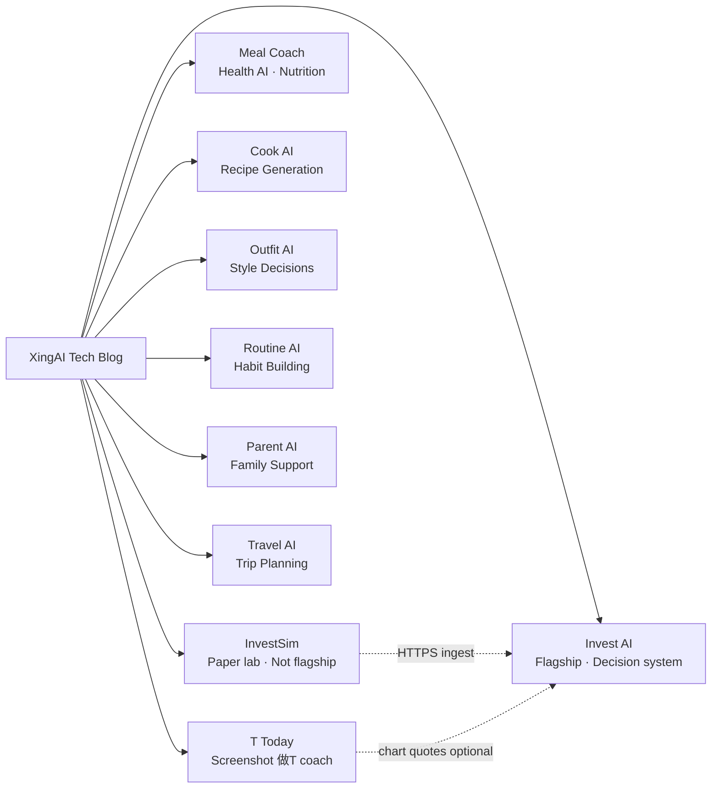

# XingAI Tech Blog

Technical deep dives, architecture decisions, and engineering notes from the [XingAI](https://xingai.app) team.

> We build focused AI decision systems for everyday life. This repo documents **how** we build them.

**Bilingual posts:** New articles ship **English + 中文 in one file** ([convention](docs/BILINGUAL-POSTS.md)). Use the **Languages** line at the top of each post to jump between sections.

## Posts

| Date | Title | Project | Tags |
|------|-------|---------|------|
| 2026-05-30 | [Rules First, AI Second: T Today’s Two-Layer Decision Engine](posts/2026-05-30-t-today-risk-decision-engine.md) · 中文 | T Today | `architecture` `decision-system` `paper-trading` `openai` `adr` |
| 2026-05-30 | [When Bilingual JSON Looks Fine in the Network Tab but Empty in the UI](posts/2026-05-30-t-today-bilingual-advisory-json.md) · 中文 | T Today | `openai` `json` `i18n` `bugfix` `vision` |
| 2026-05-30 | [Opening T Today to Guests — Three Free AI Runs, No Login Wall](posts/2026-05-30-t-today-guest-access-and-ai-quotas.md) · 中文 | T Today | `auth` `rate-limiting` `nextjs` `product` |
| 2026-05-15 | [InvestSim Becomes a Live Paper Engine](posts/2026-05-15-investsim-live-paper-engine.md) | InvestSim | `paper-trading` `turso` `vercel-cron` `invest-ai` `simulation` `adr` |
| 2026-05-14 | [Splitting the Paper Lab: Why InvestSim Lives in Its Own Repo](posts/2026-05-14-invest-performance-sim-paper-lab-own-repo.md) | InvestSim | `nextjs` `prisma` `sqlite` `paper-trading` `invest-ai` `architecture` `vercel` |
| 2026-05-14 | [Vercel Git Auto-Deploy Is Not Limited to Public Repositories](posts/2026-05-14-vercel-private-repos-git-auto-deploy.md) | Platform | `vercel` `github` `deployment` `private-repository` `devops` |
| 2026-05-13 | [Shipping Invest AI V1: Runbook Thinking for Fly.io + Vercel](posts/2026-05-13-production-runbook-fly-vercel.md) | Invest AI | `deployment` `fly-io` `vercel` `devops` `runbook` |
| 2026-05-13 | [Treating LLM Output Like Cache Rows (Planned): Worker-Owned Inference](posts/2026-05-13-llm-cached-resource-planned.md) | Invest AI | `architecture` `worker` `sqlite` `openai` `roadmap` |
| 2026-05-13 | [Four Runtimes, One Repo: Why We Skipped Nx (For Now)](posts/2026-05-13-four-apps-one-repo.md) | Invest AI | `monorepo` `nextjs` `fastapi` `developer-experience` |
| 2026-05-13 | [CQRS with SQLite: One Writer, Many Readers, No Drama](posts/2026-05-13-cqrs-sqlite-worker-writes.md) | Invest AI | `cqrs` `sqlite` `worker` `fastapi` `cache` |
| 2026-05-13 | [Why We Flipped V1 Routing to OpenAI-First (and What Comes Next)](posts/2026-05-13-openai-first-llm-routing.md) | Invest AI | `llm` `openai` `gemini` `ollama` `routing` |
| 2026-05-13 | [Capping Free-Tier AI Calls Without Slowing Down Development](posts/2026-05-13-free-tier-ai-rate-limits.md) | Invest AI | `rate-limiting` `sqlite` `cost-control` `openai` |
| 2026-05-13 | [Five Layers of “Not Investment Advice” for an AI Finance Product](posts/2026-05-13-legal-disclaimers-five-layers.md) | Invest AI | `legal` `disclaimers` `product` `compliance` |
| 2026-05-12 | [Hosting an AI Side Project for $0: How We Picked Fly.io for V1](posts/2026-05-12-v1-hosting-fly-io.md) | Invest AI | `deployment` `fly-io` `vercel` `cost-optimization` |
| 2026-05-12 | [The Monitor That Wouldn't Stop Refreshing — A React Effect Loop Postmortem](posts/2026-05-12-monitor-render-loop.md) | Invest AI | `react` `hooks` `useeffect` `bugfix` `postmortem` |
| 2026-05-12 | [Three-Layer AI Architecture for Investment Decisions](posts/2026-05-12-three-layer-ai-architecture.md) | Invest AI | `architecture` `gemini` `openai` `hybrid-ai` |
| 2026-05-12 | [Why We Chose a Hybrid LLM Pipeline](posts/2026-05-12-hybrid-llm-pipeline.md) | Invest AI | `llm` `pipeline` `gemini` `openai` `cost` |
| 2026-05-12 | [MCP Phased Rollout: From Dashboard to Autonomous Trading](posts/2026-05-12-mcp-phased-rollout.md) | Invest AI | `mcp` `broker` `architecture` `roadmap` |

## Backlog (posts & ADRs not yet written)

Invest AI has broad **May 2026** coverage for ADRs **001–011**. The living **gap matrix** (missing ADR-012, blog placeholders for Meal Coach / dot-app / ops-status, backend ADR-0017, etc.) is maintained in the Invest AI repo: **[`xingai-invest-ai/docs/content-backlog.md`](https://github.com/xingaiapp/xingai-invest-ai/blob/main/docs/content-backlog.md)** (clone path: `../xingai-invest-ai/docs/content-backlog.md`).

**Still open for future posts:** Meal Coach AI, xingai-dot-app, xingai-ops-status, and other products in the diagram — plus “shipped” stories when **ADR-002 / 003 / 010** move from planned to implemented. **T Today (`invest-t-advisor`):** ADRs 0001–0004 + May 2026 posts (guest access, bilingual JSON, decision engine). **InvestSim:** split-repo (2026-05-14) + live paper engine (2026-05-15). Next posts: multi-strategy lab, Turso bootstrap ops story.

**Positioning guide:** [docs/POSITIONING.md](docs/POSITIONING.md) — flagship **Invest AI** vs **InvestSim** paper lab; avoid “AI stock analyzer / trading tool”.

## XingAI Products

These posts cover engineering across all XingAI products:

## About

XingAI builds AI products that help people make better decisions — in health, finance, style, and daily life. Each product is a focused tool, not a chatbot.

**Investment vertical:** XingAI is an **AI-powered investment decision system**. **Flagship product:** Invest AI. **InvestSim** is the **AI paper trading lab** (simulation only). See [docs/POSITIONING.md](docs/POSITIONING.md).

We publish technical writing here to share what we learn: architecture trade-offs, model selection, cost optimization, and the engineering behind real AI products.

**Links:**
- [xingai.app](https://xingai.app)
- [GitHub](https://github.com/xingaiapp)
- [LinkedIn](https://www.linkedin.com/in/xingaiapp/)
- [X/Twitter](https://x.com/XingAIApp)

## License

Content is published under [CC BY 4.0](https://creativecommons.org/licenses/by/4.0/). You're free to share and adapt with attribution.
