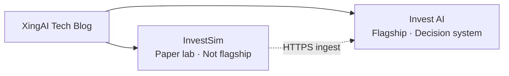

# XingAI — Public positioning (for blog & external comms)

**Status:** Active — 2026-05-15  
**License context:** CC BY 4.0 applies to blog posts; this page is maintainer guidance.

---

## Brand (company)

```text
XingAI builds focused AI decision systems for everyday life.
```

**Investment vertical one-liner:**

```text
XingAI is an AI-powered investment decision system.
```

---

## Product hierarchy

| Layer | Name | Blog tag |
|-------|------|----------|
| Flagship | **XingAI Invest AI** | `Invest AI` |
| Paper lab | **InvestSim** | `InvestSim` |
| Platform | Vercel, Fly, Turso, etc. | `Platform` |



---

## How to describe Invest AI in posts

- ✅ AI-powered **investment decision system**  
- ✅ Decision context, signals, transparent architecture  
- ✅ Educational / not investment advice (link [Five Layers post](../posts/2026-05-13-legal-disclaimers-five-layers.md))  
- ❌ AI stock analyzer, trading bot, guaranteed alpha  

---

## How to describe InvestSim in posts

- ✅ **AI paper trading lab**, simulated ledger, reproducible rules  
- ✅ Separate repo by design ([split post](../posts/2026-05-14-invest-performance-sim-paper-lab-own-repo.md))  
- ✅ Live engine story ([engine post](../posts/2026-05-15-investsim-live-paper-engine.md))  
- ❌ Second flagship, live brokerage  

---

## Short social copy (English)

```text
Our flagship product isn’t a dashboard.

It’s an AI decision system.
```

---

## Maintainer note

Investor-only variants (`investment decision infrastructure`, deck slides) stay in private `business-plan/POSITIONING.md`, not duplicated here.

When a post ships a major capability, update [README](../README.md) posts table and Invest AI [content-backlog](https://github.com/xingaiapp/xingai-invest-ai/blob/main/docs/content-backlog.md) if applicable.
