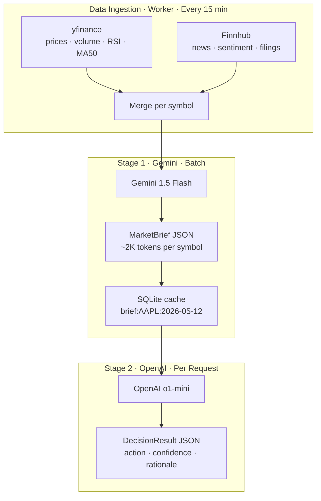
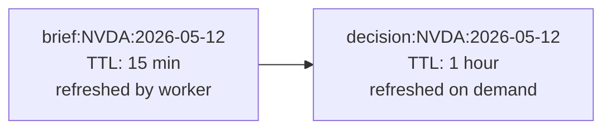

# Why We Chose a Hybrid LLM Pipeline: Gemini Screens, OpenAI Decides

**Date:** May 12, 2026
**Author:** Xing @ [XingAI](https://xingai.app)
**Project:** [XingAI Invest AI](https://xingai.app/apps/invest-ai)
**Tags:** `llm` `pipeline` `gemini` `openai` `cost-optimization` `invest-ai`  
**Also available:** [中文](2026-05-12-hybrid-llm-pipeline.zh.md)
---

## From Fallback Chain to Pipeline

Our V1 system uses a fallback chain: try Ollama (local, free), then Gemini, then OpenAI. Whichever model responds first wins. It's resilient, but every model does the exact same job with the exact same input.

That's like hiring three chefs and having them each cook the same dish. You get reliability, but you waste two chefs' unique skills.

V2 changes this. Instead of redundant fallbacks, we build a **pipeline** where each model handles the stage it's best at.

## The Pipeline



### Stage 1: Gemini Compresses

Gemini receives **everything** for a symbol: 60 days of price history, recent news articles, sentiment scores, upcoming earnings dates. Total input: 5,000–20,000 tokens per symbol.

Its output is a structured `MarketBrief` — about 1,500 tokens:

```json
{
  "symbol": "NVDA",
  "price_summary": { "price": 950.20, "trend": "bullish", "rsi_14": 67.2 },
  "news_digest": [
    { "headline": "NVIDIA data center revenue beats estimates by 12%", "sentiment": 0.91 }
  ],
  "risk_flags": ["valuation_stretched", "sector_rotation_risk"],
  "key_signal": "Strong AI spending cycle but RSI approaching overbought"
}
```

This runs in the **background worker**, not per-request. Gemini processes 250 symbols in batch, writes briefs to SQLite, and the API serves them instantly.

### Stage 2: OpenAI Reasons

OpenAI receives only the compressed brief (1,500 tokens) and produces a decision:

```json
{
  "symbol": "NVDA",
  "action": "HOLD",
  "confidence": 0.68,
  "rationale": "Revenue beat supports the thesis, but RSI at 67 and stretched valuation suggest waiting for a pullback before adding. Hold current position.",
  "risk_level": "medium-high",
  "key_factors": [
    "Data center revenue beat +12%",
    "RSI approaching overbought territory",
    "Sector rotation out of megacap tech in progress"
  ]
}
```

This can run per-request (fast, cheap with small input) or pre-computed in the worker for top symbols.

## Why This Split Works

### Cost comparison

| Approach | Input per symbol | Cost per symbol | 250 symbols/day |
|----------|-----------------|----------------|-----------------|
| OpenAI for everything | ~15,000 tokens | ~$0.045 | **$11.25** |
| Gemini screening + OpenAI decision | 15K → Gemini + 1.5K → OpenAI | ~$0.007 | **$1.75** |
| **Savings** | | | **~84%** |

### Latency comparison

| Approach | Time per symbol |
|----------|----------------|
| OpenAI processes raw data | 5–10 seconds |
| OpenAI processes compressed brief | 1–2 seconds |
| Pre-computed (cache hit) | <50ms |

### Quality comparison

Gemini with 15,000 tokens of context produces **better summaries** than OpenAI with the same input — it's designed for long-context comprehension. OpenAI with a clean 1,500-token brief produces **better decisions** than Gemini — it's designed for structured reasoning.

Each model plays to its strength.

## The Data Gap We Had to Fix First

Here's the thing nobody tells you about building AI pipelines: **the pipeline is only as good as the data feeding it**.

Our V1 only had yfinance price data. Sending that to Gemini for "summarization" is pointless — there's nothing to summarize. Gemini needs text: news articles, earnings transcripts, analyst notes.

So before we could build the pipeline, we had to add a real data source. We chose [Finnhub](https://finnhub.io/):

- Free tier: 60 API calls/minute
- Provides: company news, market news, sentiment scores, SEC filings
- Quality: good enough for structured screening

With Finnhub + yfinance, Gemini finally has material worth compressing.

## Caching: The Silent Performance Win

The pipeline has two cache layers:



- **Stage 1 briefs** refresh every 15 minutes (worker cycle). Multiple users requesting NVDA decisions all hit the same cached brief.
- **Stage 2 decisions** cache for 1 hour. Users see instant results. Manual refresh triggers a new OpenAI call against the latest brief.

This means most API responses are **zero LLM calls** — just a SQLite read.

## Failure Modes

| What fails | What happens |
|-----------|-------------|
| Gemini down | OpenAI receives raw data directly. Costs more, still works. |
| OpenAI down | Gemini produces a standalone analysis. Lower confidence, no deep reasoning. |
| Finnhub down | Briefs generated from yfinance data only. No news digest. Decisions still work, less context. |
| Both LLMs down | Cached decisions served with `is_stale: true`. Refresh button disabled. |

No single failure kills the system.

## What's Next

The pipeline is the foundation for everything that follows:

- **Phase 1:** Ship the Gemini → OpenAI pipeline with Finnhub data
- **Phase 2:** Add earnings calendar and portfolio context as inputs to Stage 2
- **Phase 3:** Broker execution — but only after months of tracked decision accuracy

Full details in [ADR-002: Hybrid LLM Pipeline](https://github.com/xingaiapp/xingai-invest-ai/blob/main/docs/adr/002-hybrid-llm-pipeline.md).
