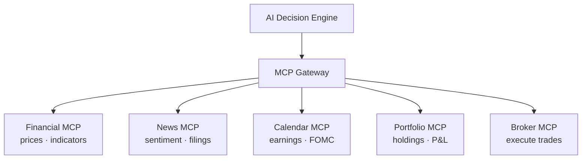
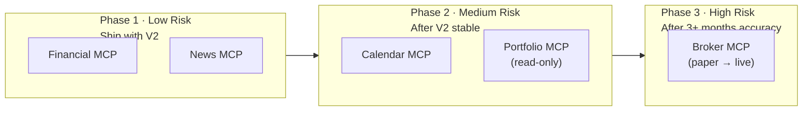
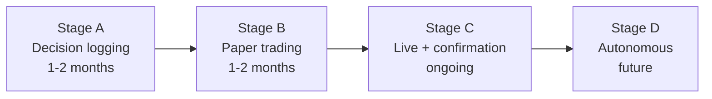

# MCP Phased Rollout: From Dashboard to Autonomous Trading

**Date:** May 12, 2026
**Author:** Xing @ [XingAI](https://xingai.app)
**Project:** [XingAI Invest AI](https://xingai.app/apps/invest-ai)
**Tags:** `mcp` `broker` `architecture` `roadmap` `invest-ai`

---

## The Temptation of Building Everything at Once

When you design an AI investment platform, the dream architecture looks like this:

Five MCP servers, full data coverage, automated execution. Ship it.

**Don't.**

Building all five at once is a trap. Each server has different risk profiles, different data source challenges, and different regulatory implications. The Broker MCP alone could sink the project if you get it wrong.

## The Phased Approach

We're rolling out MCP servers in order of **value delivered** vs **risk introduced**:

## Phase 1: Wrap What You Already Have

**Financial MCP** and **News MCP** don't introduce new risk — they wrap existing data sources (yfinance, Finnhub) behind a standard MCP interface.

Why bother wrapping? Two reasons:

1. **Swappable providers.** When yfinance breaks (it will), swapping to Polygon or Alpha Vantage is a server config change, not a code rewrite.
2. **AI-native access.** MCP tools can be called directly by Gemini/OpenAI via function calling. The AI can ask for data it needs instead of receiving a fixed bundle.

**Risk:** Low. If the MCP server crashes, fall back to direct API calls. No user data involved.

## Phase 2: Add Context the AI Actually Needs

**Calendar MCP** gives the AI temporal awareness. "AAPL earnings in 2 days" changes a HOLD into a "wait for the event." "FOMC tomorrow" changes risk calculations. Without calendar context, the AI is blind to scheduled catalysts.

**Portfolio MCP** (read-only) gives the AI position awareness. "You already have 30% in tech" prevents the AI from recommending more AAPL. This requires connecting to a broker API for read access, which introduces:

- Credential management (secure storage of broker API keys)
- Data privacy (user holdings are sensitive)
- Sync reliability (partial fills, corporate actions, dividends)

We explicitly limit Phase 2 Portfolio MCP to **read-only**. No orders, no modifications. Just "tell me what I hold."

**Risk:** Medium. User financial data requires proper security, but no money moves.

## Phase 3: The Dangerous Part

Broker MCP is where **real money** enters the system. An AI bug doesn't just show wrong data — it loses real dollars.

We're breaking Phase 3 into four sub-stages:

### Stage A: Just Log It (No Broker Connection)

The system logs every decision it *would* make: "BUY NVDA, 50 shares, confidence 78%." No broker connection. We track hypothetical P&L against actual market prices.

**Goal:** Build a track record. If the AI's decisions would have lost money over 2 months, we know before anyone's account is affected.

### Stage B: Paper Trading (Simulated Fills)

Connect to Alpaca's paper trading API. Real market data, simulated fills, zero risk. This catches execution bugs: did the order actually submit? Did the fill price make sense? Did the position sizing calculate correctly?

**Goal:** Validate the full pipeline end-to-end without real money.

### Stage C: Live with User Confirmation

Real orders through a real broker, but every trade requires explicit user approval:

1. AI produces a decision with rationale
2. User sees the recommendation in the dashboard
3. User clicks "Execute" or dismisses
4. Order submitted only after confirmation

**Goal:** Real execution with human oversight. The AI suggests, the human decides.

### Stage D: Autonomous (Maybe Never)

Fully automated execution within guardrails. This stage may never ship — many users prefer the confirmation model. If it does, it requires:

- Per-trade position limit (max 5% of portfolio)
- Daily loss limit (-2% triggers shutdown)
- Trade frequency cap (max 10/day)
- Kill switch in the Monitor UI
- No margin trading
- Market hours only

## Why Alpaca First

| Broker | Why / Why not |
|--------|-------------|
| **Alpaca** | Clean REST API, free paper trading, no account minimum, excellent docs. Best for starting. |
| **Interactive Brokers** | Powerful but complex API. Global markets. Better for advanced users. |
| **Schwab/TD** | Largest US retail base, but API is in transition post-merger. Wait for stability. |

Start with Alpaca for paper trading and initial live execution. Add IBKR as a second option for power users.

## The Non-Negotiable Safety Checklist

Before any live trade:

- [ ] 3+ months of logged decision accuracy data
- [ ] Paper trading validates order submission and fill handling
- [ ] Per-trade position limit enforced server-side (not just UI)
- [ ] Daily loss limit with automatic shutdown
- [ ] Complete audit log (every decision, order, fill, cancellation)
- [ ] Kill switch accessible from Monitor UI
- [ ] No margin trading enabled
- [ ] User confirmation required for every trade (Stage C)

## Timeline

| Phase | Start | Duration | Prerequisite |
|-------|-------|----------|-------------|
| Phase 1 (Financial + News MCP) | With V2 | ~2 weeks | V2 pipeline working |
| Phase 2 (Calendar + Portfolio MCP) | V2 + 1 month | ~3 weeks | Phase 1 stable |
| Phase 3A (Decision logging) | V2 + 2 months | 1–2 months | Phase 2 stable |
| Phase 3B (Paper trading) | V2 + 4 months | 1–2 months | 3A shows positive returns |
| Phase 3C (Live + confirmation) | V2 + 6 months | Ongoing | 3B validates execution |
| Phase 3D (Autonomous) | TBD | TBD | 3C proves reliable over months |

Full technical details in [ADR-003: MCP Phased Rollout](https://github.com/xingaiapp/xingai-invest-ai/blob/main/docs/adr/003-mcp-phased-rollout.md).

---

*Part of the [XingAI Tech Blog](https://github.com/xingaiapp/xingai-tech-blog). We build AI decision systems for everyday life.*

**Links:** [XingAI](https://xingai.app) · [Invest AI](https://xingai.app/apps/invest-ai) · [GitHub](https://github.com/xingaiapp) · [LinkedIn](https://www.linkedin.com/in/xingaiapp/) · [X/Twitter](https://x.com/XingAIApp)
