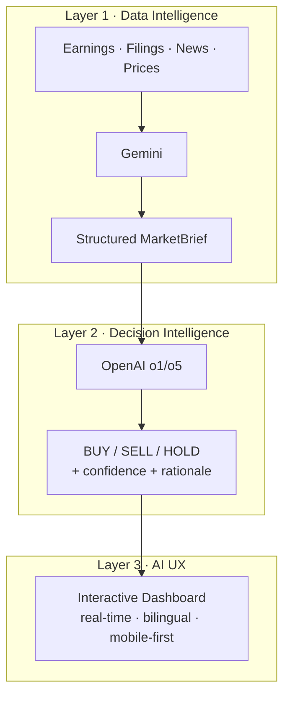

# Building a Three-Layer AI Architecture for Investment Decisions

**Date:** May 12, 2026
**Author:** Xing @ [XingAI](https://xingai.app)
**Project:** [XingAI Invest AI](https://xingai.app/apps/invest-ai)
**Tags:** `architecture` `gemini` `openai` `hybrid-ai` `invest-ai`

---

## The Problem with Single-Model AI

Most AI investment tools today work like this: dump market data into one LLM, get an answer back. It's simple, and it's wrong.

No single model is best at everything. Asking GPT to simultaneously process a 50-page earnings transcript, compute risk metrics, and produce a nuanced buy/sell decision is like asking one person to be the researcher, analyst, and portfolio manager. It can do all three — just not well.

## The 2026 Industry Shift: Hybrid AI Pipelines

The industry is moving toward **hybrid architectures** where different models handle different jobs. At XingAI, we're building our investment platform around three intelligence layers:

### Layer 1: Data Intelligence — Gemini

Gemini's superpower is its **1M+ token context window**. We feed it raw earnings reports, SEC filings, news articles, and market data — all at once. Its job isn't to make decisions. It's to **compress** thousands of pages into a structured brief: key signals, risk flags, and sentiment.

Cost: ~$0.10 per cycle for 250 symbols. That's the entire US market for a dime.

### Layer 2: Decision Intelligence — OpenAI

OpenAI's o1/o5 models excel at **structured reasoning**. They receive the compressed brief (1,000–3,000 tokens instead of 100,000+) and focus purely on the decision:

- Should you buy, sell, or hold?
- How confident is that recommendation?
- What's the reasoning in plain English?

Because the input is small (thanks to Layer 1), each decision costs ~$0.006 and takes 1–2 seconds.

### Layer 3: AI UX — Frontend

The frontend isn't just a renderer. It makes UX decisions about **how to present uncertainty**. A 72% confidence HOLD is shown differently than a 95% confidence BUY. The dashboard uses progressive disclosure — summary first, rationale on tap, raw data available for those who want it.

## Why Not Just Use One Model?

| Approach | Problem |
|----------|---------|
| **OpenAI for everything** | Sending 100K+ tokens of raw filings to o1 is slow and expensive ($0.30+ per symbol) |
| **Gemini for everything** | Great at summarization, weaker at multi-step reasoning and calibrated confidence |
| **Local model (Ollama)** | Free and private, but not accurate enough for real investment decisions |

The hybrid pipeline gives us the **cost of Gemini** with the **reasoning quality of OpenAI**.

## What We're Building

Our V1 (shipped) uses a simple fallback chain — try Ollama, then Gemini, then OpenAI. Same input, same job, different providers. It works for MVP.

V2 (in progress) separates the layers. The worker runs Gemini screening in batch, caches the briefs, and OpenAI produces decisions on demand. We're integrating [Finnhub](https://finnhub.io/) for news and sentiment data — giving Gemini something meaningful to summarize beyond price tickers.

V3 (future) adds MCP servers for portfolio data, earnings calendars, and eventually broker execution — but only after the AI decisions prove their accuracy over months of paper trading.

## Cost Breakdown

| Component | Daily Cost (250 symbols) |
|-----------|------------------------|
| Gemini screening (4x/hr, market hours) | ~$2.60 |
| OpenAI decisions (top 50 symbols, hourly) | ~$0.30 |
| Finnhub API | Free tier |
| yfinance | Free |
| **Total** | **~$3/day** |

That's a full AI investment analysis platform for less than a cup of coffee.

## Technical Details

We've documented the full architecture as ADRs in our [Invest AI repo](https://github.com/xingaiapp/xingai-invest-ai):

- **[ADR-001: Three-Layer AI Architecture](https://github.com/xingaiapp/xingai-invest-ai/blob/main/docs/adr/001-three-layer-ai-architecture.md)** — why each layer exists
- **[ADR-002: Hybrid LLM Pipeline](https://github.com/xingaiapp/xingai-invest-ai/blob/main/docs/adr/002-hybrid-llm-pipeline.md)** — how data flows from Gemini to OpenAI
- **[ADR-003: MCP Phased Rollout](https://github.com/xingaiapp/xingai-invest-ai/blob/main/docs/adr/003-mcp-phased-rollout.md)** — how we'll add broker execution safely

---

*XingAI builds focused AI decision systems for everyday life. Invest AI is our finance product — helping you invest smarter with AI that knows its limits.*

**Links:** [XingAI](https://xingai.app) · [Invest AI](https://xingai.app/apps/invest-ai) · [GitHub](https://github.com/xingaiapp) · [LinkedIn](https://www.linkedin.com/in/xingaiapp/) · [X/Twitter](https://x.com/XingAIApp)
