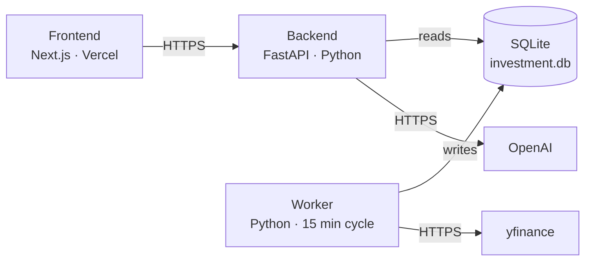

# Hosting an AI Side Project for $0: How We Picked Fly.io for Invest AI V1

**Date:** May 12, 2026
**Author:** Xing @ [XingAI](https://xingai.app)
**Project:** [XingAI Invest AI](https://xingai.app/apps/invest-ai)
**Tags:** `deployment` `hosting` `fly-io` `vercel` `cost-optimization` `side-project`  
**Also available:** [中文](2026-05-12-v1-hosting-fly-io.zh.md)
---

## The question every indie AI dev faces

We had the V1 of Invest AI working locally. The frontend was already on Vercel — that part is solved for everyone. The harder question:

> *Where do you put a Python backend and a long-running cache worker — for free, or close to it?*

Most "deploy your app for free" articles assume you have one service. Real AI products usually don't. You have a stateless API, plus something that runs on a timer to pull data, plus maybe a vector DB, plus maybe a queue.

This post is the actual decision we made, the constraints that drove it, and the alternatives we ruled out. The answer turned out to be **Fly.io free tier**, but the reasoning matters more than the destination.

## The architecture we needed to host



Two Python processes:

- **Backend** — FastAPI. Stateless request/response. Reads cached market data, calls OpenAI for analysis, returns JSON.
- **Worker** — Long-running daemon. Every 15 minutes it pulls fresh quotes and computes signals, writes to SQLite.

They talk to each other **through a file on disk**. The worker writes, the backend reads. This is a classic **CQRS** pattern — separate the write side from the read side — and SQLite is perfect for it at small scale.

## The constraint that decides everything

> The backend and worker must share a SQLite file.

That one sentence eliminated half of the "free hosting" options before we even read their pricing pages.

**Why?** SQLite is a file. To share it between two processes, they need the same filesystem. Modern serverless platforms (Vercel functions, AWS Lambda, Cloudflare Workers) give each invocation an ephemeral, isolated filesystem. There is no "shared disk".

So we needed:

1. **One host, two processes, same persistent volume.** Or:
2. **Migrate to a network database** (Postgres, Turso, Supabase).

Option 2 is the V2 plan. For V1 we wanted to ship — not refactor — so option 1 won.

## The shortlist

I evaluated five hosts that *could* satisfy "one machine, two processes, persistent disk, always-on, HTTPS":

### Fly.io ✅

- **Free tier**: 3× shared-cpu-1x VMs (256MB each), 3GB persistent volume.
- **Same-host multi-process**: `fly.toml` has a `[processes]` block. One app, multiple commands, all sharing the volume.
- **HTTPS auto-configured.** Custom domain optional.
- **Region pick** close to Vercel for low latency.
- **Outbound network** unrestricted (yfinance and OpenAI both work).

### Railway 🟡

- Excellent developer experience.
- $5 trial credit per month, then pay-as-you-go (~$5–10/mo for our shape).
- Plan B if Fly.io's 256MB feels tight.

### Render ❌

- Free web service exists but **sleeps after 15 min of inactivity**, which breaks the always-on worker.
- Background workers cost $7/mo each.
- Free tier has no persistent disk.
- Disqualified.

### Oracle Cloud Always Free 🟡

- Truly free forever: 2× AMD VMs or 4× ARM VMs, 200GB block storage, 10TB egress/month.
- The most generous free tier in the cloud market.
- Catch: you operate the OS. systemd, nginx, certbot, kernel updates, Linux user management.
- Worth it if hosting cost is a religious concern. Not worth it for a V1 side project where engineering time is the scarce resource.

### GitHub Actions cron + serverless backend ❌

- Free for public repos (2000 minutes/month).
- Cron interval minimum is 5 minutes and often delayed by GitHub's queue.
- Would force migration off SQLite immediately.
- Wrong tool for "every 15 minutes, reliably".

## Why Fly.io specifically

Six reasons, ranked by how much they actually matter:

**1. $0/month at our current scale, end of story.**
Three machines free. 3GB volume free. We use one machine and ~50MB of volume. The free tier isn't a marketing trick — it's a real allowance.

**2. No code changes.**
SQLite stays SQLite. The CQRS pattern stays as designed. The day we move to a real DB, we'll move because we *chose* to, not because hosting forced us to.

**3. The `[processes]` block is exactly the right primitive.**

```toml
[processes]
  web    = "uvicorn app:app --host 0.0.0.0 --port 8080"
  worker = "python -m market_cache_worker"

[mounts]
  source      = "investai_data"
  destination = "/data"
```

That's it. One machine, two processes, one mounted volume, both processes read and write to it.

**4. Outbound network just works.**
I'd been fighting yfinance and OpenAI through our dev sandbox's outbound proxy, both throwing 403s. On Fly.io, this category of bug stops being a category.

**5. Heroku-style ergonomics without Heroku-style pricing.**
`flyctl logs`, `flyctl ssh`, `flyctl scale`, `flyctl secrets set`. The interface is friendly enough that you don't lose an afternoon learning the platform.

**6. Vendor lock-in is shallow.**
The portable parts are the `Dockerfile` and the application code. The Fly-specific parts (`fly.toml`, `flyctl`) are small and replaceable. If we ever need to move, we move.

## The honest downsides

I'd be wasting your time if I pretended Fly.io free tier was strictly better than the paid options.

**256 MB RAM is tight.** Two Python processes plus the interpreter plus FastAPI plus SQLAlchemy plus aiosqlite plus all the libraries... 256MB is workable but not comfortable. We monitor it. If memory pressure shows up, the 512MB upgrade is $1.94/month, which is still effectively free.

**Single point of failure.** One machine, one volume. If the machine restarts mid-write, SQLite's WAL recovery handles it, but the worker loses in-flight progress for that cycle. Acceptable at 15-minute cadence. Not acceptable for high-stakes write paths.

**No horizontal scale on free tier.** Going from 1 machine to 2 with a shared SQLite means LiteFS (Fly's SQLite replication). At that point Turso is honestly simpler. So Fly.io free is a one-machine deal.

## The migration trigger we wrote down

Decision documents are useless if they don't tell future-you when to revisit them. We listed concrete triggers that move us off Fly.io shared-disk SQLite to a V2 architecture:

1. **Backend goes serverless on Vercel.** Vercel Python functions cannot share a filesystem; SQLite stops working. Migrate the cache to **Turso** (libsql, near-drop-in) or **Supabase Postgres**.
2. **Two regions needed.** International users → need a DB that replicates.
3. **Cache writes exceed 1/sec sustained.** Not even close at V1, but worth tracking.
4. **Worker splits into multiple components.** News worker + quotes worker + fundamentals worker → they need a shared network DB.

Until one of those fires, Fly.io is the right answer.

## The principle behind the choice

Two ideas drove this:

**1. The cheapest piece of infrastructure is the one you don't add.**
We didn't switch databases. We didn't add a message queue. We didn't introduce a vector store. SQLite + filesystem + two processes is a complete architecture for V1. Every piece you add is a piece you operate, monitor, and pay for.

**2. Pick the constraint that's hardest to change later, and design around that one first.**
Our hardest-to-change constraint was *"backend and worker share state through SQLite"*. Once we honored that, the hosting choice almost made itself. If we'd started from "what's the trendiest free tier?" we'd have landed somewhere that forced a database migration on Day 1.

## What deploying looked like

The TL;DR for anyone copying this setup:

```bash
# 1. Add a Dockerfile (multi-stage, copies both backend and worker code)
# 2. Add fly.toml with [processes] and [mounts] blocks
# 3. Launch
flyctl auth signup
flyctl launch         # pick region close to Vercel (iad for US East)
flyctl volumes create investai_data --size 1 --region iad
flyctl secrets set OPENAI_API_KEY=sk-...
flyctl deploy

# 4. Point Vercel at the new URL
# In Vercel dashboard: NEXT_PUBLIC_API_BASE_URL=https://<app>.fly.dev
```

A separate deploy guide will land in the repo with the actual `Dockerfile` and `fly.toml` files we use.

## Closing thought

There's a worldview that says "real engineers use Kubernetes" and another that says "real engineers run everything on Cloudflare Workers". Both are usually wrong for side projects.

The right hosting for a V1 AI product is: **whatever lets you ship today without making decisions you'd regret in three months.** For us, that turned out to be a $0 tier on a platform optimized for exactly this shape — one app, two processes, one disk, public HTTPS.

If your AI side project has the same shape, you can probably reuse this decision verbatim.
