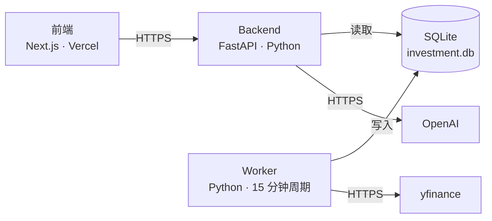

# 中文 · 零成本托管 AI 副业：Invest AI V1 为何选 Fly.io

**日期：** May 12, 2026
**作者：** Xing @ [XingAI](https://xingai.app)
**项目：** [XingAI Invest AI](https://xingai.app/apps/invest-ai)
**标签：** `deployment` `hosting` `fly-io` `vercel` `cost-optimization` `side-project`
**语言：** [English](2026-05-12-v1-hosting-fly-io.md) · 中文

---

## 每个 indie AI 开发者都会问的问题

Invest AI V1 在本地跑通；前端已在 Vercel — 这部分人人都会。更难的是：

> *Python backend 和长期跑的 cache worker 放哪 — 免费或接近免费？*

多数「免费部署」文章假设只有一个服务。真实 AI 产品通常有：无状态 API、定时拉数据的进程、也许向量库、也许队列。

本文是我们**实际做的决定**、驱动约束、以及否决的备选。**答案**是 **Fly.io 免费档** — 但推理比目的地重要。

## 要托管的架构



两个 Python 进程：**Backend** 读缓存、调 OpenAI 返回 JSON；**Worker** 每 15 分钟拉报价写 SQLite。通过**磁盘上的同一文件**通信 — 经典 **CQRS**，小规模 SQLite 很合适。

## 一锤定音的约束

> Backend 与 worker 必须共享同一个 SQLite 文件。

这句话在还没看定价页前就淘汰了一半「免费托管」。SQLite 是文件；两进程共享需要**同一文件系统**。Vercel Functions、Lambda、Cloudflare Workers 的文件系统 ephemeral 且隔离 — 没有「共享盘」。

所以要：**一台主机、两进程、同一持久卷**；或 **迁到网络数据库**（Postgres、Turso、Supabase）。V2 计划走选项 2；V1 要 ship 不 refactor → 选项 1 赢。

## 短名单

评估了五类能满足「一机、两进程、持久盘、常开、HTTPS」的主机：

- **Fly.io ✅** — 3 台 shared-cpu-1x 免费、3GB 卷；`[processes]` 同机多命令共享卷；出站网络 unrestricted
- **Railway 🟡** — DX 好，试用后约 $5–10/月；Fly 256MB 紧时的 Plan B
- **Render ❌** — 免费 Web 15 分钟无活动休眠，打断 worker；后台 worker $7/个；免费无持久盘
- **Oracle Always Free 🟡** — 最慷慨但要自己运维 OS；V1 时间更稀缺
- **GitHub Actions cron + serverless ❌** — 最小 5 分钟且排队；迫迁数据库；不适合 15 分钟可靠任务

## 为何具体选 Fly.io

1. **当前规模真 $0/月**  
2. **零代码形态变更** — SQLite 仍是 SQLite  
3. **`[processes]` + `[mounts]` 就是对的原语**  
4. **出站网络直接能用**（yfinance、OpenAI）  
5. **Heroku 式 ergonomics，没有 Heroku 价**  
6. **锁定浅** — 可移植 Dockerfile 与业务代码

## 诚实缺点

256MB RAM 紧；单点故障；免费档难水平扩展共享 SQLite — 到那步 Turso 往往更简单。

## 写下何时迁移

1. Backend 上 Vercel serverless → SQLite 不行 → Turso/Supabase  
2. 需要两区域  
3. 缓存写持续 >1/sec  
4. Worker 拆成多个组件 → 需要网络 DB

## 部署 TL;DR

```bash
flyctl auth signup
flyctl launch
flyctl volumes create investai_data --size 1 --region iad
flyctl secrets set OPENAI_API_KEY=sk-...
flyctl deploy
# Vercel: NEXT_PUBLIC_API_BASE_URL=https://<app>.fly.dev
```

## 收束

V1 AI 产品的好托管是：**今天能 ship，又不会在三个月里后悔。** 对我们，就是「一应用、两进程、一盘、公网 HTTPS」的 $0 档。

若你的副业是同一形状，这套决定多半能原样复用。

---

*Part of the [XingAI Tech Blog](../README.md). Related reading: [Three-Layer AI Architecture](2026-05-12-three-layer-ai-architecture.zh.md), [Why We Chose a Hybrid LLM Pipeline](2026-05-12-hybrid-llm-pipeline.zh.md), [The Monitor That Wouldn't Stop Refreshing](2026-05-12-monitor-render-loop.zh.md).*
