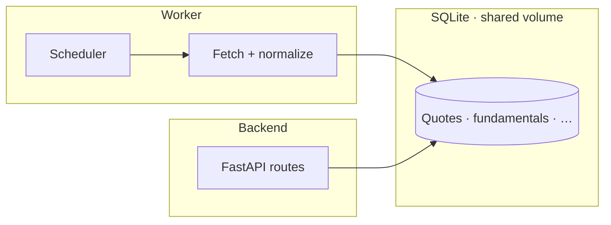

# CQRS with SQLite: One Writer, Many Readers, No Drama

**Date:** May 13, 2026  
**Author:** Xing @ [XingAI](https://xingai.app)  
**Project:** [XingAI Invest AI](https://xingai.app/apps/invest-ai)  
**Tags:** `cqrs` `sqlite` `worker` `fastapi` `cache` `architecture`  
**Also available:** [中文](2026-05-13-cqrs-sqlite-worker-writes.zh.md)
---

## The tension

Market dashboards want **fresh data**. Upstream APIs want **low call volume**. Users want **sub-200ms** first paint.

Calling Yahoo / Finnhub / Alpha Vantage from the FastAPI request path on every page load fails all three: you hit rate limits, you add latency, and you duplicate work across every concurrent user.

## The pattern: worker writes, backend reads

We formalized what we were already doing:

- **`stock-ai-worker`** — the **only** writer to the market SQLite cache. Scheduled refresh, idempotent upserts, handles upstream failures.
- **`stock-ai-back-end`** — **read-only** against that cache for `/api/v1/*` dashboard and quotes. No direct market-data HTTP from the API layer.

That is classic **CQRS** (Command–Query Responsibility Segregation): commands (refresh market state) live on one side; queries (serve users) on the other.

## Hard rules that keep it honest

1. Backend never opens a socket to Yahoo “just this once.”
2. Worker never serves HTTP; it is a daemon, not a second API.
3. Schema is the contract — one module owns the SQL shape.
4. Writes are idempotent (`symbol`, `as_of`, etc.).
5. Reads tolerate staleness; the UI shows **when** data was last refreshed.

## Why not Redis read-through here?

A read-through cache in the API tier means **every cold pod** warms independently, and the first user of the morning pays full upstream latency. A single writer warming **one** shared file means predictable cost and predictable freshness.

## When we outgrow it

SQLite + single host stops scaling when you need **multiple API regions** or **multiple writers**. That is the trigger to revisit Postgres, LiteFS, or a dedicated time-series store — not before the pain is real.

## Takeaway

If your AI product reads the same market facts for every user, **do not fan out upstream calls from the request path.** Push refresh to a worker, keep the API boring and fast, and let SQLite be the cheap source of truth at small scale.

**Further reading:** ADR-008 (`docs/adr/008-cqrs-cache-pattern.md`).
