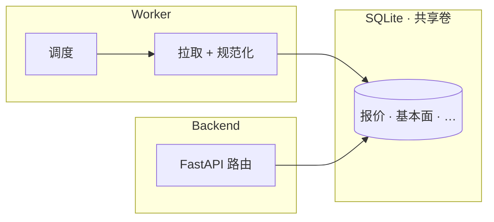

# 中文 · CQRS + SQLite：一个写入方，多个读取方

**日期：** May 13, 2026
**作者：** Xing @ [XingAI](https://xingai.app)
**项目：** [XingAI Invest AI](https://xingai.app/apps/invest-ai)
**标签：** `cqrs` `sqlite` `worker` `fastapi` `cache` `architecture`
**语言：** [English](2026-05-13-cqrs-sqlite-worker-writes.md) · 中文

---

## 矛盾

市场仪表盘要**新数据**；上游 API 要**少调用**；用户要**首屏 <200ms**。

在 FastAPI 请求路径里每次页面加载都打 Yahoo / Finnhub / Alpha Vantage，三件事全输：限流、延迟、并发重复劳动。

## 模式：worker 写，backend 读

我们把已在做的事写清楚：

- **`stock-ai-worker`** — 市场 SQLite 缓存的**唯一**写入方。定时刷新、幂等 upsert、处理上游失败。
- **`stock-ai-back-end`** — 对 `/api/v1/*` 仪表盘与报价**只读**缓存。API 层不再直连市场 HTTP。

即经典 **CQRS**：命令（刷新市场状态）一侧；查询（服务用户）另一侧。

## 硬规则

1. Backend 绝不「就这一次」直连 Yahoo
2. Worker 不提供 HTTP；它是守护进程，不是第二个 API
3. Schema 即契约 — 单一模块拥有 SQL 形状
4. 写入幂等（`symbol`、`as_of` 等）
5. 读容忍略旧；UI 展示**上次刷新时间**

## 为何这里不用 Redis read-through

API 层的 read-through 意味着**每个冷 pod 各自预热**，早上第一个用户付全量上游延迟。单一 writer 预热**一份**共享文件 → 成本与新鲜度可预期。

## 何时升级

需要**多 API 区域**或**多写入方**时，SQLite + 单机就不够了 — 那时再考虑 Postgres、LiteFS 或专用时序库，而不是痛出现前。

## 一句话

若 AI 产品为每个用户读同一套市场事实，**别在请求路径扇出上游调用。** 刷新交给 worker，API 保持无聊且快，小规模让 SQLite 当便宜真相源。

**延伸阅读：** ADR-008（`docs/adr/008-cqrs-cache-pattern.md`）。
