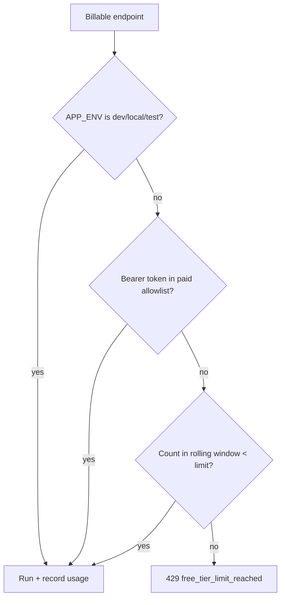

# Capping Free-Tier AI Calls Without Slowing Down Development

**Date:** May 13, 2026  
**Author:** Xing @ [XingAI](https://xingai.app)  
**Project:** [XingAI Invest AI](https://xingai.app/apps/invest-ai)  
**Tags:** `rate-limiting` `sqlite` `cost-control` `openai` `fastapi` `product`

---

## The problem

Three endpoints burn real tokens on every hit:

- `POST /api/v1/analyze`
- `GET` / `POST /api/v1/analyze/stream`
- `POST /api/v1/ai/refresh` (dashboard “regenerate”)

Dashboard reads from SQLite are cheap and stay unlimited. Without limits, one tab left open, one curious visitor, or one scraper can run the OpenAI bill into uncomfortable territory before you notice.

We had no auth in V1, so we could not bill per user. We still needed a **stable identifier** and a **dev bypass** so local work never hits the cap.

## The design

**Defaults we ship with:** 3 analyses per rolling 24-hour window for anonymous free traffic. Paid or internal callers can pass a configured bearer token to bypass. Developers set `APP_ENV` to a dev value and never see the gate.

## Caller identity

Order of preference:

1. **`X-Client-Id`** — UUID generated in the browser and stored in `localStorage` (survives IP changes).
2. **`X-Forwarded-For`** first hop when behind Vercel or Fly.
3. **Peer IP** for direct local calls.

Identifiers are **SHA-256 hashed** before persistence so the meter DB does not store raw IPs or client IDs.

## Why a second SQLite file

Market cache SQLite is written every few minutes by the worker and read heavily by the API. Mixing usage-meter writes into the same file risks lock contention. A dedicated usage DB is a few lines of code and isolates write patterns.

## Frontend UX

- Header badge showing remaining free analyses (polls a small quota endpoint).
- Paywall-style modal when `429` returns, with calm copy and upgrade placeholder for a future paid tier.

## Takeaway

Cost control for AI APIs is not optional at launch. A **small SQLite meter + client id + dev bypass** gets you 80% of what a full auth system would give for abuse protection — without blocking your own keyboard.

**Further reading:** ADR-006 (`docs/adr/006-free-tier-usage-limits.md`).
