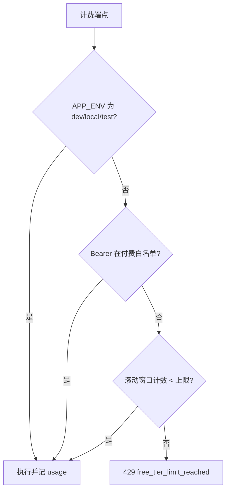

# 中文 · 限制免费 AI 调用，又不拖慢开发

**日期：** May 13, 2026
**作者：** Xing @ [XingAI](https://xingai.app)
**项目：** [XingAI Invest AI](https://xingai.app/apps/invest-ai)
**标签：** `rate-limiting` `sqlite` `cost-control` `openai` `fastapi` `product`
**语言：** [English](2026-05-13-free-tier-ai-rate-limits.md) · 中文

---

## 问题

三个端点每次命中都烧真 token：

- `POST /api/v1/analyze`
- `GET` / `POST /api/v1/analyze/stream`
- `POST /api/v1/ai/refresh`（仪表盘「重新生成」）

从 SQLite 读仪表盘很便宜，可不限。没有限额时，一个忘关的标签页、一个好奇访客或爬虫，都能在察觉前把 OpenAI 账单推高。

V1 没有登录，无法按用户计费，但仍要**稳定标识**和**开发豁免**，本地不被 cap 卡住。

## 设计

**默认：** 匿名免费流量滚动 24 小时窗口内 3 次分析。付费/内部调用者可带配置 bearer 绕过。开发把 `APP_ENV` 设为 dev 值则不见闸门。

## 调用方身份

优先级：

1. **`X-Client-Id`** — 浏览器 `localStorage` 的 UUID（比 IP 稳）
2. Vercel / Fly 后的 **`X-Forwarded-For`** 首跳
3. 本地直连的 **peer IP**

持久化前对标识做 **SHA-256**，计量库不存原始 IP 或 client id。

## 为何单独 SQLite 文件

市场缓存 SQLite 每几分钟被 worker 写、API 猛读。把 usage 写进同一文件易锁争用。独立 usage DB 几行代码，隔离写模式。

## 前端 UX

- 顶栏徽章显示剩余免费次数（轮询小 quota 接口）
- `429` 时平静文案的 paywall 式弹窗，预留未来付费档

## 一句话

AI API 的成本控制上线就不能省。**小 SQLite 计量 + client id + 开发豁免** 能拿到完整登录体系约 80% 的防滥用能力，又不挡你自己的键盘。

**延伸阅读：** ADR-006（`docs/adr/006-free-tier-usage-limits.md`）。
