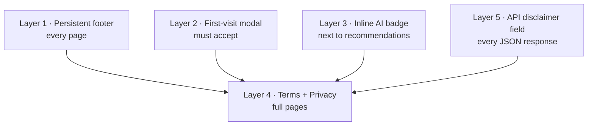
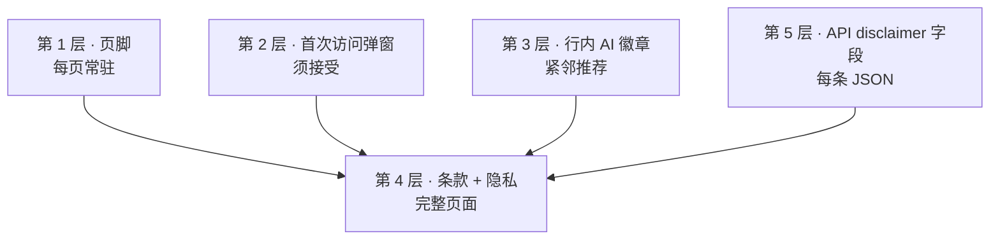

# Five Layers of “Not Investment Advice” for an AI Finance Product

**Date:** May 13, 2026  
**Author:** Xing @ [XingAI](https://xingai.app)  
**Project:** [XingAI Invest AI](https://xingai.app/apps/invest-ai)  
**Tags:** `legal` `disclaimers` `product` `compliance` `frontend` `api-design`  
**Languages:** English · [中文 ↓](#中文)

---

## Why this matters

Invest AI surfaces BUY / HOLD / SELL style signals and confidence scores. In many jurisdictions, anything that *looks* like personalized investment advice can drag you into regulated territory unless you are very clear about what you are — and what you are not.

We are **not** a Registered Investment Advisor (RIA). The product is framed as an **educational** tool: explore market data with AI, do your own research, talk to a licensed professional before acting.

This post is **not legal advice**. I am not a lawyer. Before any **paid** or high-traffic commercial launch, a securities lawyer should review the exact copy. For a **free public beta**, we still wanted a defensible, industry-standard pattern that is hard for a reasonable user to miss.

## The five layers

We stack five independent surfaces so the message survives UI changes, scrapers, and future API clients.

1. **Footer** — One short line plus links to Terms, Privacy, Help, and contact. Always visible.
2. **First-visit modal** — Bulleted summary, checkbox acknowledging Terms + Privacy, no dismiss without acceptance. Versioned `localStorage` key so we can force re-accept if copy changes materially.
3. **Inline badge** — Next to recommendation-heavy UI: “AI · Not Advice · You Decide” with a tooltip.
4. **Terms & Privacy** — Full pages at `/terms` and `/privacy`.
5. **API envelope** — Every `/api/v1/analyze` response includes a `disclaimer` string. Third-party clients and scrapers still see the legal framing even if they strip the HTML.

## Single source of truth (almost)

Frontend legal copy is centralized in `lib/legal/disclaimers.ts`. The backend mirrors the same substance in `ANALYSIS_DISCLAIMER` so API responses stay aligned. A future improvement is one shared artifact (JSON/YAML) imported by both stacks.

## What we deliberately did not do

- **Become an RIA** — Wrong product stage; high cost and ongoing compliance.
- **Footer only** — Too easy to miss; regulators care about *prominence*.
- **Hope nobody complains** — Not a strategy.

## Takeaway

If you ship an AI product that touches money decisions, treat disclaimers as **product design**, not a legal appendix. Five thin layers beat one thick paragraph nobody reads.

**Further reading:** ADR-005 in the [Invest AI repo](https://github.com/xingaiapp) (`docs/adr/005-legal-disclaimers-v1.md`).

---

# 中文 · AI 金融产品上的五层「非投资建议」

**语言：** [English ↑](#five-layers-of-not-investment-advice-for-an-ai-finance-product) · 中文

---

## 为何重要

Invest AI 展示 BUY / HOLD / SELL 风格信号与置信度。在许多法域，**看起来像**个性化投资建议的东西，若不清楚「我们是什么 / 不是什么」，可能把你拖进监管范畴。

我们**不是**注册投资顾问（RIA）。产品定位为**教育**工具：用 AI 探索市场数据、自己做研究、行动前咨询持牌专业人士。

本文**不是法律意见**。上线前应有证券律师审阅具体文案。即便是**免费公测**，我们仍要可辩护、行业常见的模式，且合理用户难以忽略。

## 五层

五处独立表面，让信息在 UI 改版、爬虫、未来 API 客户端下仍能存活。

1. **页脚** — 短句 + 链到条款、隐私、帮助、联系。始终可见。
2. **首次访问弹窗** — 要点列表、勾选确认条款+隐私、不接受不能关。`localStorage` 版本键，文案大变可强制重接受。
3. **行内徽章** — 推荐密集 UI 旁：「AI · 非建议 · 你决定」+ tooltip。
4. **条款与隐私** — `/terms`、`/privacy` 全文。
5. **API 信封** — 每条 `/api/v1/analyze` 含 `disclaimer` 字符串；剥 HTML 的第三方仍见法律框。

## 单一真相源（几乎）

前端集中在 `lib/legal/disclaimers.ts`；backend `ANALYSIS_DISCLAIMER` 对齐实质。后续可共享 JSON/YAML 双栈 import。

## 刻意没做的

- **当 RIA** — 阶段不对；成本高、持续合规重
- **只有页脚** — 太容易漏；监管看**显著性**
- **赌没人投诉** — 不是策略

## 一句话

AI 碰钱决策时，把免责声明当**产品设计**，不是法律附录。五层薄提示胜过一段没人读的长文。

**延伸阅读：** Invest AI 仓库 ADR-005（`docs/adr/005-legal-disclaimers-v1.md`）。
