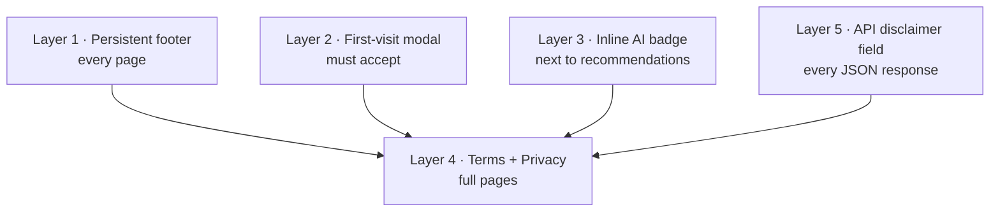

# Five Layers of “Not Investment Advice” for an AI Finance Product

**Date:** May 13, 2026  
**Author:** Xing @ [XingAI](https://xingai.app)  
**Project:** [XingAI Invest AI](https://xingai.app/apps/invest-ai)  
**Tags:** `legal` `disclaimers` `product` `compliance` `frontend` `api-design`

---

## Why this matters

Invest AI surfaces BUY / HOLD / SELL style signals and confidence scores. In many jurisdictions, anything that *looks* like personalized investment advice can drag you into regulated territory unless you are very clear about what you are — and what you are not.

We are **not** a Registered Investment Advisor (RIA). The product is framed as an **educational** tool: explore market data with AI, do your own research, talk to a licensed professional before acting.

This post is **not legal advice**. I am not a lawyer. Before any **paid** or high-traffic commercial launch, a securities lawyer should review the exact copy. For a **free public beta**, we still wanted a defensible, industry-standard pattern that is hard for a reasonable user to miss.

## The five layers

We stack five independent surfaces so the message survives UI changes, scrapers, and future API clients.

1. **Footer** — One short line plus links to Terms, Privacy, Help, and contact. Always visible.
2. **First-visit modal** — Bulleted summary, checkbox acknowledging Terms + Privacy, no dismiss without acceptance. Versioned `localStorage` key so we can force re-accept if copy changes materially.
3. **Inline badge** — Next to recommendation-heavy UI: “AI · Not Advice · You Decide” with a tooltip.
4. **Terms & Privacy** — Full pages at `/terms` and `/privacy`.
5. **API envelope** — Every `/api/v1/analyze` response includes a `disclaimer` string. Third-party clients and scrapers still see the legal framing even if they strip the HTML.

## Single source of truth (almost)

Frontend legal copy is centralized in `lib/legal/disclaimers.ts`. The backend mirrors the same substance in `ANALYSIS_DISCLAIMER` so API responses stay aligned. A future improvement is one shared artifact (JSON/YAML) imported by both stacks.

## What we deliberately did not do

- **Become an RIA** — Wrong product stage; high cost and ongoing compliance.
- **Footer only** — Too easy to miss; regulators care about *prominence*.
- **Hope nobody complains** — Not a strategy.

## Takeaway

If you ship an AI product that touches money decisions, treat disclaimers as **product design**, not a legal appendix. Five thin layers beat one thick paragraph nobody reads.

**Further reading:** ADR-005 in the [Invest AI repo](https://github.com/xingaiapp) (`docs/adr/005-legal-disclaimers-v1.md`).
