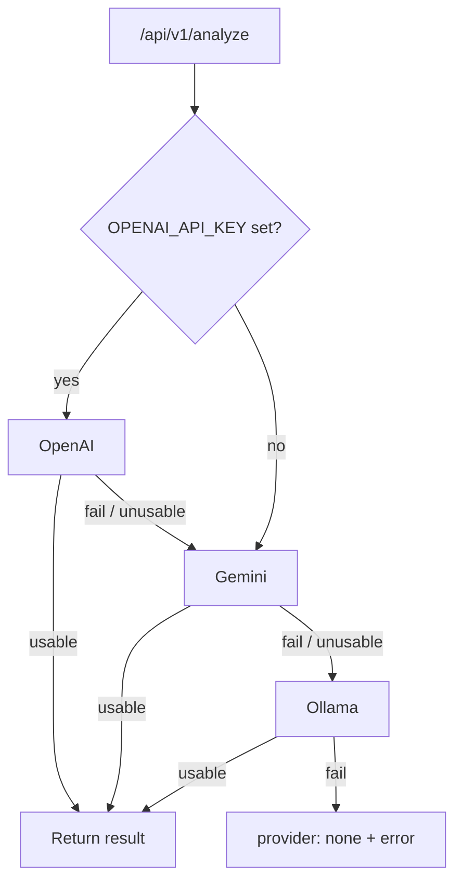

# Why We Flipped V1 Routing to OpenAI-First (and What Comes Next)

**Date:** May 13, 2026  
**Author:** Xing @ [XingAI](https://xingai.app)  
**Project:** [XingAI Invest AI](https://xingai.app/apps/invest-ai)  
**Tags:** `llm` `openai` `gemini` `ollama` `routing` `latency` `architecture`  
**Also available:** [中文](2026-05-13-openai-first-llm-routing.zh.md)
---

## The old default: “free first”

Early V1 tried providers in **`Ollama → Gemini → OpenAI`** order. The idea: avoid cloud cost until you must.

In practice:

1. **Most users do not run Ollama.** Every request still probed local inference first — hundreds of milliseconds of dead latency before falling through.
2. **Local quality was uneven.** Output often failed our light sanity checks, so we paid the Ollama tax *and* still called the cloud.
3. **Production reality.** We do not ship a local model on Fly; the “free first” path optimized a scenario that did not exist in prod.

## The new default: OpenAI-first resilience

V1 now routes **`OpenAI → Gemini → Ollama → safe defaults`**.

**OpenAI** — best structured JSON for our schema, fast cold start in the cloud.  
**Gemini** — strong fallback when OpenAI rate-limits or errors; also the natural **Stage 1** model in our planned V2 hybrid pipeline (compress raw data cheaply).  
**Ollama** — dev / air-gapped / last resort.  
**Safe defaults** — explicit `{ provider: "none", error: "..." }` so the UI can degrade gracefully instead of hanging.

Routing is **implicit from env**: whichever API keys are set determines the chain. No extra “router mode” flag to misconfigure.

## Relationship to V2

This ADR is **V1 routing**. [Hybrid LLM pipeline](2026-05-12-hybrid-llm-pipeline.md) is **V2**: Gemini screens and summarizes; OpenAI decides. When V2 lands, the fallback chain shape may change again — but the lesson stays: **optimize for the path users and production actually take.**

## Takeaway

“Cheapest provider first” is not always cheapest *overall* once you count latency, retries, and failed parses. For our product, **OpenAI-first** was the honest default; Gemini stays the safety net and the bridge to V2.

**Further reading:** ADR-007 (`docs/adr/007-v1-llm-routing.md`).
