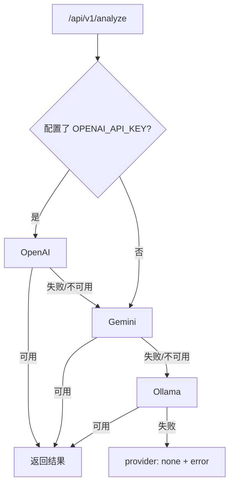

# 中文 · 为何 V1 路由改成 OpenAI 优先（以及下一步）

**日期：** May 13, 2026
**作者：** Xing @ [XingAI](https://xingai.app)
**项目：** [XingAI Invest AI](https://xingai.app/apps/invest-ai)
**标签：** `llm` `openai` `gemini` `ollama` `routing` `latency` `architecture`
**语言：** [English](2026-05-13-openai-first-llm-routing.md) · 中文

---

## 旧默认：「免费优先」

早期 V1 按 **`Ollama → Gemini → OpenAI`** 试。想法：能不用云就不用。

实际上：

1. **多数用户不跑 Ollama。** 每次请求仍先探本地 — 几百毫秒死延迟再 fallback
2. **本地质量不稳。** 常过不了轻量校验，付了 Ollama 税**仍**要打云
3. **生产现实。** Fly 上不 ship 本地模型；「免费优先」优化了 prod 不存在的路径

## 新默认：OpenAI 优先的韧性链

V1 现为 **`OpenAI → Gemini → Ollama → 安全默认`**。

**OpenAI** — 结构化 JSON 最好、云上冷启动快。  
**Gemini** — OpenAI 限流/报错时的强后备；也是规划 V2 混合管道自然的 **Stage 1**（便宜压缩原始数据）。  
**Ollama** — 开发 / 离线 / 最后手段。  
**安全默认** — 显式 `{ provider: "none", error: "..." }`，UI 可优雅降级而非挂死。

路由**由环境隐式决定**：配了哪些 key 就走哪条链，少一个易配错的「路由模式」开关。

## 与 V2 的关系

本篇是 **V1 路由**。[混合 LLM 管道](2026-05-12-hybrid-llm-pipeline.zh.md) 是 **V2**：Gemini 筛与摘要，OpenAI 决策。V2 落地后 fallback 形状可能再变 — 教训不变：**优化用户与生产实际走的路径。**

## 一句话

「最便宜模型优先」算上延迟、重试、解析失败，总成本未必最低。对我们产品，**OpenAI 优先**是诚实默认；Gemini 仍是安全网与通往 V2 的桥。

**延伸阅读：** ADR-007（`docs/adr/007-v1-llm-routing.md`）。
