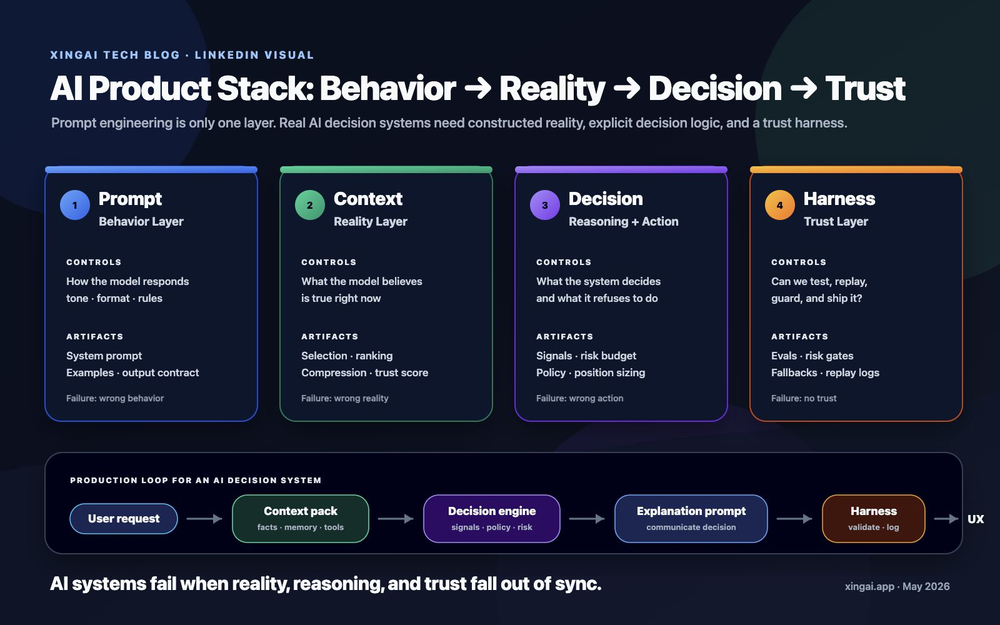
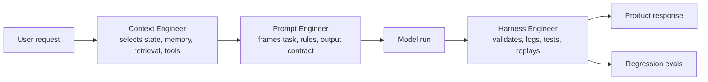

# Prompt Engineer vs Context Engineer vs Harness Engineer

**Date:** May 20, 2026
**Author:** Xing @ [XingAI](https://xingai.app)
**Project:** XingAI Platform
**Tags:** `ai-engineering` `prompt-engineering` `context-engineering` `harness-engineering` `llm-systems`

---



## The Job Title Is Changing Because the Work Changed

In 2023, a lot of AI engineering looked like prompt writing. You opened a chat box, tuned a system prompt, added examples, and tried to make the model answer better.

That skill still matters. But once an AI feature becomes a product, the hard part is rarely the sentence you put at the top of the prompt. The hard part is everything around it:

- Which user state should the model see?
- Which database rows are safe to include?
- Which tool calls are allowed?
- How do we replay a bad answer?
- How do we know a model upgrade did not break the workflow?

This is why I now separate three roles:

1. **Prompt Engineer**: shapes the instruction.
2. **Context Engineer**: shapes the information environment.
3. **Harness Engineer**: shapes the execution and evaluation system.

They overlap, but they are not the same job.

## The Short Version

| Role | Core Question | Main Artifact | Failure Mode |
|------|---------------|---------------|--------------|
| Prompt Engineer | "How should the model think and respond?" | System prompt, examples, output schema | The model misunderstands the task |
| Context Engineer | "What should the model know right now?" | Retrieval, memory, state packing, tool context | The model sees the wrong facts |
| Harness Engineer | "How do we run, test, and trust this repeatedly?" | Eval harness, replay logs, tool sandbox, CI checks | The product cannot be debugged or shipped safely |

A simple demo can survive with prompt engineering. A real AI product needs all three.

## Prompt Engineering: The Instruction Layer

Prompt engineering is the most visible layer because it is closest to language.

The prompt engineer writes instructions that define:

- The assistant's role and boundaries
- The task decomposition
- Output format
- Tone and audience
- Examples of good and bad answers
- Refusal or escalation behavior

For example, a prompt engineer working on an investment assistant might write:

```text
You are an investment research assistant.
Summarize the latest market setup in plain English.
Do not provide personalized financial advice.
Return JSON with: direction, confidence, risks, rationale.
```

That is useful. It gives the model a shape.

But it does not answer the most important production question: **what exact evidence should the model use?**

If the prompt says "latest market setup" but the model receives stale data, duplicated news, missing holdings, and no timestamp, better wording will not save the system.

Prompt engineering optimizes the model's behavior inside the context it receives. It does not, by itself, make that context correct.

## Context Engineering: The Information Layer

Context engineering is the discipline of deciding what enters the model window.

This includes:

- Retrieval from vector search, SQL, cache, APIs, and files
- Memory selection
- User profile and preference packing
- Tool result summarization
- Token budgeting
- Freshness and timestamp labeling
- Conflict handling
- Source priority
- Redaction and privacy filtering

The context engineer asks:

- Does the model need raw data, a summary, or both?
- Which fields matter for this decision?
- Is this data fresh enough?
- Should we include historical examples?
- How do we prevent irrelevant context from crowding out the real signal?

In our XingAI products, this distinction shows up everywhere.

For **Invest AI**, the model should not receive a random pile of tickers. It needs a structured decision context: market regime, macro radar, engine votes, confidence, risk budget, and freshness metadata.

For **Meal Coach**, the model should not receive every prior meal forever. It needs the current food image, user goal, diet constraints, portion uncertainty, and recent pattern summaries.

For **Travel AI**, the model should not simply get "plan a trip." It needs dates, budget, weather, constraints, traveler style, saved places, and trade-offs.

The prompt can say "be helpful." Context engineering decides whether the model is helpful with the right facts.

## Harness Engineering: The Execution Layer

Harness engineering is the least glamorous layer and often the one that determines whether the product can ship.

The harness is the system around the model:

- Request builders
- Tool-call routers
- Sandboxes and permissions
- JSON schema validation
- Retry and fallback logic
- Snapshot and replay logs
- Evaluation suites
- Regression tests
- Cost and latency tracking
- Red-team cases
- CI checks before deployment

The harness engineer asks:

- Can we replay this exact model run tomorrow?
- Can we compare model A vs model B on the same inputs?
- What happens if a tool call fails halfway through?
- Can the model return malformed JSON?
- Do we have fixtures for the top 20 failure modes?
- How do we know a prompt edit improved quality instead of just changing vibes?

This is where AI engineering starts to look like systems engineering again.

Without a harness, every AI bug becomes folklore:

```text
"It gave a weird answer yesterday, but I cannot reproduce it."
```

With a harness, the bug becomes an artifact:

```text
input snapshot + prompt version + model version + tool outputs + expected behavior
```

That is the difference between experimenting with AI and operating an AI product.

## A Concrete Example: AI Investment Decision

Imagine an AI investment dashboard that produces a daily recommendation.

### Prompt Engineer View

The prompt engineer writes:

```text
Analyze the market data.
Return a recommendation: BUY, HOLD, or REDUCE.
Explain the top three reasons.
Do not provide personalized investment advice.
```

Useful, but incomplete.

### Context Engineer View

The context engineer defines the payload:

```json
{
  "as_of": "2026-05-20T09:30:00-04:00",
  "market_regime": "Risk-Off",
  "macro_radar": {
    "scenario": "Scenario C",
    "risk_budget_cap": 3,
    "long_signal_discount": 0.12,
    "decision_factors": ["credit stress", "safe-haven failure"]
  },
  "engine_votes": [
    { "name": "trend", "score": 61, "signal": "Neutral" },
    { "name": "volatility", "score": 28, "signal": "Risk-Off" }
  ],
  "top_signals": [
    { "symbol": "CLSK", "rating": "Buy", "confidence": 100 }
  ],
  "freshness": "today"
}
```

Now the model has the right world state.

### Harness Engineer View

The harness engineer makes it reliable:

```text
Fixture: risk_off_macro_with_high_stock_signal
Expected:
- recommendation should not ignore macro risk cap
- rationale must mention macro radar or risk budget
- output must match DecisionResult schema
- no personalized financial advice language
- response must complete under 2 seconds from cache
```

Now the system can be tested.

The prompt makes the model respond. The context makes the response grounded. The harness makes the behavior repeatable.

## Why "Context Engineer" Became a Real Role

LLMs are sensitive to what they see. Two prompts with the same wording can produce opposite results if the context changes.

Context engineering matters because the model window is not just storage. It is the model's temporary reality.

Bad context creates failure patterns that look like model problems:

- Hallucination because source data was missing
- Confident wrong answer because stale data was unlabeled
- Overly generic answer because user state was not included
- Contradictory answer because retrieved chunks disagreed
- Expensive answer because raw documents were included when summaries would do

Many teams try to fix these with more prompt text:

```text
Be accurate. Use the latest data. Do not hallucinate.
```

But the better fix is usually structural:

- include timestamps
- rank sources
- deduplicate chunks
- compress old context
- separate facts from instructions
- add "unknown" states
- make freshness visible to the model and the UI

That is context engineering.

## Why "Harness Engineer" Became a Real Role

AI products fail differently from normal apps.

A normal app often fails with an exception, a 500, or a broken UI state. An AI app can fail while looking successful. It returns fluent text, valid JSON, and a confident recommendation that is subtly wrong.

That means we need more than unit tests.

A good AI harness includes:

### 1. Golden Fixtures

Known inputs with expected behavior.

```text
Case: stale market data
Expected: assistant must say data is stale and avoid strong claims
```

### 2. Schema Gates

The model must return valid structured output.

```text
DecisionResult.action in ["BUY", "HOLD", "REDUCE"]
confidence between 0 and 100
rationale length <= 800 characters
```

### 3. Tool Sandboxing

The model can only call approved tools with approved arguments.

```text
Allowed: read cached quote, read macro radar
Blocked: place broker order, access unrelated user data
```

### 4. Replay Logs

Every important model run can be reconstructed.

```text
prompt_version
context_snapshot_id
model
tool_outputs
final_response
latency
cost
```

### 5. Regression Evals

Before changing a prompt, context packer, model, or tool, run the same cases again.

The goal is not to make AI deterministic. The goal is to make changes observable.

## The Three Roles in One Workflow

Here is how the work splits in a real feature:



The same person can do all three, especially in a small team. But the mental models are different:

- Prompt engineering is about **instruction quality**.
- Context engineering is about **information quality**.
- Harness engineering is about **operational quality**.

## How to Tell Which Problem You Have

When an AI feature behaves badly, ask which layer failed.

| Symptom | Likely Layer | Fix |
|---------|--------------|-----|
| Output format is inconsistent | Prompt / Harness | Tighten schema, add examples, validate output |
| Answer ignores user preference | Context | Include preference in packed state |
| Answer uses old data | Context / Harness | Add freshness labels and stale-data tests |
| Tool call uses wrong argument | Prompt / Harness | Improve tool instructions and argument validation |
| Quality drops after model upgrade | Harness | Add regression evals before upgrade |
| Model gives generic advice | Context | Retrieve more specific evidence |
| Model is verbose or off-tone | Prompt | Adjust style rules and examples |
| Cannot reproduce bug | Harness | Log prompt, context, tool outputs, model version |

The fastest teams debug AI systems by locating the layer first.

## What This Means for Builders

If you are building AI products, do not stop at prompt writing.

A practical roadmap:

1. Start with prompt engineering to define the behavior.
2. Add context engineering when the feature needs real user state, data, or tools.
3. Add harness engineering before you trust the output in production.

For a weekend prototype, a good prompt may be enough.

For a product people rely on, you need:

- a prompt contract
- a context contract
- an execution contract
- an evaluation contract

That is the real stack.

## The Takeaway

"Prompt engineer" was the first name we gave to a new kind of work. It captured the moment when language became an interface to software.

But the deeper discipline is broader.

AI product engineering is now about designing the full loop:

```text
instructions + context + tools + validation + replay + evaluation
```

Prompt engineering tells the model what to do.

Context engineering gives the model the right world.

Harness engineering makes the system safe enough to ship.

The future belongs to teams that can do all three.

---

*Part of the [XingAI Tech Blog](https://github.com/xingaiapp/xingai-tech-blog). We build focused AI decision systems for everyday life.*

**Links:** [XingAI](https://xingai.app) · [GitHub](https://github.com/xingaiapp) · [LinkedIn](https://www.linkedin.com/in/xingaiapp/) · [X/Twitter](https://x.com/XingAIApp)
