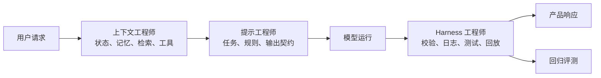

# 中文 · 提示工程师、上下文工程师与 Harness 工程师

**日期：** May 20, 2026
**作者：** Xing @ [XingAI](https://xingai.app)
**项目：** XingAI Platform
**标签：** `ai-engineering` `prompt-engineering` `context-engineering` `harness-engineering` `llm-systems`
**语言：** [English](2026-05-20-prompt-context-harness-engineering.md) · 中文

---


## 职位在变，因为工作在变

2023 年很多 AI 工程像「写提示词」：调 system prompt、加 few-shot，让模型答得更好。这技能仍重要；但一旦 AI 变成产品，难点很少是提示词里那几句话，而是周围一切：

- 模型该看到哪些用户状态？
- 哪些数据库行可以进上下文？
- 允许哪些 tool call？
- 坏答案如何回放？
- 模型升级有没有悄悄弄坏工作流？

因此我区分三个角色：**提示工程师**塑指令；**上下文工程师**塑信息环境；**Harness 工程师**塑执行与评测系统。有重叠，不是同一工种。

## 速览

| 角色 | 核心问题 | 主要产物 | 典型失败 |
|------|----------|----------|----------|
| 提示工程师 | 模型该怎么想、怎么答？ | System prompt、样例、输出 schema | 误解任务 |
| 上下文工程师 | 模型此刻该知道什么？ | 检索、记忆、状态打包、工具上下文 | 看到错误事实 |
| Harness 工程师 | 如何可重复地跑、测、信任？ | Eval、回放日志、工具沙箱、CI | 无法调试、不敢上线 |

Demo 可以只靠提示；真产品需要三者。

## 提示工程：指令层

定义角色边界、任务分解、输出格式、语气、好坏样例、拒绝/升级行为。例如投资助手：

```text
你是投资研究助手。用白话总结最新市场结构。
不要给个性化投资建议。
返回 JSON：direction, confidence, risks, rationale。
```

有用，但没回答生产关键问题：**模型该用哪份证据？** 若 prompt 写「最新市场」却喂陈旧、重复、缺持仓、无时间戳的数据，措辞再好也救不了。提示工程优化的是**给定上下文内的行为**，不保证上下文正确。

## 上下文工程：信息层

决定什么进入模型窗口：向量/SQL/缓存/API/文件检索、记忆选取、用户画像打包、工具结果摘要、token 预算、新鲜度标签、冲突处理、来源优先级、脱敏过滤。

上下文工程师问：要原始数据还是摘要？哪些字段服务本次决策？够新吗？无关上下文是否在挤掉信号？

在 XingAI：**Invest AI** 不该收到随机 ticker 堆，而要结构化决策上下文（宏观雷达、引擎票、风险预算、新鲜度元数据）。**Meal Coach** 不该永久塞满历史餐次，而要当前图、目标、约束、份量不确定性与近期模式摘要。**Travel AI** 需要日期、预算、天气、约束、风格、收藏点与权衡 — 不是一句「规划行程」。

Prompt 可以说「要有帮助」；上下文工程决定是不是**用对事实**有帮助。

## Harness 工程：执行层

最不炫，往往决定能不能 ship：请求构建、工具路由、沙箱权限、JSON schema 校验、重试/fallback、快照回放、评测集、回归测试、成本延迟追踪、红队、部署前 CI。

没有 harness，每个 AI bug 都是传说：「昨天答案怪，复现不了。」有了 harness，bug 是工件：`输入快照 + prompt 版本 + 模型版本 + 工具输出 + 期望行为`。这是「玩 AI」和「运营 AI 产品」的分水岭。

## 投资决策例子（三层各看什么）

- **提示**：分析市场数据，返回 BUY/HOLD/REDUCE 与三条理由 — 有用但不完整  
- **上下文**：打包 `as_of`、regime、macro_radar、engine_votes、top_signals、freshness — 模型才有正确世界状态  
- **Harness**：fixture 期望不无视宏观风险上限、符合 schema、无个性化建议措辞、缓存路径 <2s — 才可测

Prompt 让模型回答；上下文让回答有根据；Harness 让行为可重复。

## 为何「上下文工程师」成岗

LLM 对所见极敏感；同 prompt 不同上下文可相反。坏上下文像模型问题：缺源幻觉、未标陈旧却自信、缺用户状态而泛化、检索块矛盾、塞全文而贵。加「别幻觉」往往不如结构修复：时间戳、来源排序、去重、压缩旧上下文、事实与指令分离、显式 unknown、UI 也显示新鲜度。

## 为何「Harness 工程师」成岗

AI 产品常「看起来成功」地失败 — 流利 JSON、自信但 subtly 错。需要 golden fixture、schema 门、工具沙箱、回放日志（prompt_version、context_snapshot_id、model、tool_outputs、latency、cost）、改 prompt/上下文/模型前的回归 eval。目标不是确定性，而是**变更可观测**。

## 一条工作流里的分工



小团队可一人三包，但心智模型不同：指令质量 / 信息质量 / 运营质量。

## 排障：哪一层坏了？

| 现象 | 可能层 | 方向 |
|------|--------|------|
| 输出格式乱 | 提示 / Harness | 收紧 schema、校验 |
| 忽略用户偏好 | 上下文 | 打包偏好 |
| 用旧数据 | 上下文 / Harness | 新鲜度标签 + stale 测试 |
| 工具参数错 | 提示 / Harness | 工具说明 + 参数校验 |
| 换模型后变差 | Harness | 升级前回归 |
| 建议很泛 | 上下文 | 检索更具体证据 |
| 冗长跑调 | 提示 | 风格规则与样例 |
| 无法复现 | Harness | 记 prompt、上下文、工具、模型版本 |

## 对建设者的含义

别停在写 prompt。路线图：先提示定行为 → 要真实状态/数据/工具时加上下文 → 生产信任前加 harness。周末原型好 prompt 可能够；人要依赖的产品需要 prompt 契约、上下文契约、执行契约、评测契约 — 这才是完整栈。

## 一句话

「提示工程师」是我们给新工种的第一名字；更深的是整环：

```text
instructions + context + tools + validation + replay + evaluation
```

提示告诉模型做什么；上下文给对的世界；Harness 让系统够安全可以 ship。能三者兼修的团队会赢。

---

*Part of the [XingAI Tech Blog](https://github.com/xingaiapp/xingai-tech-blog). We build focused AI decision systems for everyday life.*

**Links:** [XingAI](https://xingai.app) · [GitHub](https://github.com/xingaiapp) · [LinkedIn](https://www.linkedin.com/in/xingaiapp/) · [X/Twitter](https://x.com/XingAIApp)
