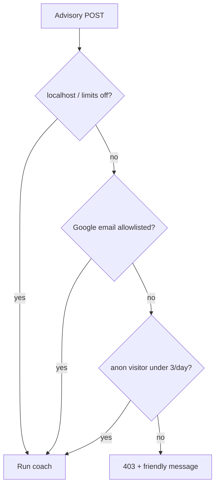

# Opening T Today to Guests — Three Free AI Runs, No Login Wall

**Date:** May 30, 2026  
**Author:** Xing @ [XingAI](https://xingai.app)  
**Project:** [T Today / invest-t-advisor](https://t.xingai.app) (`t.xingai.app`)  
**Tags:** `nextjs` `openai` `rate-limiting` `auth` `product` `paper-trading` `adr`  
**Languages:** English · [中文 ↓](#中文)

---

## What we were getting wrong

[T Today](https://t.xingai.app) is the screenshot-first coach: upload brokerage holdings, get a **做T** plan with buy zones and rule checks. It’s paper-only — no orders.

We had middleware set so production visitors hit **Google sign-in before the homepage**. That’s fine for a private admin tool. It’s wrong for “try it once with a photo.”

We still needed a **cost ceiling**. One OpenAI vision + JSON advisory call is real money at scale. Invest AI already solved anonymous limits with a client id and SQLite meter ([*Capping Free-Tier AI Calls*](./2026-05-13-free-tier-ai-rate-limits.md)). T Today needed the same idea in **Next.js + Prisma**, without blocking `localhost`.

## What we shipped

### Public paths, optional login

These routes work **without** a session:

- Homepage `/`, Position Planner, Chart, Trader OS, legal pages
- `POST /api/risk-lab/advisory` (limits enforced inside the handler, not at the door)

Google sign-in stays for **allowlisted emails**, higher daily caps, and saved thread history (50 vs 10).

### Guest quota

| Setting | Default |
|---------|---------|
| `T_GUEST_AI_LIMIT` | 3 analyses per US session day |
| Identifier | `X-T-Visitor-Id` (UUID in `localStorage`) |
| Storage | `RiskLabAnonAiUsage` in Turso/SQLite |

Signed-in allowlist users keep `T_DAILY_AI_LIMIT` (default 5) on `RiskLabAiUsage`. `T_UNLIMITED_EMAILS` bypasses the cap.

### Local dev bypass

`T_AUTH_MODE=auto` (default):

- **Production host** — guest limits on, homepage open
- **`localhost`** — no login required, **no** guest counter, full rule-engine panel without sign-in

`aiLimitsEnforcedForHost()` mirrors `authRequiredForHost()`. When limits are off, we don’t increment usage rows — so you’re not burning your three free tries while iterating.

## UX split we kept on purpose

**Zone A (free):** AI structured output — summary, `tDecision`, buy/sell tables from screenshot zones.

**Zone B (sign-in on prod):** Full rule-engine panel — traffic lights, binding flatten/raise-cash actions merged with AI.

On localhost, zone B shows for guests too so we can test the merge without OAuth dance.

## Deploy note

New table `RiskLabAnonAiUsage`. Run `npx prisma db push` (or your migration flow) on production after deploy.

## Takeaway

“Open homepage” and “cap OpenAI spend” aren’t opposites. **Public routes + visitor id + dev bypass** gives try-before-login without handing everyone unlimited vision calls.

**Further reading:** [invest-t-advisor ADR-0003](https://github.com/xingaiapp/invest-t-advisor/blob/main/docs/adr/0003-guest-access-and-ai-quotas.md), [AUTH.md](https://github.com/xingaiapp/invest-t-advisor/blob/main/docs/AUTH.md).

---

# 中文 · 访客开放首页：每日 3 次免费 AI，无需先登录

**语言：** [English ↑](#opening-t-today-to-guests--three-free-ai-runs-no-login-wall) · 中文

---

## 之前哪里不对

[T Today](https://t.xingai.app) 的核心路径是：上传券商持仓截图 → 拿到**做T**计划（买卖区间 + 规则检查）。纯纸面，不下单。

生产环境中间件曾把未登录用户直接挡在**登录页**，进不了首页。内部小工具可以这么干；「先传一张图试试」就不行。

OpenAI 视觉 + JSON 每次调用都有成本。Invest AI 已经用浏览器 client id + SQLite 计数做过匿名限额（见 [*Capping Free-Tier AI Calls*](./2026-05-13-free-tier-ai-rate-limits.md)）。T Today 要在 **Next.js + Prisma** 里做同样的事，但不能把 `localhost` 开发体验搞死。

## 我们上了什么

### 公开路由，登录可选

以下路径**不需要** Google 会话：

- 首页 `/`、仓位计划器、技术信号、Trader OS、法律页
- `POST /api/risk-lab/advisory`（限额在接口里判，不在门口拦）

登录仍用于：邮箱白名单、更高每日额度、更多聊天历史（50 条 vs 访客 10 条）。

### 访客额度

| 配置 | 默认 |
|------|------|
| `T_GUEST_AI_LIMIT` | 每个美东交易日 3 次分析 |
| 标识 | `X-T-Visitor-Id`（`localStorage` 里的 UUID） |
| 存储 | Turso/SQLite 表 `RiskLabAnonAiUsage` |

已登录白名单用户仍走 `T_DAILY_AI_LIMIT`（默认 5），`T_UNLIMITED_EMAILS` 不限次。

### 本地开发豁免

`T_AUTH_MODE=auto`（默认）时：

- **生产域名** — 开放首页 + 访客 3 次限额
- **`localhost`** — 无需登录、**不计**访客次数，未登录也能看完整规则引擎面板

`aiLimitsEnforcedForHost()` 与 `authRequiredForHost()` 一致；限额关闭时不写 usage 表，本地调试不会烧掉三次免费额度。

## 产品上的两层 UX（故意保留）

**A 区（免费）：** AI 结构化结果 — 摘要、`tDecision`、买卖表（来自截图区间）。

**B 区（生产需登录）：** 完整规则引擎 — 状态灯、强制减仓/腾现金等与 AI 合并后的动作列表。

本地开发时 B 区也对访客开放，方便不测 OAuth 就验证合并逻辑。

## 部署注意

新增表 `RiskLabAnonAiUsage`。上线后跑 `npx prisma db push`（或你们的迁移流程）。

## 一句话

「首页开放」和「控制 OpenAI 花费」不矛盾：**公开路由 + 访客 ID + 本地豁免**，让人先试再用，又不会在产线无限跑视觉模型。

**延伸阅读：** [ADR-0003](https://github.com/xingaiapp/invest-t-advisor/blob/main/docs/adr/0003-guest-access-and-ai-quotas.md)、[AUTH.md](https://github.com/xingaiapp/invest-t-advisor/blob/main/docs/AUTH.md)。
