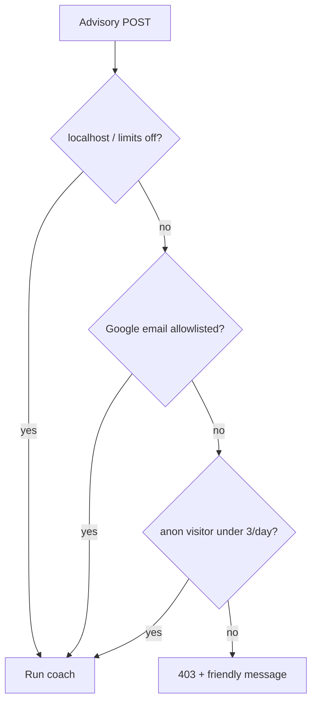

# Opening T Today to Guests — Three Free AI Runs, No Login Wall

**Date:** May 30, 2026  
**Author:** Xing @ [XingAI](https://xingai.app)  
**Project:** [T Today / invest-t-advisor](https://t.xingai.app) (`t.xingai.app`)  
**Tags:** `nextjs` `openai` `rate-limiting` `auth` `product` `paper-trading` `adr`  
**Also available:** [中文](2026-05-30-t-today-guest-access-and-ai-quotas.zh.md)
---

## What we were getting wrong

[T Today](https://t.xingai.app) is the screenshot-first coach: upload brokerage holdings, get a **做T** plan with buy zones and rule checks. It’s paper-only — no orders.

We had middleware set so production visitors hit **Google sign-in before the homepage**. That’s fine for a private admin tool. It’s wrong for “try it once with a photo.”

We still needed a **cost ceiling**. One OpenAI vision + JSON advisory call is real money at scale. Invest AI already solved anonymous limits with a client id and SQLite meter ([*Capping Free-Tier AI Calls*](./2026-05-13-free-tier-ai-rate-limits.md)). T Today needed the same idea in **Next.js + Prisma**, without blocking `localhost`.

## What we shipped

### Public paths, optional login

These routes work **without** a session:

- Homepage `/`, Position Planner, Chart, Trader OS, legal pages
- `POST /api/risk-lab/advisory` (limits enforced inside the handler, not at the door)

Google sign-in stays for **allowlisted emails**, higher daily caps, and saved thread history (50 vs 10).

### Guest quota

| Setting | Default |
|---------|---------|
| `T_GUEST_AI_LIMIT` | 3 analyses per US session day |
| Identifier | `X-T-Visitor-Id` (UUID in `localStorage`) |
| Storage | `RiskLabAnonAiUsage` in Turso/SQLite |

Signed-in allowlist users keep `T_DAILY_AI_LIMIT` (default 5) on `RiskLabAiUsage`. `T_UNLIMITED_EMAILS` bypasses the cap.

### Local dev bypass

`T_AUTH_MODE=auto` (default):

- **Production host** — guest limits on, homepage open
- **`localhost`** — no login required, **no** guest counter, full rule-engine panel without sign-in

`aiLimitsEnforcedForHost()` mirrors `authRequiredForHost()`. When limits are off, we don’t increment usage rows — so you’re not burning your three free tries while iterating.

## UX split we kept on purpose

**Zone A (free):** AI structured output — summary, `tDecision`, buy/sell tables from screenshot zones.

**Zone B (sign-in on prod):** Full rule-engine panel — traffic lights, binding flatten/raise-cash actions merged with AI.

On localhost, zone B shows for guests too so we can test the merge without OAuth dance.

## Deploy note

New table `RiskLabAnonAiUsage`. Run `npx prisma db push` (or your migration flow) on production after deploy.

## Takeaway

“Open homepage” and “cap OpenAI spend” aren’t opposites. **Public routes + visitor id + dev bypass** gives try-before-login without handing everyone unlimited vision calls.

**Further reading:** [invest-t-advisor ADR-0003](https://github.com/xingaiapp/invest-t-advisor/blob/main/docs/adr/0003-guest-access-and-ai-quotas.md), [AUTH.md](https://github.com/xingaiapp/invest-t-advisor/blob/main/docs/AUTH.md).
