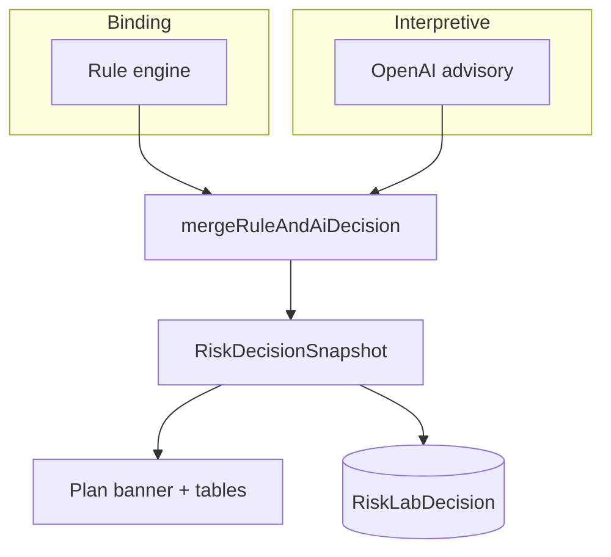

# Rules First, AI Second: T Today’s Two-Layer Decision Engine

**Date:** May 30, 2026  
**Author:** Xing @ [XingAI](https://xingai.app)  
**Project:** [T Today / invest-t-advisor](https://t.xingai.app)  
**Tags:** `architecture` `decision-system` `openai` `paper-trading` `nextjs` `adr`  
**Also available:** [中文](2026-05-30-t-today-risk-decision-engine.zh.md)
---

## The product shape

T Today (`t.xingai.app`) answers a narrow question:

> Given my **screenshot** and our **defensive 做T rules**, what should I watch today — and what does the paper lab say I must fix first?

That’s a **decision system**, not a chatbot. Invest AI’s flagship answers macro and signal questions on a worker-owned cache. T Today owns **overnight base + intraday T structure** in its own repo — same UX discipline, different domain.

## Two layers

| Layer | Code | Job |
|-------|------|-----|
| **Rules** | `src/lib/risk-control/*` | Deterministic: base ≤200 sh/symbol, cash ≥60%, T stop −1.5%, flatten orders, traffic lights |
| **AI** | `advisory-llm.ts` | Vision + bilingual JSON: holdings extract, `tDecision` zones, narrative |
| **Merge** | `risk-decision-engine/*` | `prioritizedActions`: rule rows first, then AI |

**Rules win** on hard constraints. The model can suggest T entries and copy — it cannot mark overnight structure “ok” when rules say otherwise.

## Screenshot path matters

On image upload we **do not** inject stale demo portfolio into the vision prompt. The screenshot is source of truth. After extract, we sync holdings and **re-merge** the decision so rule lights match the new positions.

That’s the difference between a demo and something you might actually trust for paper practice.

## What we don’t do

- Recompute rankings or macro state in the Next.js API (that’s Invest AI worker territory).
- Send broker orders.
- Cache-bust with a fake “refresh” that silently changes investment meaning on the client.

## Related posts

- [Opening T Today to Guests](./2026-05-30-t-today-guest-access-and-ai-quotas.md) — who can call the engine without login  
- [Bilingual JSON postmortem](./2026-05-30-t-today-bilingual-advisory-json.md) — AI output shape  
- [Three-Layer AI Architecture](./2026-05-12-three-layer-ai-architecture.md) — flagship Invest AI pattern  

**ADR:** [0004](https://github.com/xingaiapp/invest-t-advisor/blob/main/docs/adr/0004-risk-decision-engine-layers.md)
