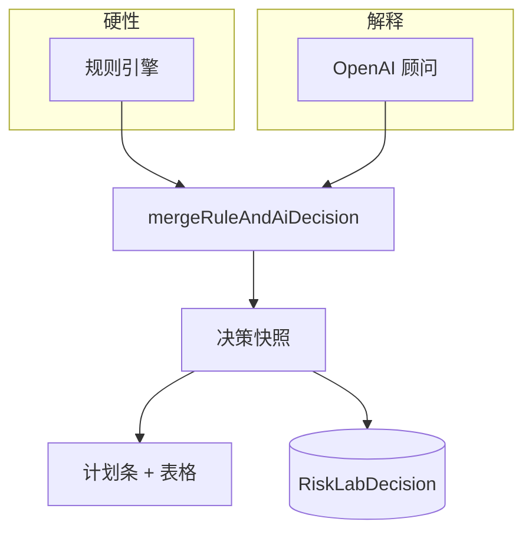

# 中文 · 规则先行、AI 其次：T Today 双层决策引擎

**日期：** May 30, 2026
**作者：** Xing @ [XingAI](https://xingai.app)
**项目：** [T Today / invest-t-advisor](https://t.xingai.app)
**标签：** `architecture` `decision-system` `openai` `paper-trading` `nextjs` `adr`
**语言：** [English](2026-05-30-t-today-risk-decision-engine.md) · 中文

---

## 产品形态

T Today（`t.xingai.app`）只回答一个窄问题：

> 根据**持仓截图**和我们的**防守型做T规则**，今天该盯什么 — 纸面实验室里**必须先修什么**？

这是**决策系统**，不是开放式聊天。Invest AI 旗舰回答宏观与信号（worker 写缓存）。T Today 在本仓库管**过夜底仓 + 日内做T结构** — UX 同一套「决策感」，领域不同。

## 两层

| 层 | 代码 | 职责 |
|----|------|------|
| **规则** | `src/lib/risk-control/*` | 确定性：单标的底仓 ≤200 股、现金 ≥60%、T 止损 −1.5%、一键回底仓、状态灯 |
| **AI** | `advisory-llm.ts` | 视觉 + 双语 JSON：提取持仓、`tDecision` 区间、叙述 |
| **合并** | `risk-decision-engine/*` | `prioritizedActions`：规则动作在前，AI 在后 |

**硬约束规则说了算。** 模型可以建议做T标的和文案 — 规则已判 `critical` 时，不能把过夜结构标成「没问题」。

## 截图路径很关键

上传图片时**不把**演示用旧持仓塞进视觉提示。截图即真相。提取后同步持仓，**再合并**决策，状态灯才和新仓位一致。

演示和「纸面练习里还能信一点」的差别就在这里。

## 我们不做的事

- 在 Next.js API 里重算宏观排名（那是 Invest AI worker 的事）。
- 向券商下单。
- 客户端「刷新」时偷偷改投资含义。

## 相关文章

- [访客开放首页](2026-05-30-t-today-guest-access-and-ai-quotas.zh.md) — 谁可以不登录调用引擎  
- [双语 JSON 复盘](2026-05-30-t-today-bilingual-advisory-json.zh.md) — AI 输出形状  
- [三层 AI 架构](2026-05-12-three-layer-ai-architecture.zh.md) — 旗舰 Invest AI 模式  

**ADR：** [0004](https://github.com/xingaiapp/invest-t-advisor/blob/main/docs/adr/0004-risk-decision-engine-layers.md)
