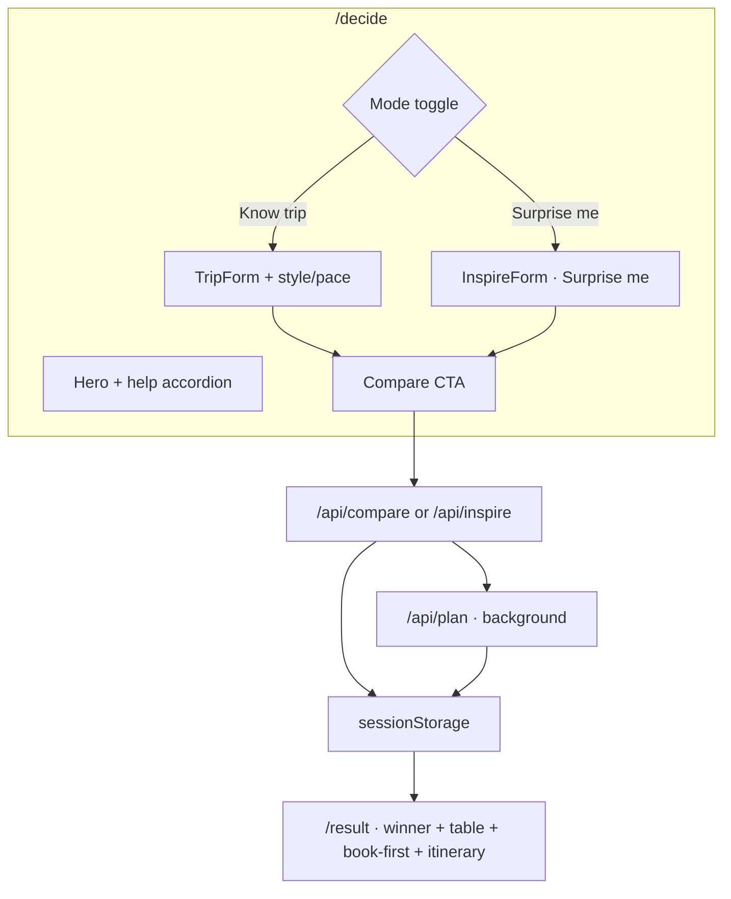

# Travel AI as a Decision System: Compare First, Book Second

**Date:** May 31, 2026  
**Author:** Xing @ [XingAI](https://xingai.app)  
**Project:** [XingAI Travel AI](https://travel.xingai.app) — `xingai-travel-ai`  
**Tags:** `travel` `decision-system` `nextjs` `openai` `mobile-first` `affiliate` `hydration`  
**Also available:** [中文](2026-05-31-travel-compare-first-decision-system.zh.md)

---

## The problem we refused to solve

Most travel sites answer: *“Here are 400 flights.”*

Our user is stuck earlier: *“Should I even go to Lisbon — really?”*

Booking inventory is a solved UX pattern. **Destination choice under real constraints** is not. XingAI Travel AI (`travel.xingai.app`) is built for that moment — same decision-system instinct as Meal Coach and Invest AI, applied to trips.

Product shorthand: **compare first, plan second.** Not another OTA wall.

## What shipped in the app

### Three API routes, one JSON contract

We use OpenAI Chat Completions with `response_format: { type: "json_object" }`:

| Route | When | Output |
|-------|------|--------|
| `/api/compare` | User has trip constraints | `CompareResult` — 3 cities, 1 winner |
| `/api/inspire` | “Surprise me” mode | Same shape, model picks candidates |
| `/api/plan` | After compare succeeds | `PlanResult` — book-first + days + warnings |

No API key? Routes return Lisbon demo data from `lib/mock-data.ts`. Local dev and design review never block on keys.

Production demo cap: **3 compare/inspire calls per IP per day** (`TRAVEL_DEMO_DAILY_LIMIT`). Plan does not double-charge the limit — it rides along after compare.

Prompts live in `lib/prompts.ts`. Response language follows `locale` (`en`, `zh`, `ko`, `es`).

## UX decisions that matter

### Headline voice: “I”, not “you”

Hero copy: **“Where should I go — really?”**

The doubt is internal. It matches **“Start with my trip”** and **“I know where I want to go.”** Advisor-voice “you” felt like marketing; first-person reads like the user’s own question.

### Surprise me is optional, not default

Gold-accent tab + legal banner when inspire mode is on. Same result components — we did not fork `/result`. AI suggestions are labeled; user still sees a comparison table and trade-offs.

### Column tap = photo preview only

On the compare table, tapping a city column swaps the hero photo. **Winner copy, confidence, and book-first stay on the top pick.** Users explore alternatives visually without pretending the recommendation changed.

### Book-first is where affiliate lives

Monetization rule: **decision quality first, affiliate after.**

`lib/affiliate.ts` builds Skyscanner / Booking / Expedia / Viator / GetYourGuide URLs with optional partner IDs. Links only render in `BookFirst` on `/result`, with `rel="sponsored nofollow"`. Compare prompts never mention partners.

See [ADR 0004](https://github.com/xingaiapp/xingai-travel-ai/blob/main/docs/adr/0004-affiliate-after-decision.md).

## React 19 + Next.js 16: hydration we hit twice

Session-backed UI is convenient until SSR.

**Bug class:** `useState(() => readSessionStorage())` — server renders defaults, client first paint reads storage → mismatch. We saw it on the sidebar “Continue your last trip” card (`
` vs `<Link>`).

**Fix:**

1. Stable SSR defaults (`null`, `defaultTrip`, `"en"`, `"light"`).
2. Load storage in `useEffect` after mount.
3. Gate persistence effects with a `ready` flag so mount does not overwrite stored values.

Theme: dropped `next-themes` inline `<script>` (React 19 warns and will not execute scripts in the component tree). Custom `ThemeProvider` + `<html class="light">` default. Brief dark-mode flash beats console errors.

JSON-LD moved to `next/script` (`afterInteractive`) instead of raw `<script>` in JSX.

Full write-up: [ADR 0003](https://github.com/xingaiapp/xingai-travel-ai/blob/main/docs/adr/0003-session-storage-client-state.md).

## Mobile chrome

Same foundation contract as other XingAI apps:

- Sticky top bar · hamburger drawer · fixed bottom nav (primary routes)
- Collapsible desktop sidebar with logo mark; brand text in header
- LEGAL + Help accordions pinned to bottom of mobile drawer (default closed)
- Locale + theme reachable on mobile without opening the drawer

Sky-blue primary (`#2563eb`), oklch tokens in `globals.css`, hero photo with brighter dark-mode treatment.

## What we deliberately did not build (V1)

- User accounts or saved trips DB
- Live fare scraping
- Shareable `/result` URLs (session-only; excluded from sitemap)
- Chat UI

`/llms.txt`, FAQ JSON-LD, and product principles doc tell crawlers and partners what we *are*.

## Files worth reading

| Path | Why |
|------|-----|
| `components/decide-page.tsx` | Mode toggle, compare flow, plan prefetch |
| `components/destination-compare.tsx` | Winner + column preview |
| `components/book-first.tsx` | Affiliate boundary in UI |
| `lib/prompts.ts` | Structured AI contracts |
| `docs/adr/` | [Bilingual ADRs 0001–0005](https://github.com/xingaiapp/xingai-travel-ai/tree/main/docs/adr) |
| `docs/PRODUCT-PRINCIPLES.md` | Monetization rules |

## Next likely steps

1. Cookie-backed theme/locale for zero-flash SSR
2. KV-backed rate limits + affiliate click analytics
3. Saved trips (requires auth + DB — only after compare flow proves retention)
4. Stricter JSON schema validation on model output

---

**Repo:** `xingai-travel-ai` · **Domain:** [travel.xingai.app](https://travel.xingai.app)
