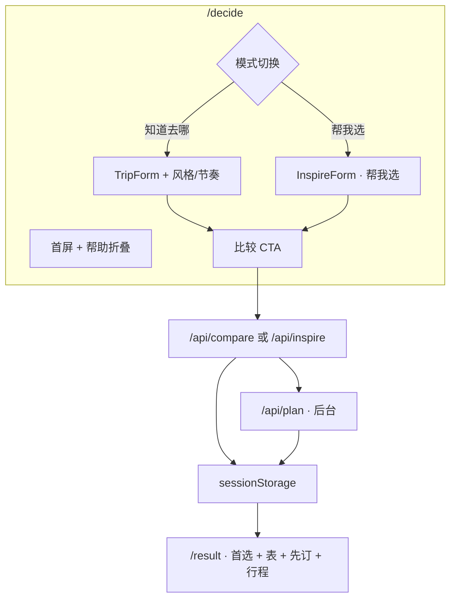

# Travel AI 做成决策系统：先比较，再预订

**日期：** 2026年5月31日  
**作者：** Xing @ [XingAI](https://xingai.app)  
**项目：** [XingAI Travel AI](https://travel.xingai.app) — `xingai-travel-ai`  
**标签：** `travel` `decision-system` `nextjs` `openai` `mobile-first` `affiliate` `hydration`  
**语言：** [English](2026-05-31-travel-compare-first-decision-system.md) · 中文

---

## 我们刻意不解决的问题

多数旅行站回答的是：*「这里有 400 个航班。」*

用户卡在更前面：*「里斯本值得去吗 — 真的值得吗？」*

订库存是成熟 UX。**在真实约束下选目的地** 并没有被做好。XingAI Travel AI（`travel.xingai.app`）服务的就是这个瞬间 — 和 Meal Coach、Invest AI 同一套决策直觉，用在出行上。

产品一句话：**先比较，再规划。** 不是又一个 OTA 墙。

## 应用里实际上了什么

### 三个 API、一套 JSON 契约

OpenAI Chat Completions + `response_format: { type: "json_object" }`：

| 路由 | 时机 | 输出 |
|------|------|------|
| `/api/compare` | 用户填了行程约束 | `CompareResult` — 3 城、1 首选 |
| `/api/inspire` | 「帮我选」模式 | 同结构，由模型提候选 |
| `/api/plan` | compare 成功后 | `PlanResult` — 先订 + 每日 + 警告 |

没有 API Key？路由返回 `lib/mock-data.ts` 里斯本 demo。本地开发和设计验收不依赖 Key。

生产 demo 上限：**每 IP 每天 3 次 compare/inspire**（`TRAVEL_DEMO_DAILY_LIMIT`）。plan 不重复扣配额 — 跟在 compare 后面跑。

Prompt 在 `lib/prompts.ts`；回复语言跟 payload 里的 `locale`（`en`、`zh`、`ko`、`es`）。

## 几个关键的 UX 选择

### 标题用「我」，不用「你」

首屏：**「这次到底该去哪？」**（英文：*Where should I go — really?*）

疑问发生在用户心里。和 **「开始规划我的行程」**、**「我知道想去哪」** 同一人称。第二人称「你」像广告；第一人称像用户自己在问。

### 「帮我选」可选，且非默认

Surprise 标签页金色强调 + inspire 模式下的法律条。结果仍走同一套组件 — 没有单独 fork `/result`。AI 建议是建议；用户仍看到对比表和 trade-off。

### 点列头只换照片

对比表里点城市列，hero 图换成该城。**首选文案、置信度、先订清单仍以 top pick 为准。** 用户能视觉浏览备选，不会误以为推荐改了。

### 联盟链接只在「先订」

变现规则：**决策质量优先，联盟事后。**

`lib/affiliate.ts` 拼 Skyscanner / Booking / Expedia / Viator / GetYourGuide 链接，合作 ID 可选。链接只在 `/result` 的 `BookFirst` 出现，`rel="sponsored nofollow"`。compare 的 prompt 不出现任何平台名。

见 [ADR 0004](https://github.com/xingaiapp/xingai-travel-ai/blob/main/docs/adr/0004-affiliate-after-decision.zh.md)。

## React 19 + Next.js 16：hydration 踩了两次坑

Session  UI 省事，直到遇上 SSR。

**典型 bug：** `useState(() => readSessionStorage())` — 服务端出默认态，客户端首帧读 storage → 不一致。侧栏「继续上次行程」曾出现 server 渲染 `
`、client 渲染 `<Link>`。

**修法：**

1. SSR 用稳定默认值（`null`、`defaultTrip`、`"en"`、`"light"`）。
2. mount 后在 `useEffect` 读 storage。
3. 持久化 effect 用 `ready` 门闩，避免 mount 时用默认值覆盖已存数据。

主题：去掉 `next-themes` 内联 `<script>`（React 19 报警且不在组件树里执行）。自定义 `ThemeProvider` + SSR 默认 `<html class="light">`。暗色模式闪一下，好过控制台红字。

JSON-LD 改用 `next/script`（`afterInteractive`），不再在 JSX 里写裸 `<script>`。

详见 [ADR 0003](https://github.com/xingaiapp/xingai-travel-ai/blob/main/docs/adr/0003-session-storage-client-state.zh.md)。

## 移动壳层

与其他 XingAI 产品同一套 foundation：

- 顶栏 sticky · 汉堡抽屉 · 底栏固定（主路由）
- 桌面可折叠侧栏 + logo；品牌字在顶栏
- 移动抽屉底部 LEGAL + Help 手风琴（默认收起）
- 语言/主题在移动顶栏可达，不必先开抽屉

主色天蓝（`#2563eb`），`globals.css` oklch token；暗色 hero 照片略提亮。

## V1 故意没做的

- 账号与行程数据库
- 实时票价抓取
- 可分享的 `/result` URL（仅 session；sitemap 排除）
- 对话式 chat

`/llms.txt`、FAQ JSON-LD、产品原则文档向爬虫和合作方说明我们**是什么**。

## 建议先读的代码

| 路径 | 原因 |
|------|------|
| `components/decide-page.tsx` | 模式切换、compare 流、plan 预取 |
| `components/destination-compare.tsx` | 首选 + 列预览 |
| `components/book-first.tsx` | 联盟边界在 UI 层的落点 |
| `lib/prompts.ts` | 结构化 AI 契约 |
| `docs/adr/` | [双语 ADR 0001–0005](https://github.com/xingaiapp/xingai-travel-ai/tree/main/docs/adr) |
| `docs/PRODUCT-PRINCIPLES.md` | 变现规则 |

## 下一步可能做什么

1. Cookie 承载 theme/locale，去掉 SSR 闪烁
2. KV 限流 + 联盟点击统计
3. 保存行程（要 auth + DB — 等 compare 流证明留存）
4. 模型输出更严格的 JSON schema 校验

---

**仓库：** `xingai-travel-ai` · **域名：** [travel.xingai.app](https://travel.xingai.app)
