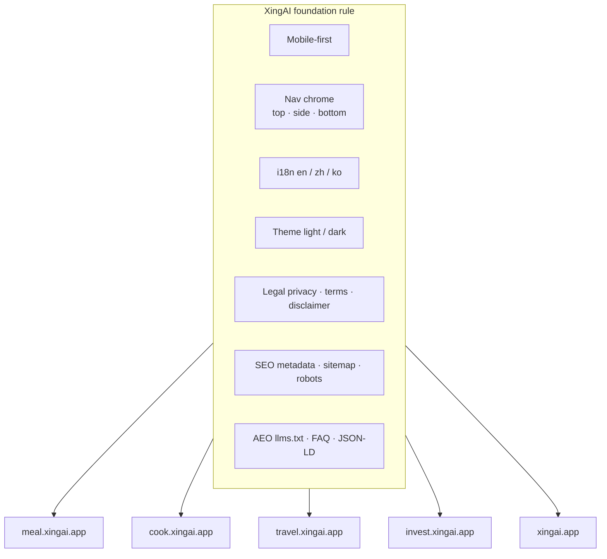

# One Foundation Rule for Every XingAI Product: Mobile Chrome, i18n, Legal, SEO, and AEO

**Date:** May 31, 2026  
**Author:** Xing @ [XingAI](https://xingai.app)  
**Project:** [XingAI Platform](https://xingai.app) — Meal, Cook, Travel, Invest, and the rest  
**Tags:** `platform` `mobile-first` `i18n` `seo` `aeo` `legal` `cursor` `product-engineering`  
**Also available:** [中文](2026-05-31-xingai-foundation-mobile-i18n-seo-aeo.zh.md)

---

## The problem

We ship more than one app. Meal Coach, Cook AI, Travel AI, Invest AI, the marketing site at xingai.app — each repo had its own habits for navigation, languages, themes, and legal footers.

That worked until it didn’t. A Travel UX mock inherited Routine copy. A product shipped with English-only error strings. Another had a beautiful desktop layout and a broken bottom nav on iPhone. SEO metadata lived in one repo’s checklist but not in the agent’s head when opening a different folder.

We needed a **shared floor**, not another one-off doc buried in a single project.

## What we shipped

A workspace-level Cursor rule: **`.cursor/rules/xingai-foundation.mdc`** (`alwaysApply: true`), referenced from root `AGENTS.md`.

It is the minimum bar before any `*.xingai.app` surface counts as “shipped.” Product-specific rules still apply — Invest AI keeps its decision-cache boundary; the marketing site keeps `docs/marketing-site-standards.md`. The foundation rule does not replace those; it connects them.

## Mobile-first is not a breakpoint tweak

The rule says: design for **320–430px usable width first**, then add `sm:` / `lg:`. Not the reverse.

Concrete requirements:

- Touch targets **≥ 44×44 CSS px**
- `env(safe-area-inset-*)` on fixed chrome and main content padding
- Single-column layouts by default; dense comparison tables need scroll or folds on phone
- Decision content before decorative chrome in DOM order

We explicitly ban fake iOS status bars in the DOM. Users already have a real one.

## One navigation pattern, many products

Labels change per product (`Decide`, `Scan`, `Today`). The **chrome shape** does not.

| Surface | Mobile | Desktop |
|---------|--------|---------|
| **Top bar** | Sticky: menu · title · language + theme | Same controls reachable |
| **Side menu** | Drawer from hamburger | Same drawer or persistent sidebar — pick one per repo and keep it |
| **Bottom bar** | Fixed tabs for primary destinations | **No** bottom tab bar |
| **Footer links** | Privacy, Terms, Disclaimer in drawer and/or page footer | Same legal links |

Two rules we learned the hard way:

1. **Do not hide language or theme on mobile** unless the drawer repeats them.
2. **Do not ship empty nav routes** — mark future tabs `Soon` with a toast instead.

Cook and Meal use `MobileChrome`: top + sheet + bottom nav on small screens. The marketing site uses `Header`, `MobileNavDrawer`, and `MobileBottomNav`. Different components, same contract.

Internal version labels (`V1`, `V2`) stay out of user-facing UI. Users should not relearn the product every release.

## Three languages before “done”

Required locales: **`en`**, **`zh`** (中文), **`ko`** (한국어).

- UI strings go through the repo i18n layer — `translations.ts`, `messages.js`, locale providers — not hard-coded JSX.
- Persist locale (`localStorage`, cookie, or both); apply before paint when you can (`i18n-boot.js` in static UX mocks).
- **Marketing site:** locale lives in the **URL** (`/`, `/zh/…`, `/ko/…`). The switcher changes path, not cookie-only. `hreflang` and per-locale canonicals are mandatory.
- **Product apps:** locale drives UI **and** AI output language on API routes.
- **Legal pages:** all three locales before legal is “done.”

A fourth locale (e.g. Spanish in Travel UX experiments) is optional — it never replaces the trio above.

## Light and dark are not optional polish

Every public surface supports **light** and **dark**:

- `<html data-theme="…">` for static mocks; `next-themes` for Next.js apps
- No theme flash on load
- `theme-color` meta updates with theme
- Marketing demos that depend on theme ship **light + dark** screenshot pairs (`ThemedImage` on dot-app)
- Product colors from **oklch tokens** in repo CSS — not `#3b82f6` because it looked fine in a screenshot

## Legal: three pages, everywhere

Public `*.xingai.app` products link to (or host):

| Page | Slug |
|------|------|
| Privacy Policy | `/legal/privacy` |
| Terms of Service | `/legal/terms` |
| Disclaimer | `/legal/disclaimer` |

Footers must expose all three. Lifestyle and travel products add **suggestions only; verify before booking**. Invest adds risk-first language — see the [five-layer disclaimer post](2026-05-13-legal-disclaimers-five-layers.md) for finance-specific depth.

The foundation rule is the **floor**. Invest still stacks modals, inline badges, and API disclaimer fields on top.

## SEO: ship metadata, not hope

Before a route is “live”:

- `metadataBase`, unique title and description
- Canonical URL (locale-aware on xingai.app)
- Open Graph + Twitter cards — product screenshot or branded OG, not favicon alone
- `sitemap.xml`, `robots.txt` with `Sitemap:` directive
- `<html lang>` matches active locale
- Internal links respect locale (`/zh/apps`, not `/apps` when browsing Chinese)

Marketing deploys run through [`seo-aeo-checklist.md`](https://github.com/xingaiapp/xingai-dot-app/blob/main/docs/seo-aeo-checklist.md) in `xingai-dot-app`. Product UX folders mirror the basics: `seo-config.js`, `sitemap.xml`, `robots.txt`.

## AEO: write for humans and answer engines

Search is not only Google blue links anymore. We treat **AEO** (AI answer engines) as a first-class deliverable:

- **`llms.txt`** at product root or `public/` — plain summary: what it does, URL, main flow, languages, one-line disclaimer
- Short **FAQ** on landing pages, aligned with visible copy
- **JSON-LD** where it fits: `SoftwareApplication` on product pages, `FAQPage` on marketing home, `Organization` / `WebSite` on dot-app
- Factual answers with real domains (`cook.xingai.app`, `travel.xingai.app`) — no hype

When positioning changes, update **`llms.txt` and FAQ together**. Otherwise ChatGPT and your homepage disagree, and users trust neither.

## Pre-ship checklist (for humans and agents)

The rule ends with a checklist agents can run before merging UI:

- Mobile ~375px, safe areas, bottom nav clearance
- Top + drawer + bottom nav on phone; desktop top chrome
- en / zh / ko complete for new strings
- Light + dark readable
- Footer: Privacy, Terms, Disclaimer
- Metadata + canonical + OG
- `robots.txt`, `sitemap.xml`, `llms.txt` if routes changed
- No internal version labels in UI

We encode this in Cursor so every session starts with the same bar — not so we skip human review on legal or SEO regressions.

## What this is not

- **Not a design system replacement** — use the `xingai-web-design` skill and repo tokens for visuals.
- **Not Invest’s decision architecture** — worker/cache boundaries stay in Invest ADRs.
- **Not legal advice** — lawyer review still required before paid launch at scale.

## Takeaway

Ten AI products fail in boring ways: wrong language, missing disclaimer link, desktop-only layout, empty `og:image`. The foundation rule turns those into **defaults**, not postmortems.

If you maintain a multi-app AI portfolio, write the boring stuff once — mobile chrome, i18n, theme, legal, SEO, AEO — and enforce it where agents and humans actually work: in the repo rules, not a slide deck.

**References:**

- Workspace rule: `ai-projects-work-space/.cursor/rules/xingai-foundation.mdc`
- `AGENTS.md` — foundation summary + product upgrade rules
- Marketing standards: `xingai-dot-app/docs/marketing-site-standards.md`
- Legal layers (Invest): [Five Layers of “Not Investment Advice”](2026-05-13-legal-disclaimers-five-layers.md)
