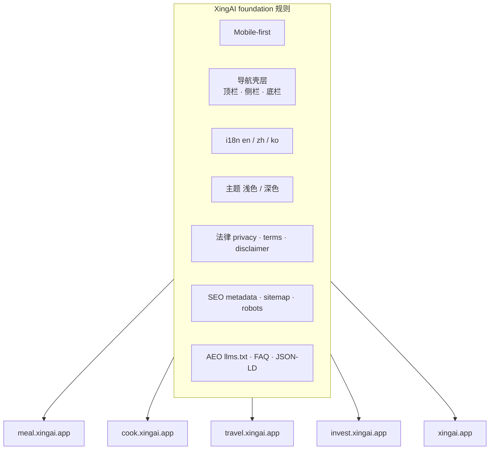

# 一套 Foundation 规则管所有 XingAI 产品：移动壳层、i18n、法律、SEO 与 AEO

**日期：** 2026年5月31日  
**作者：** Xing @ [XingAI](https://xingai.app)  
**项目：** [XingAI 平台](https://xingai.app) — Meal、Cook、Travel、Invest 等  
**标签：** `platform` `mobile-first` `i18n` `seo` `aeo` `legal` `cursor` `product-engineering`  
**语言：** [English](2026-05-31-xingai-foundation-mobile-i18n-seo-aeo.md) · 中文

---

## 问题从哪来

我们在维护的不止一个 app：Meal Coach、Cook AI、Travel AI、Invest AI、营销站 xingai.app……每个仓库各自有一套导航、语言、主题、法律页脚的习惯。

单仓库时还行。产品一多就出事：Travel 的 UX mock 混进了 Routine 文案；某个产品错误提示只有英文；桌面版漂亮、iPhone 底栏却叠在内容上；SEO 清单只写在 dot-app 里，换文件夹开 Cursor 时 agent 根本不知道。

我们需要的是 **统一底线**，而不是第 N 份只在一个 repo 里有效的文档。

## 我们做了什么

在工作区加了 Cursor 规则：**`.cursor/rules/xingai-foundation.mdc`**（`alwaysApply: true`），并在根目录 `AGENTS.md` 里引用。

这是任何 `*.xingai.app` 对外界面算「可上线」前的 **最低标准**。产品专用规则照旧 — Invest 仍有 decision-cache 边界；营销站仍看 `docs/marketing-site-standards.md`。Foundation 不是替代，是把散落的要求串起来。

## Mobile-first 不是事后改断点

规则要求：**先按 320–430px 可用宽度设计**，再用 `sm:` / `lg:` 放大 — 不要桌面优先再缩小。

具体要求：

- 触控区域 **≥ 44×44 CSS px**
- 固定顶栏/底栏和主内容区使用 `env(safe-area-inset-*)`
- 默认单列；手机上的对比表要可滚动或折叠
- DOM 顺序上，决策内容优先于装饰性 chrome

明确禁止在 DOM 里假 iOS 状态栏 — 用户手机自带真的。

## 一套导航形态，多个产品

文案因产品而异（`Decide`、`Scan`、`Today`）。**壳层结构**不能各搞各的。

| 区域 | 手机 | 桌面 |
|------|------|------|
| **顶栏** | 固定：菜单 · 标题 · 语言 + 主题 | 同样控件可触达 |
| **侧栏** | 汉堡打开抽屉 | 同一抽屉或 persistent 侧栏 — 每 repo 选一种并坚持 |
| **底栏** | 主路径固定 Tab | **不要**底栏 Tab |
| **页脚链接** | 抽屉底部和/或页脚放 Privacy、Terms、Disclaimer | 同样法律链接 |

两条踩坑教训：

1. **手机别藏语言和主题** — 除非抽屉里有一份一样的。
2. **别上空壳路由** — 未上线 Tab 标 `Soon`，点按给 toast。

Cook、Meal 用 `MobileChrome`；营销站用 `Header` + `MobileNavDrawer` + `MobileBottomNav`。组件不同，**契约相同**。

用户界面不出现内部版本号（V1、V2）。用户不该每次发版重新学产品。

## 三种语言才算「完成」

必选 locale：**`en`**、**`zh`**（中文）、**`ko`**（韩文）。

- 界面文案走 i18n 层（`translations.ts`、`messages.js`、locale provider），别硬编码在组件里。
- 持久化 locale；能的话首屏绘制前应用（静态 mock 的 `i18n-boot.js`）。
- **营销站：** locale 在 **URL**（`/`、`/zh/…`、`/ko/…`）；切换语言改路径，不能只改 cookie。必须 `hreflang` + 各语言 canonical。
- **产品 app：** locale 同时驱动 UI 和 **AI 接口输出语言**。
- **法律页：** 三语齐全才叫 legal done。

第四语言（如 Travel UX 里的西班牙语）可选 — **不能替代** en/zh/ko。

## 浅色/深色不是锦上添花

每个对外界面都要 **light + dark**：

- 静态 mock：`<html data-theme>`；Next.js：`next-themes`
- 加载无主题闪烁
- `theme-color` 随主题更新
- 依赖主题的演示图要 **浅色+深色** 两套（dot-app 的 `ThemedImage`）
- 产品色用仓库 **oklch token** — 别因为截图好看就上 `#3b82f6`

## 法律：三页 + 处处可点

公开 `*.xingai.app` 必须链到（或自建）：

| 页面 | 路径 |
|------|------|
| 隐私政策 | `/legal/privacy` |
| 服务条款 | `/legal/terms` |
| 免责声明 | `/legal/disclaimer` |

页脚三链齐全。生活方式/旅行类加 **仅供参考，预订/行动前请核实**。金融类更严 — 见 [五层免责声明](2026-05-13-legal-disclaimers-five-layers.zh.md)。

Foundation 是 **地板**。Invest 还会在之上叠 modal、内联 badge、API 里的 disclaimer 字段。

## SEO：带 metadata 上线，别靠运气

路由「上线」前要有：

- `metadataBase`、独立 title/description
- canonical（营销站按语言）
- Open Graph + Twitter — 用产品截图或品牌 OG，别只用 favicon
- `sitemap.xml`、`robots.txt`（含 `Sitemap:`）
- `<html lang>` 与当前语言一致
- 内链尊重 locale（中文浏览时用 `/zh/apps`，不是 `/apps`）

营销站部署走 `xingai-dot-app/docs/seo-aeo-checklist.md`。产品 UX 目录至少 mirroring：`seo-config.js`、`sitemap.xml`、`robots.txt`。

## AEO：给人看，也给答案引擎看

搜索不只有 Google 十条蓝链。我们把 **AEO**（AI 答案引擎）当正式交付物：

- 产品根或 `public/` 放 **`llms.txt`** —  plain 说明：做什么、URL、主流程、语言、一句 disclaimer
- 落地页短 **FAQ**，与可见文案一致
- **JSON-LD**：产品页 `SoftwareApplication`、营销首页 `FAQPage`、dot-app `Organization` / `WebSite`
- 答案写事实、写真实域名 — 不吹

定位改了，**`llms.txt` 和 FAQ 一起改**。否则 ChatGPT 和官网各说各的，用户谁都不信。

## 上线前清单（人 + Agent）

规则末尾给 agent 一份合并前自检：

- ~375px、安全区、底栏留白
- 手机：顶栏 + 抽屉 + 底栏；桌面：顶栏 chrome
- 新文案 en/zh/ko 齐全
- 浅/深主题可读
- 页脚：Privacy、Terms、Disclaimer
- metadata + canonical + OG
- 路由变了就更新 robots、sitemap、llms.txt
- UI 无内部版本标签

写进 Cursor 是为了 **每个会话默认门槛相同** — 不是说法务/SEO 可以不做人工复查。

## 这不是什么

- **不是设计系统替代品** — 视觉细节仍看 `xingai-web-design` skill 和各 repo token。
- **不是 Invest 决策架构** — worker/cache 边界仍在 Invest ADR 里。
- **不是法律意见** — 规模化付费上线前仍要律师审文案。

## Takeaway

十个 AI 产品常死在无聊地方：语言错、免责声明没链、只有桌面版、`og:image` 空着。Foundation 规则把这些变成 **默认**，而不是事故复盘。

如果你也在维护多 app 的 AI 产品矩阵，把无聊但关键的东西写一次 — 移动壳层、i18n、主题、法律、SEO、AEO — 并 enforced 在 agent 和人真正干活的地方：**仓库规则**，不是 PPT。

**参考：**

- 工作区规则：`ai-projects-work-space/.cursor/rules/xingai-foundation.mdc`
- `AGENTS.md` — foundation 摘要 + 产品升级规则
- 营销标准：`xingai-dot-app/docs/marketing-site-standards.md`
- Invest 法律分层：[Five Layers of “Not Investment Advice”](2026-05-13-legal-disclaimers-five-layers.zh.md)
