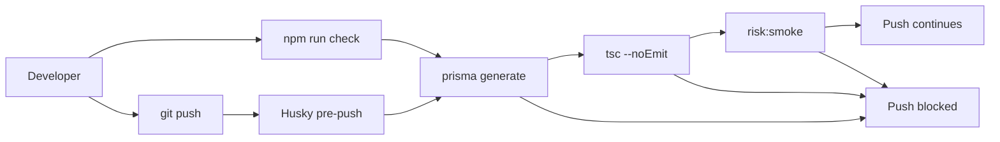

# Two Safety Nets Before Push: Husky pre-push and `npm run check`

**Date:** June 1, 2026  
**Author:** Xing @ [XingAI](https://xingai.app)  
**Project:** [T Today / invest-t-advisor](https://t.xingai.app) (`t.xingai.app`)  
**Tags:** `husky` `git-hooks` `typescript` `developer-experience` `nextjs` `paper-trading`  
**Also available:** [中文](2026-06-01-t-today-husky-pre-push-and-check.zh.md)

---

## The problem

[T Today](https://t.xingai.app) ships rule-engine logic, Prisma schema, and OpenAI vision routes in one Next.js repo. TypeScript can look fine in the editor while `tsc` fails. A risk-control regression can slip in without a failing build — until Vercel does.

We wanted one command that catches the usual breaks **before** remote CI, and a hook that runs it automatically so nobody has to remember.

## What we added

Two pieces, same pipeline:

| Piece | Role |
|-------|------|
| **`npm run check`** | Manual gate — run anytime in the repo root |
| **Husky `pre-push`** | Automatic gate — runs `npm run check` before `git push`; push aborts on failure |

`check` chains three steps:

```json
"check": "prisma generate && npm run lint && npm run risk:smoke"
```

1. **`prisma generate`** — client matches `schema.prisma` (types won’t lie after a schema edit).
2. **`npm run lint`** — `tsc --noEmit` across the app.
3. **`npm run risk:smoke`** — fast script against the rule engine (overnight severity, VWAP blocks, flatten/raise-cash paths). No network, no OpenAI key.

Husky wires on `npm install` via `"prepare": "husky"`. The hook file is minimal:

```bash
# .husky/pre-push
npm run check
```

## 5Ws

### What

A **local quality gate** for `invest-t-advisor`: one npm script plus a Git hook that blocks push when the gate fails.

Not a replacement for Vercel builds or production smoke tests — a cheap filter on the developer machine.

### Why

- **Type errors** should not reach `main` because someone skipped `tsc`.
- **Rule-engine regressions** are product-critical for a paper-trading coach; `risk:smoke` catches obvious breaks in seconds.
- **Prisma drift** after schema edits shows up at generate time, not mid-request on Turso.

Push-time enforcement beats “please run lint before you push” in Slack. Manual `check` stays for pre-commit iteration without touching Git.

### When

| Moment | What runs |
|--------|-----------|
| Anytime you want | `npm run check` |
| Every `git push` | Husky → `npm run check` (unless you bypass with `--no-verify`, which we don’t recommend) |
| Fresh clone / `npm install` | `prepare` installs Husky hooks |

Run `check` before opening a PR if you’ve been pushing with `--no-verify`. Run it after pulling schema or risk-control changes.

### Where

| Location | Purpose |
|----------|---------|
| `package.json` → `"check"` | Single entry point for humans and CI-like local runs |
| `package.json` → `"prepare": "husky"` | Hook install after dependencies |
| `.husky/pre-push` | Git hook that calls `check` |
| `scripts/risk-control-smoke.ts` | Deterministic rule-engine assertions |

Repo: [github.com/xingaiapp/invest-t-advisor](https://github.com/xingaiapp/invest-t-advisor)

### Who

**Every contributor** cloning the repo gets hooks after `npm install`. **You**, before a long debugging session, when you only want types + rules without a full `next build`. **CI/Vercel** still own production builds — this layer is local and fast (~3s on a laptop).

## Flow



## What we deliberately skipped

- **`pre-commit`** — too noisy while WIP commits; push is the right boundary for this repo.
- **Full `next build` in `check`** — slower; Vercel still builds on merge. Add later if we keep hitting Next-only failures locally.
- **Husky on every XingAI repo** — pattern is portable; T Today got it first because rule smoke + Prisma are high-signal here.

## Onboarding

```bash
git clone git@github.com:xingaiapp/invest-t-advisor.git
cd invest-t-advisor
npm install          # postinstall → prisma generate; prepare → husky
npm run check        # should print risk-control-smoke: OK
git push             # pre-push runs check again
```

## Takeaway

**Manual `check` for speed. Husky pre-push for discipline.** Same script, two triggers — types, schema, and core 做T rules stay aligned before code hits GitHub.
