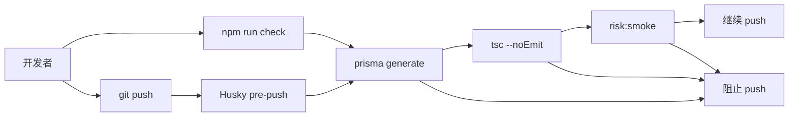

# 中文 · push 前两道闸：Husky pre-push 与 `npm run check`

**日期：** June 1, 2026  
**作者：** Xing @ [XingAI](https://xingai.app)  
**项目：** [T Today / invest-t-advisor](https://t.xingai.app) (`t.xingai.app`)  
**标签：** `husky` `git-hooks` `typescript` `developer-experience` `nextjs` `paper-trading`  
**语言：** [English](2026-06-01-t-today-husky-pre-push-and-check.md) · 中文

---

## 背景

[T Today](https://t.xingai.app) 把规则引擎、Prisma schema、OpenAI 视觉接口放在同一个 Next.js 仓库里。编辑器里看着没问题，`tsc` 却可能挂。规则引擎改坏了也不一定会触发 build 失败——直到 Vercel 帮你发现。

我们需要：**一条命令**在进远程 CI 前拦住常见错误；再加一个 **Git hook**，不用靠人记。

## 加了什么

两件事，跑同一套流水线：

| 组件 | 作用 |
|------|------|
| **`npm run check`** | 手动 — 在仓库根目录随时跑 |
| **Husky `pre-push`** | 自动 — `git push` 前跑 `npm run check`，失败则中断 push |

`check` 串联三步：

```json
"check": "prisma generate && npm run lint && npm run risk:smoke"
```

1. **`prisma generate`** — Client 与 `schema.prisma` 一致，改 schema 后类型不会骗你。
2. **`npm run lint`** — 全项目 `tsc --noEmit`。
3. **`npm run risk:smoke`** — 对规则引擎做确定性断言（隔夜 severity、VWAP 拦截、flatten/raise-cash 等）。不走网络，不需要 OpenAI key。

Husky 通过 `"prepare": "husky"` 在 `npm install` 时装 hook。hook 文件本身很短：

```bash
# .husky/pre-push
npm run check
```

## 5W

### What（是什么）

`invest-t-advisor` 的**本地质量闸**：一个 npm script + 一个在失败时阻止 push 的 Git hook。

不能替代 Vercel build 或生产冒烟——只是在开发机上做便宜过滤。

### Why（为什么）

- **类型错误**不该因为有人没跑 `tsc` 就进 `main`。
- **规则引擎回归**对纸面做T教练是核心；`risk:smoke` 几秒内能抓明显问题。
- **Prisma 漂移**在 generate 阶段暴露，而不是 Turso 请求中途爆。

push 时强制比 Slack 里喊「push 前请 lint」靠谱。手动 `check` 留给改代码过程中频繁跑，不必每次都碰 Git。

### When（什么时候）

| 时机 | 行为 |
|------|------|
| 任意时刻 | `npm run check` |
| 每次 `git push` | Husky → `npm run check`（可用 `--no-verify` 跳过，不建议） |
| 新 clone / `npm install` | `prepare` 安装 Husky hooks |

开 PR 前若用过 `--no-verify`，补跑一次 `check`。拉过 schema 或 risk-control 变更后也应跑。

### Where（在哪里）

| 位置 | 用途 |
|------|------|
| `package.json` → `"check"` | 人与本地「类 CI」的统一入口 |
| `package.json` → `"prepare": "husky"` | 依赖装完后装 hook |
| `.husky/pre-push` | 调用 `check` 的 Git hook |
| `scripts/risk-control-smoke.ts` | 规则引擎确定性断言 |

仓库：[github.com/xingaiapp/invest-t-advisor](https://github.com/xingaiapp/invest-t-advisor)

### Who（谁用）

**所有 contributor** — `npm install` 后自动有 hook。**你自己** — 长调试前只想看类型 + 规则、不想跑完整 `next build` 时。**CI/Vercel** — 仍负责生产 build；这一层本地、快（笔记本上大约 3 秒）。

## 流程



## 故意没做的

- **`pre-commit`** — WIP commit 太吵；对这个仓库，push 边界更合适。
- **`check` 里跑完整 `next build`** — 太慢；合并后 Vercel 仍会 build。若 Next 专有错误变多，以后再考虑加。
- **所有 XingAI 仓库统一上 Husky** — 模式可复用；T Today 先做，因为 rule smoke + Prisma 信号最强。

## 上手

```bash
git clone git@github.com:xingaiapp/invest-t-advisor.git
cd invest-t-advisor
npm install          # postinstall → prisma generate；prepare → husky
npm run check        # 应看到 risk-control-smoke: OK
git push             # pre-push 会再跑一遍 check
```

## 小结

**手动 `check` 求快，Husky pre-push 求稳。** 同一套脚本、两种触发——类型、schema、做T 核心规则在进 GitHub 前先对齐。
