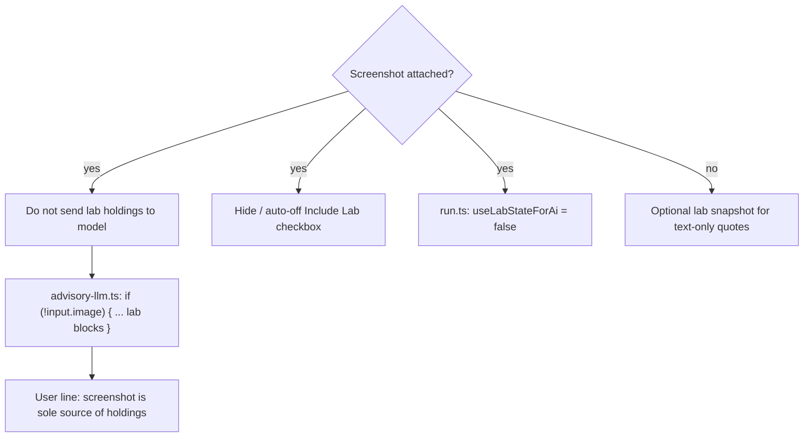

# Prompt Rules That Stop the Model From Guessing Tickers on Blurry Screenshots

**Date:** June 2, 2026  
**Author:** Xing @ [XingAI](https://xingai.app)  
**Project:** [T Today / invest-t-advisor](https://t.xingai.app) (`t.xingai.app`)  
**Tags:** `openai` `prompt-engineering` `vision` `json` `paper-trading` `honesty` `i18n`  
**Also available:** [中文](2026-06-02-t-today-prompt-honesty-screenshot-vision.zh.md)

---

## Why this matters

[T Today](https://t.xingai.app) reads brokerage screenshots and returns a **做T** plan — buy zones, sell targets, cash notes. A confident wrong ticker is worse than “I can’t read this.” Users will act on PLTR advice when they meant TSLL.

Vision models *want* to be helpful. Without explicit rules they fill gaps: blur → guess, old context → reuse HODU from yesterday’s lab save. Prompt design here is product safety, not polish.

Related: [Prompt vs Context vs Harness engineering](./2026-05-20-prompt-context-harness-engineering.md) · [Two-layer decision engine](./2026-05-30-t-today-risk-decision-engine.md).

---

## The three behavior rules

We state these plainly in the system prompt and enforce them in code around the call:

| Situation | Required AI behavior |
|-----------|----------------------|
| **Ticker clearly readable** | Parse into `extractedPortfolio`, run normal T analysis, fill `tDecision` from *that* data only |
| **Ticker not readable** | Say so in `summary`; set `extractedPortfolio: null`, `tDecision: null`; ask for a clearer image **or** typed holdings (e.g. `TSLL 200 shares, $5000 cash`) |
| **Never guess** | **First honesty rule in the prompt:** `NEVER guess or infer a ticker symbol` — no fabricating symbols from price levels, chart shape, or stale lab rows |

“Helpful” hallucination is a bug in a finance coach, even a paper one.

---

## Layer 1: System prompt (behavior contract)

All screenshot honesty rules live in `buildAdvisorySystemPrompt()` — [`invest-t-advisor/src/lib/risk-lab/advisory-context.ts`](https://github.com/xingaiapp/invest-t-advisor/blob/main/src/lib/risk-lab/advisory-context.ts).

The critical block (paraphrased; see repo for exact string):

```text
NEVER guess or infer a ticker symbol.
If you cannot read a symbol with full confidence from the image:
  → extractedPortfolio = null
  → tDecision = null
  → summary = honest message asking for clearer image or text (e.g. "TSLL 200 shares, $5000 cash")

If user sends a screenshot, read symbols into extractedPortfolio only when clearly visible.
Brokerage screenshots: ticker, "N shares", day % — screenshot is source of truth.
tDecision.symbol must come from screenshot or typed holdings, not old lab data.

Single-stock chart: read ticker from chart title only — never guess from price or prior context.
If title unreadable, admit it and ask for a clearer image.
```

**Why system, not user message?** User presets change by flow (`morning_t`, `t_analysis`, `overnight`). Honesty rules must survive every path. System prompt = invariant behavior.

**Why JSON fields, not prose?** The UI renders structured cards. “Sorry, can’t read” must map to `extractedPortfolio: null` so we don’t show a fake holdings table. The schema is part of the prompt:

```json
"extractedPortfolio": {"cash": number|null, "holdings": [...]} | null
"tDecision": { "symbol": string|null, ... } | null
```

Null is the machine-readable “I refused to guess.”

---

## Layer 2: User message (task, not ethics)

`buildAnalysisUserMessage()` in `advisory-presets.ts` adds session time, screenshot type A/B (portfolio list vs single chart), and “tDecision REQUIRED when holdings are known.”

That **REQUIRED** line applies when input is readable — not when honesty rules fire. We rely on system prompt priority: unclear image → null outputs beat “always fill tDecision.”

When we tighten further, we’ll add one explicit line to presets:

```text
If ticker unreadable per system honesty rules, skip tDecision — do not invent.
```

---

## Layer 3: Context assembly (don’t poison vision)

Prompt text saying “screenshot is truth” fails if the same request includes `HODU 200 sh · last $41` from yesterday’s lab.

**Fix in three places:**



1. **`advisory-llm.ts`** — lab snapshot and quote lines only when `!input.image`
2. **`run.ts`** — `useLabStateForAi = input.image ? false : …`
3. **UI** — picking a screenshot auto-unchecks “Include saved lab portfolio” and hides the checkbox

Prompt + context hygiene together. Either alone leaked old tickers in production.

---

## Layer 4: Model settings (harness, not prompt)

Same file, `runRiskAdvisoryChat()`:

| Setting | Value | Why |
|---------|-------|-----|
| `response_format` | `json_object` | Parser rejects free-text guesses |
| `temperature` | `0.35` | Less creative symbol invention |
| Image `detail` | `high` | Better OCR on small ticker text |
| Post-parse | `parseBilingualAdvisory()` | Schema validation before UI |

Rules in the prompt; validation in the harness. See [harness engineering post](./2026-05-20-prompt-context-harness-engineering.md).

---

## Example outputs

**Clear Robinhood-style list** → `extractedPortfolio.holdings: [{symbol:"TSLL", shares:200}, …]`, full `tDecision`, normal plan card.

**Blurry crop / unreadable title** →

```json
{
  "v": 1,
  "en": {
    "summary": "I can't read the ticker symbols clearly from this image. Please upload a sharper screenshot or type your holdings (e.g. TSLL 200 shares, $5000 cash).",
    "extractedPortfolio": null,
    "tDecision": null,
    ...
  },
  "zh": { "...": "无法清晰识别截图中的股票代码。请上传更清晰的截图，或用文字描述持仓（例如：TSLL 200股，现金 $5000）。" }
}
```

**Typed fallback** — user message `$12k cash, PLTR 200 shares` → parse text into `extractedPortfolio`; screenshot optional.

---

## Checklist for similar products

1. **Write the refusal path in the schema** — null objects, not empty strings that look like success  
2. **Put “never guess” in system prompt** — early, imperative, with concrete fallback copy  
3. **Strip conflicting context** — stale DB rows + new image = confused model  
4. **Align UI with prompt** — don’t show “include old data” when image is attached  
5. **Validate JSON after the call** — prompt compliance is probabilistic; parsers are deterministic  
6. **Bilingual refusal copy** — same facts in `zh` and `en` leaves; user locale picks display  

---

## Takeaway

Good vision prompts aren’t “describe this image.” They’re **decision trees in prose**: read clearly → analyze; read poorly → refuse with a path forward; **never guess** — and the harness (context, schema, UI) must match.

**Code:** [`advisory-context.ts`](https://github.com/xingaiapp/invest-t-advisor/blob/main/src/lib/risk-lab/advisory-context.ts), [`advisory-llm.ts`](https://github.com/xingaiapp/invest-t-advisor/blob/main/src/lib/risk-lab/advisory-llm.ts), [`advisory-presets.ts`](https://github.com/xingaiapp/invest-t-advisor/blob/main/src/lib/risk-lab/advisory-presets.ts).
