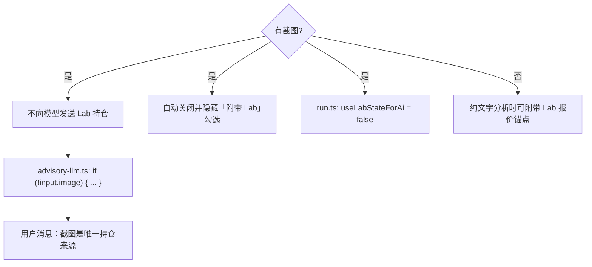

# 中文 · 用 Prompt 约束 AI：截图读不清就别猜 Ticker

**日期：** June 2, 2026  
**作者：** Xing @ [XingAI](https://xingai.app)  
**项目：** [T Today / invest-t-advisor](https://t.xingai.app) (`t.xingai.app`)  
**标签：** `openai` `prompt-engineering` `vision` `json` `paper-trading` `honesty` `i18n`  
**语言：** [English](2026-06-02-t-today-prompt-honesty-screenshot-vision.md) · 中文

---

## 为什么要写这套规则

[T Today](https://t.xingai.app) 读券商持仓截图，输出 **做T** 计划（买卖区间、现金建议）。模型自信地猜错代码，比直接说「看不清」更危险——用户可能按 PLTR 的计划去操作，其实持仓是 TSLL。

视觉模型默认想「帮上忙」。没有硬规则就会补全：模糊 → 猜代码；上下文里还有昨天的 Lab → 继续用 HODU。这里的 Prompt 是产品安全，不是文案优化。

延伸阅读：[Prompt / Context / Harness 工程](./2026-05-20-prompt-context-harness-engineering.zh.md) · [规则优先、AI 其次](./2026-05-30-t-today-risk-decision-engine.zh.md)。

---

## 三条 AI 行为规则

我们在 system prompt 里写死，并在调用链外围用代码兜底：

| 情况 | AI 必须怎么做 |
|------|----------------|
| **Ticker 能清晰读到** | 写入 `extractedPortfolio`，正常做T分析；`tDecision` 只能来自截图或用户文字 |
| **读不清楚** | `summary` 诚实说明；`extractedPortfolio: null`，`tDecision: null`；请用户重传更清晰截图，或文字描述（如 `TSLL 200股, $5000 现金`） |
| **绝对禁止猜测** | Prompt 第一条诚实规则：**`NEVER guess or infer a ticker symbol`** — 不能从价格、K 线形状、旧 Lab 数据臆造代码 |

纸面教练也一样：「看起来有帮助」的幻觉是 bug。

---

## 第一层：System Prompt（行为契约）

截图诚实规则集中在 `buildAdvisorySystemPrompt()` — [`invest-t-advisor/src/lib/risk-lab/advisory-context.ts`](https://github.com/xingaiapp/invest-t-advisor/blob/main/src/lib/risk-lab/advisory-context.ts)。

核心段落（意译；以仓库原文为准）：

```text
NEVER guess or infer a ticker symbol.
若无法从图片中 FULL CONFIDENCE 读出代码：
  → extractedPortfolio = null
  → tDecision = null
  → summary 说明原因，并请更清晰截图或文字（例："TSLL 200 shares, $5000 cash"）

有截图时，只有清晰可见才写入 extractedPortfolio。
券商列表常见：ticker、"N shares"、日涨跌幅 — 截图是唯一持仓真相。
tDecision.symbol 只能来自截图或用户输入，不能来自旧 Lab。

单股 K 线：代码在图表标题里读（如 "Direxion Daily TSLA Bull 2X ETF" → TSLL），
禁止从价格或历史上下文猜。标题看不清就承认并让用户重传。
```

**为什么放 system？** 用户 preset 随流程变（盘前做T、做T分析、过夜检查）。诚实规则必须每条路径都生效。

**为什么绑 JSON 字段？** UI 渲染结构化卡片。「看不清」必须对应 `extractedPortfolio: null`，否则会展示假持仓表。Schema 本身就是 Prompt 的一部分：

```json
"extractedPortfolio": {"cash": number|null, "holdings": [...]} | null
"tDecision": { "symbol": string|null, ... } | null
```

`null` = 机器可读的「我拒绝猜测」。

---

## 第二层：User Message（任务说明，不是伦理）

`advisory-presets.ts` 的 `buildAnalysisUserMessage()` 补充：美东时间、截图类型 A/B（持仓列表 vs 单股图）、以及「有持仓时 tDecision 必填」。

**必填**只适用于**读得清**的情况。看不清时 system 诚实规则优先：宁可 `tDecision: null`，也不瞎填。

后续可在 preset 加一句显式消歧：

```text
若 ticker 无法识别（system 诚实规则），跳过 tDecision，禁止编造。
```

---

## 第三层：上下文组装（别让 Vision 被旧数据污染）

Prompt 写「以截图为准」，同一请求里却带上 `HODU 200 sh · last $41`，模型还是会混。

**三层一起修：**



1. **`advisory-llm.ts`** — 仅 `!input.image` 时注入 Lab 快照 / 报价行  
2. **`run.ts`** — 有图则 `useLabStateForAi = false`  
3. **前端** — 选图后自动关掉「附带已保存的 Lab 组合数据」，有图时隐藏该 checkbox  

只改 Prompt 或只改代码都不够；我们两种泄漏都遇到过。

---

## 第四层：模型参数（Harness）

`runRiskAdvisoryChat()` 里：

| 参数 | 值 | 作用 |
|------|-----|------|
| `response_format` | `json_object` | 强制 JSON，便于校验 |
| `temperature` | `0.35` | 降低「创造性」猜代码 |
| 图片 `detail` | `high` | 小字号 ticker OCR |
| 解析后 | `parseBilingualAdvisory()` | 进 UI 前 schema 校验 |

Prompt 写规则；Harness 做验收。见 [Harness 工程文](./2026-05-20-prompt-context-harness-engineering.zh.md)。

---

## 输出示例

**清晰的券商列表** → `extractedPortfolio` 含 `{symbol:"TSLL", shares:200}` 等，正常 `tDecision` 与计划卡片。

**模糊截图 / 标题不可读** →

```json
{
  "v": 1,
  "zh": {
    "summary": "无法清晰识别截图中的股票代码。请上传更清晰的截图，或用文字描述持仓（例如：TSLL 200股，现金 $5000）。",
    "extractedPortfolio": null,
    "tDecision": null
  },
  "en": { "summary": "I can't read the ticker symbols clearly..." }
}
```

**文字兜底** — 用户输入 `$12k cash, PLTR 200 shares` → 从文本解析 `extractedPortfolio`，不依赖截图。

---

## 给其他产品的清单

1. **在 Schema 里设计拒绝路径** — 用 `null`，不要用看起来像成功的空字符串  
2. **「禁止猜测」写进 system** — 靠前、祈使句、带具体 fallback 文案  
3. **去掉冲突上下文** — 旧 DB + 新图 = 模型混乱  
4. **UI 与 Prompt 一致** — 有图时不要让用户勾选「附带旧数据」  
5. **调用后校验 JSON** — Prompt 遵守率是概率；解析器是确定的  
6. **双语拒绝话术** — `zh` / `en` leaf 事实一致，UI 按 locale 展示  

---

## 小结

Vision 产品的好 Prompt 不是「描述这张图」，而是** prose 里的决策树**：读清 → 分析；读不清 → 拒绝并给出下一步；**绝不猜测**。上下文、Schema、UI 必须同一套逻辑。

**代码：** [`advisory-context.ts`](https://github.com/xingaiapp/invest-t-advisor/blob/main/src/lib/risk-lab/advisory-context.ts)、[`advisory-llm.ts`](https://github.com/xingaiapp/invest-t-advisor/blob/main/src/lib/risk-lab/advisory-llm.ts)、[`advisory-presets.ts`](https://github.com/xingaiapp/invest-t-advisor/blob/main/src/lib/risk-lab/advisory-presets.ts)。
