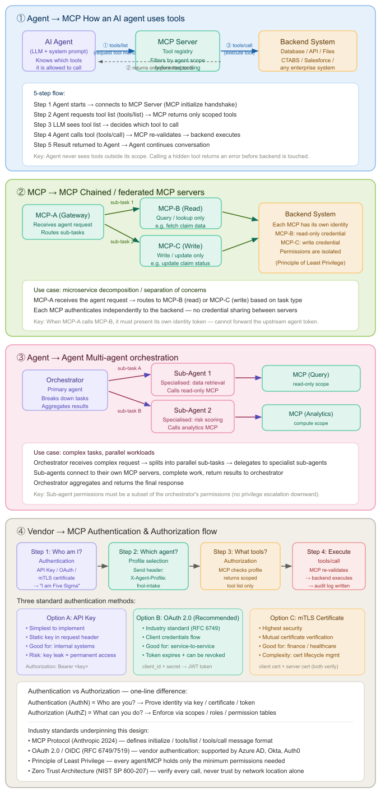

# MCP Architecture: Connection Patterns and Auth That Hold Up in Production

**Date:** June 3, 2026  
**Author:** Xing @ [XingAI](https://xingai.app)  
**Project:** XingAI Platform  
**Tags:** `mcp` `architecture` `auth` `oauth` `zero-trust` `agents`  
**Also available:** [中文](2026-06-03-mcp-architecture-best-practices.zh.md)

**Related:** [MCP Phased Rollout: From Dashboard to Autonomous Trading](2026-05-12-mcp-phased-rollout.md) — *when* to ship each MCP server; this post covers *how* to wire and secure them.

---

Model Context Protocol (MCP) gives agents a standard way to discover and call tools. That part is easy to demo. Production is harder: scoped permissions, chained servers, multi-agent workflows, and auth that does not collapse the moment someone adds a second integration.

This post walks through four patterns we use when wiring agents to enterprise backends — and the auth model that keeps them from turning into "one API key to rule them all."

---

## Why this matters now

Most teams start with a single agent and a handful of tools. It works until:

- A second product team wants the same CRM connector with different permissions.
- A "read claims" agent accidentally gets write tools because they share one MCP server.
- A gateway forwards the user's token downstream and bypasses your audit trail.

MCP does not solve those problems by itself. You still need explicit architecture: who connects to whom, which credentials travel where, and where authorization is enforced.

The diagram above maps four layers. Each layer answers a different scaling question.

---

## Pattern 1: Agent → MCP (the baseline)

**Question:** How does an AI agent safely use tools?

This is the default MCP flow:

1. **Initialize** — Agent connects to the MCP server (`initialize` handshake).
2. **Discover** — Agent calls `tools/list`. The server returns only tools in that agent's scope.
3. **Decide** — The LLM picks a tool from the visible list.
4. **Execute** — Agent calls `tools/call`. The server re-validates scope, then hits the backend (database, API, files).
5. **Continue** — Result goes back to the agent; the conversation moves on.

The critical rule: **the agent never sees out-of-scope tools.** If it tries to call a hidden tool anyway, MCP rejects the call before the backend runs.

That double gate — filter on list, validate on call — is not redundant. Listing shapes what the model can *think* about. Re-validation catches prompt injection, stale sessions, or agents that guess tool names.

### What to implement

| Layer | Responsibility |
|-------|----------------|
| Agent | Holds system prompt + allowed profile; never stores backend credentials |
| MCP server | Tool registry, scope filter, audit log on `tools/call` |
| Backend | Business logic; trusts MCP's service identity, not the end user |

Example backends: internal APIs, Salesforce, claims systems (CTABS), file stores. The pattern is the same regardless of vendor.

---

## Pattern 2: MCP → MCP (chained / federated servers)

**Question:** One MCP is getting fat. How do you split read and write without sharing keys?

Use a **gateway MCP (MCP-A)** that routes sub-tasks to specialist servers:

- **MCP-B (Read)** — query / lookup only, e.g. fetch claim data.
- **MCP-C (Write)** — update / mutate only, e.g. change claim status.

Each downstream MCP authenticates to the backend with **its own credential**. MCP-B gets read-only access. MCP-C gets write access. No shared secret between B and C.

### The rule people get wrong

When MCP-A calls MCP-B, it must present **MCP-A's identity token** — not the upstream agent's token.

If you forward the agent token, you lose:

- Independent revocation (kill one MCP without killing the agent).
- Least-privilege boundaries (B and C inherit the agent's full scope).
- Clean audit logs (you cannot tell which server actually acted).

This is microservice decomposition applied to tool servers. Same separation-of-concerns argument as splitting a monolith — just at the MCP layer.

---

## Pattern 3: Agent → Agent (multi-agent orchestration)

**Question:** One agent cannot do everything well. How do you parallelize without privilege creep?

An **orchestrator agent** breaks a complex request into sub-tasks and delegates to specialist sub-agents:

- Sub-Agent 1 — data retrieval → read-only MCP.
- Sub-Agent 2 — risk scoring → analytics MCP.

Sub-agents run in parallel when possible. The orchestrator aggregates results and returns one answer to the user.

### Downward permission rule

**Sub-agent permissions must be a subset of the orchestrator's permissions.**

The orchestrator is the trust boundary. If Sub-Agent 2 can call a write tool the orchestrator was never allowed to use, you have privilege escalation by architecture — not by bug, but by design mistake.

In practice:

- Define agent profiles in config (not in prompts).
- Pass profile ID, not raw credentials, to sub-agents.
- Log orchestrator → sub-agent delegation with correlation IDs.

---

## Pattern 4: Vendor → MCP (authentication and authorization)

**Question:** A vendor (or internal service) connects to your MCP. How do you know who they are and what they can do?

Treat it as four steps:

| Step | Name | What happens |
|------|------|--------------|
| 1 | Authentication (AuthN) | Prove identity — API key, OAuth token, or mTLS cert. "I am Five Sigma." |
| 2 | Profile selection | Client sends agent profile, e.g. `X-Agent-Profile: fnol-intake`. |
| 3 | Authorization (AuthZ) | MCP maps profile → allowed tools; `tools/list` returns scoped menu only. |
| 4 | Execute | `tools/call` → re-validate → backend → audit log. |

**AuthN vs AuthZ in one line:**

- **AuthN** = Who are you?
- **AuthZ** = What can you do?

Do not skip step 3 because step 1 "already authenticated them." Vendor identity ≠ agent capability.

### Three auth options (pick by risk tier)

| Option | Best for | Trade-off |
|--------|----------|-----------|
| **A. API key** | Internal systems, dev/staging | Simple; leak = long-lived access |
| **B. OAuth 2.0 client credentials** | Service-to-service (recommended default) | Tokens expire; revocable; works with Azure AD, Okta, Auth0 |
| **C. mTLS** | Finance, healthcare, high-assurance | Strongest; cert lifecycle is operational work |

For most B2B MCP endpoints, OAuth 2.0 client credentials plus scoped agent profiles is the sweet spot.

---

## Standards this design aligns with

- **MCP protocol** — `initialize`, `tools/list`, `tools/call` message contract.
- **OAuth 2.0 / OIDC (RFC 6749 / 7519)** — vendor and service identity.
- **Least privilege** — every agent and MCP server gets minimum permissions.
- **Zero trust (NIST SP 800-207)** — verify every call; network location is not proof of trust.

---

## Decision guide: which pattern when?

| Situation | Start here |
|-----------|------------|
| First MCP integration, one agent, few tools | Pattern 1 only |
| Same backend, different read/write policies | Pattern 2 (split MCP-B / MCP-C) |
| Long-running workflows, parallel research + action | Pattern 3 (orchestrator + sub-agents) |
| External vendor or multi-tenant access | Pattern 4 (full AuthN + AuthZ + audit) |

You can combine them. An orchestrator (Pattern 3) might call a gateway MCP (Pattern 2) that fans out to read/write servers — each step still enforcing scope.

---

## Checklist before production

- [ ] `tools/list` filtered by agent profile — not a global export of every tool.
- [ ] `tools/call` re-validates profile before backend execution.
- [ ] MCP-to-MCP calls use server identity; no upstream token forwarding.
- [ ] Sub-agents scoped ≤ orchestrator permissions.
- [ ] Audit log: who, which profile, which tool, timestamp, correlation ID.
- [ ] Secrets in env / vault — never in repo or agent prompts.

---

## Closing thought

MCP standardizes the wire format. It does not standardize your security model. The teams that ship safely treat MCP servers like microservices: bounded context, own credentials, explicit authorization at the boundary.

Get Pattern 1 right first. Add Pattern 2 when permissions diverge. Reach for Pattern 3 when latency or specialization demands it. Pattern 4 is non-negotiable the moment someone outside your team connects.

---

**Diagram:** [English PNG](../assets/MCP-Architecture-Best-Practices.png) · [中文 PNG](../assets/MCP-Architecture-Best-Practices.zh.png) · [SVG source](../assets/MCP-Architecture-Best-Practices.svg)

*Part of the [XingAI Tech Blog](https://github.com/xingaiapp/xingai-tech-blog). We build focused AI decision systems for everyday life.*
