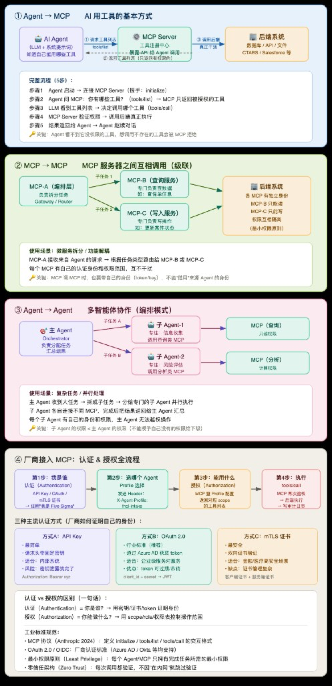

# 中文 · MCP 架构：四种连接模式与生产级鉴权实践

**日期：** June 3, 2026  
**作者：** Xing @ [XingAI](https://xingai.app)  
**项目：** XingAI Platform  
**标签：** `mcp` `architecture` `auth` `oauth` `zero-trust` `agents`  
**语言：** [English](2026-06-03-mcp-architecture-best-practices.md) · 中文

**相关阅读：** [MCP 分阶段上线：从仪表盘到自动交易](2026-05-12-mcp-phased-rollout.zh.md) — 讲 *何时* 上线各 MCP；本文讲 *如何* 连接与安全分层。

---

Model Context Protocol（MCP）给 AI Agent 提供了统一的工具发现与调用协议。Demo 很好做，上线难在别处：权限隔离、链式 MCP、多 Agent 编排，还有「一把 API Key 通吃全部后端」这种迟早会炸的设计。

这篇文章按我们接企业后端的经验，讲清楚四种连接模式，以及鉴权该怎么分层。

---

## 为什么现在就要想清楚

很多团队起步是一个 Agent + 几个工具，能跑。直到：

- 第二个产品线要接同一个 CRM，但权限不同；
- 「只读理赔」的 Agent 因为共用 MCP，意外拿到了写工具；
- 网关把用户 Token 原样转发下游，审计链断掉。

MCP 本身不解决这些。你得明确：**谁连谁、什么凭证能传、在哪一层做授权。**

下面四块 diagram，每一块对应不同的扩展问题。

---

## 模式 1：Agent → MCP（基线）

**要回答的问题：** AI Agent 怎么安全地用工具？

标准五步：

1. **Initialize** — Agent 与 MCP Server 握手连接。
2. **Discover** — 调用 `tools/list`，Server 只返回该 Agent 权限范围内的工具。
3. **Decide** — LLM 从可见列表里选工具。
4. **Execute** — 调用 `tools/call`，Server **再次校验**权限，再访问后端（数据库、API、文件）。
5. **Continue** — 结果回 Agent，对话继续。

核心规则：**Agent 永远看不到权限外的工具。** 强行调用隐藏工具名？MCP 在后端执行前就拒绝。

列表过滤 + 调用时二次校验，不是重复劳动。列表决定模型「能想到什么」；二次校验防 prompt 注入、会话过期、或 Agent 瞎猜工具名。

### 各层职责

| 层级 | 职责 |
|------|------|
| Agent | 系统提示 + 允许的 Profile；**不存**后端凭证 |
| MCP Server | 工具注册、Scope 过滤、`tools/call` 审计 |
| Backend | 业务逻辑；信任 MCP 的服务身份，不是终端用户 |

后端可以是内部 API、Salesforce、理赔系统（CTABS）、文件存储——模式一样。

---

## 模式 2：MCP → MCP（链式 / 联邦）

**要回答的问题：** 一个 MCP 太胖，读写权限不同，怎么拆？

用 **网关 MCP（MCP-A）** 把子任务路由到专用 Server：

- **MCP-B（Read）** — 只读，例如拉取理赔数据。
- **MCP-C（Write）** — 只写，例如更新理赔状态。

每个下游 MCP 用 **自己的凭证** 连后端。B 只读，C 只写，B 和 C 之间不共享密钥。

### 最容易踩的坑

MCP-A 调 MCP-B 时，必须带 **MCP-A 自己的身份 Token** —— **不能**转发上游 Agent 的 Token。

一旦转发：

- 无法单独吊销某个 MCP；
- 最小权限失效（B/C 继承 Agent 全量 Scope）；
- 审计分不清到底是哪个 Server 执行的。

这就是把微服务的「关注点分离」搬到 MCP 层。

---

## 模式 3：Agent → Agent（多 Agent 编排）

**要回答的问题：** 单个 Agent 干不了所有事，怎么并行又不上权限？

**编排 Agent（Orchestrator）** 拆任务，派给专家 Sub-Agent：

- Sub-Agent 1 — 数据检索 → 只读 MCP；
- Sub-Agent 2 — 风险评分 → 分析 MCP。

能并行的并行跑。编排 Agent 汇总结果，给用户一个答案。

### 向下授权原则

**Sub-Agent 的权限必须是 Orchestrator 权限的子集。**

编排 Agent 是信任边界。如果 Sub-Agent 2 能调 Orchestrator 本来没有的写工具，那是架构级权限提升 —— 不是 bug，是设计错误。

落地建议：

- Profile 写进配置，别塞 prompt；
- 给 Sub-Agent 传 Profile ID，不传原始凭证；
- Orchestrator → Sub-Agent 的委派打 correlation ID，方便审计。

---

## 模式 4：Vendor → MCP（认证与授权）

**要回答的问题：** 外部厂商（或内部服务）连你的 MCP，怎么知道「是谁」以及「能干什么」？

四步走完：

| 步骤 | 名称 | 做什么 |
|------|------|--------|
| 1 | 认证 AuthN | 证明身份 — API Key、OAuth Token 或 mTLS 证书。「我是 Five Sigma。」 |
| 2 | Profile 选择 | 客户端带 Agent Profile，如 `X-Agent-Profile: fnol-intake` |
| 3 | 授权 AuthZ | MCP 查 Profile → 允许的工具；`tools/list` 只返回 Scope 内菜单 |
| 4 | 执行 | `tools/call` → 再校验 → 后端 → 写审计日志 |

**一句话区分：**

- **AuthN** = 你是谁？
- **AuthZ** = 你能做什么？

Step 1 通过了，不能跳过 Step 3。厂商身份 ≠ Agent 能力。

### 三种认证方式（按风险选）

| 方案 | 适用 | 代价 |
|------|------|------|
| **A. API Key** | 内网、开发/预发 | 简单；泄露 = 长期有效 |
| **B. OAuth 2.0 客户端凭证** | 服务间（推荐默认） | Token 可过期、可吊销；兼容 Azure AD、Okta、Auth0 |
| **C. mTLS** | 金融、医疗等高保障 | 最强；证书生命周期运维成本高 |

多数 B2B MCP 端点：**OAuth 2.0 client credentials + 分 Profile 授权** 就够。

---

## 对齐的行业标准

- **MCP 协议** — `initialize`、`tools/list`、`tools/call` 消息约定
- **OAuth 2.0 / OIDC（RFC 6749 / 7519）** — 厂商与服务身份
- **最小权限原则** — 每个 Agent / MCP 只拿必要权限
- **零信任（NIST SP 800-207）** — 每次调用都验证；不能靠「在内网」当信任依据

---

## 选型：什么时候用哪种模式？

| 场景 | 建议 |
|------|------|
| 第一次接 MCP，一个 Agent、少量工具 | 只做模式 1 |
| 同一后端，读写策略不同 | 模式 2（拆 MCP-B / MCP-C） |
| 长流程、要并行调研 + 执行 | 模式 3（编排 + Sub-Agent） |
| 外部厂商或多租户接入 | 模式 4（完整 AuthN + AuthZ + 审计） |

可以组合。编排 Agent（模式 3）调网关 MCP（模式 2），再 fan-out 到读写 Server —— 每一跳都要 enforce Scope。

---

## 上线前检查清单

- [ ] `tools/list` 按 Agent Profile 过滤，不是全量导出
- [ ] `tools/call` 执行前再次校验 Profile
- [ ] MCP 调 MCP 用 Server 身份，不转发上游 Token
- [ ] Sub-Agent Scope ≤ Orchestrator
- [ ] 审计：谁、哪个 Profile、哪个工具、时间、correlation ID
- [ ] 密钥放 env / vault，不进仓库、不进 Agent prompt

---

## 最后一句

MCP 统一了「线上怎么说」。它不统一你的安全模型。能稳定上线的团队，把 MCP Server 当微服务：边界清晰、各自凭证、在边界做授权。

先把模式 1 做扎实；权限开始分叉就上模式 2；延迟或专业化逼你并行时用模式 3；外部一接入，模式 4 没有商量余地。

---

**架构图：** [中文版 PNG](../assets/MCP-Architecture-Best-Practices.zh.png) · [English PNG](../assets/MCP-Architecture-Best-Practices.png) · [SVG 源文件](../assets/MCP-Architecture-Best-Practices.svg)

*Part of the [XingAI Tech Blog](https://github.com/xingaiapp/xingai-tech-blog). We build focused AI decision systems for everyday life.*
