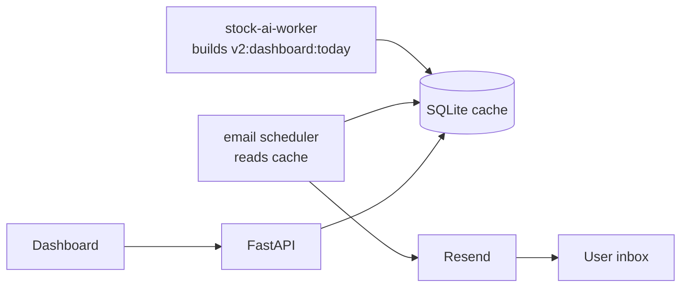

# Worker-Cache Email Digests: Notifications Without Moving Decisions Into the API

**Date:** June 6, 2026  
**Author:** Xing @ [XingAI](https://xingai.app)  
**Project:** [XingAI Invest AI](https://xingai.app/apps/invest-ai)  
**Tags:** `worker` `email` `resend` `cqrs` `decision-cache` `invest-ai`  
**Also available:** [中文](2026-06-06-invest-ai-worker-cache-email-digest.zh.md)

---

## The product need

An investment dashboard is useful when the user opens it. A morning decision brief needs to arrive before the user asks.

For Invest AI, that meant sending daily AI picks by email at fixed Central Time checkpoints. The tempting implementation is a cron endpoint:

```txt
cron -> FastAPI -> compute today's picks -> send email
```

We did not choose that.

## The boundary

Invest AI follows a strict rule:

```txt
Worker/core computes decisions.
FastAPI reads cache.
Frontend renders.
```

So the email job also reads the worker cache. It does not calculate market regime, consensus, allocation, or ranking. The email is a delivery surface, not a decision engine.



## What gets emailed

The scheduler reads:

- `consensus`
- `market_regime`
- `top_signals`
- explicit signal-driver fields already written by the worker

That makes the email reproducible: it describes the same cached decision package the dashboard would show.

## Why this matters

Notification systems are sneaky. If the email says "Buy KVUE" but the dashboard says "Risk-Off, protect capital," trust breaks immediately. Keeping both surfaces tied to the same cache prevents that split.

The worker can send a short daily brief. The dashboard can expose the full state. The API stays boring.

## Operational detail

We send through Resend. Because brand-domain verification can fail or lag, the worker tries the configured sender first and falls back to Resend's default sender when the provider rejects the brand domain. That is not the final brand state, but it prevents the scheduled product loop from silently dropping.

## Takeaway

If a notification contains decision semantics, treat it like another decision surface. It should read the same worker-owned cache as the product UI, not invent a second answer in a cron endpoint.

**Further reading:** ADR-016 (`docs/adr/016-worker-cache-email-digest.md`) and ADR-012 (`docs/adr/012-decision-cache-boundary.md`).
