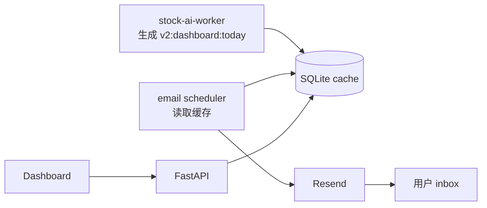

# Worker Cache 邮件摘要：不把决策搬进 API 的通知系统

**日期：** June 6, 2026  
**作者：** Xing @ [XingAI](https://xingai.app)  
**项目：** [XingAI Invest AI](https://xingai.app/apps/invest-ai)  
**标签：** `worker` `email` `resend` `cqrs` `decision-cache` `invest-ai`  
**语言：** [English](2026-06-06-invest-ai-worker-cache-email-digest.md) · 中文

---

## 产品需求

投资 dashboard 只有在用户打开时才有用。盘前决策摘要则应该在用户询问之前到达。

对 Invest AI 来说，这意味着在固定美中时间节点发送每日 AI picks 邮件。最诱人的实现是 cron endpoint：

```txt
cron -> FastAPI -> compute today's picks -> send email
```

我们没有选这个。

## 边界

Invest AI 遵守一条硬规则：

```txt
Worker/core 计算决策。
FastAPI 读取缓存。
Frontend 负责渲染。
```

所以 email job 也读取 worker cache。它不计算 market regime、consensus、allocation 或 ranking。邮件是投递表面，不是决策引擎。



## 邮件读取什么

调度器读取：

- `consensus`
- `market_regime`
- `top_signals`
- worker 已写入的显式 signal-driver 字段

这让邮件可复现：它描述的是 dashboard 会展示的同一份缓存决策包。

## 为什么重要

通知系统很容易悄悄变成第二个决策系统。如果邮件说 “Buy KVUE”，但 dashboard 说 “Risk-Off, protect capital”，用户信任会马上破裂。两个表面都绑定同一份 cache，可以避免这种分裂。

Worker 可以发短摘要。Dashboard 可以展示完整状态。API 保持无聊且可靠。

## 运维细节

邮件通过 Resend 发送。品牌域名验证可能失败或滞后，所以 worker 会先尝试配置的 sender；如果服务商拒绝品牌域名，则 fallback 到 Resend 默认 sender。这不是最终品牌形态，但能避免定时产品循环静默丢邮件。

## 一句话

如果通知里包含决策语义，就把它当成另一个决策表面。它应该读取同一份 worker-owned cache，而不是在 cron endpoint 里发明第二个答案。

**延伸阅读：** ADR-016（`docs/adr/016-worker-cache-email-digest.md`）和 ADR-012（`docs/adr/012-decision-cache-boundary.md`）。
