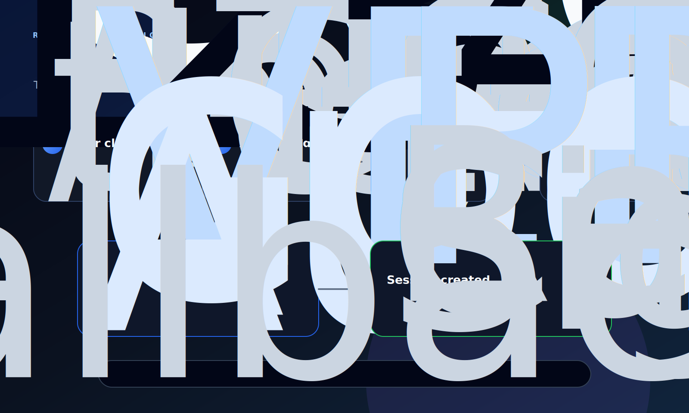

# Google OAuth for Research AI: How the Sign-In Loop Actually Works

**Date:** June 6, 2026  
**Author:** Xing @ [XingAI](https://xingai.app)  
**Project:** [Research AI](https://research.xingai.app)  
**Tags:** `oauth` `google-cloud` `next-auth` `vercel` `auth` `runbook`  
**Also available:** [中文](2026-06-06-research-ai-google-oauth-setup.zh.md)

---



Research AI lets guests use cached learning topics for free. Gmail sign-in unlocks unlimited live AI research.

That sounds simple in the UI: click **Sign in with Google**. Under the hood, four systems must agree on the same OAuth contract:

1. Google Cloud owns the OAuth client.
2. Vercel owns production environment variables.
3. Auth.js / NextAuth owns the callback route.
4. Research AI owns the product rule: signed-in users bypass the demo live-run limit.

If any one of those is wrong, the user sees a generic sign-in failure.

## The Mental Model

OAuth is a redirect handshake, not a password exchange.

```text
User
  -> Research AI /login
  -> Auth.js creates a Google authorization URL
  -> Google asks the user to approve
  -> Google redirects back to Research AI callback URL
  -> Auth.js exchanges the code using GOOGLE_CLIENT_SECRET
  -> Research AI creates a session
```

The most important line is the callback:

```text
https://research.xingai.app/api/auth/callback/google
```

That exact URI must exist in Google Cloud under **Authorized redirect URIs**. It must match protocol, domain, path, and trailing slash behavior exactly.

## What Each Secret Does

`GOOGLE_CLIENT_ID` identifies the OAuth application. It is not very sensitive, but it must match the OAuth client configured in Google Cloud.

`GOOGLE_CLIENT_SECRET` proves that the server exchanging the authorization code is allowed to use that client. This is sensitive and belongs only in server-side environments such as Vercel Production variables or local `.env.local`.

`AUTH_SECRET` signs Auth.js cookies and session tokens.

`AUTH_URL` and `NEXTAUTH_URL` tell Auth.js the canonical production origin. For Research AI:

```env
AUTH_URL=https://research.xingai.app
NEXTAUTH_URL=https://research.xingai.app
```

## Google Cloud Setup

Open:

```text
https://console.cloud.google.com/apis/credentials
```

Then:

1. Select the Google Cloud project that owns the OAuth client.
2. Open **Credentials**.
3. Under **OAuth 2.0 Client IDs**, open the web client used by Research AI.
4. Confirm the application type is **Web application**.
5. Add this Authorized JavaScript origin:

```text
https://research.xingai.app
```

6. Add this Authorized redirect URI:

```text
https://research.xingai.app/api/auth/callback/google
```

7. Save and wait a short moment for Google to propagate the change.

For local dev, add the localhost callback too:

```text
http://localhost:3000/api/auth/callback/google
```

## Vercel Setup

In Vercel, add these variables to **Production**:

```env
AUTH_SECRET=<32+ character random string>
AUTH_URL=https://research.xingai.app
NEXTAUTH_URL=https://research.xingai.app
GOOGLE_CLIENT_ID=<Google OAuth web client id>
GOOGLE_CLIENT_SECRET=<Google OAuth web client secret>
```

After changing Vercel env vars, redeploy. Existing deployments do not automatically pick up new environment variables.

```bash
cd /Users/xing/Desktop/ai-projects-work-space/xingai-research-ai
vercel deploy --prod --yes --force
```

The deployment should finish with:

```text
readyState: READY
Aliased: https://research.xingai.app
```

## Research AI Implementation

Research AI uses Auth.js / NextAuth.

Key files:

```text
auth.ts
lib/oauth-credentials.ts
lib/auth-config.ts
app/api/auth/[...nextauth]/route.ts
app/actions/auth.ts
app/login/page.tsx
```

The OAuth client is loaded from:

```text
GOOGLE_CLIENT_ID
GOOGLE_CLIENT_SECRET
AUTH_GOOGLE_ID
AUTH_GOOGLE_SECRET
AUTH_GOOGLE_CLIENT_ID
AUTH_GOOGLE_CLIENT_SECRET
```

Only one valid id/secret pair is needed. Do not mix a client id from one Google Cloud OAuth client with a secret from another.

## How Research AI Uses the Session

The product rule is not “login wall first.” The rule is:

```text
Cached topics are free.
Anonymous users get limited live AI runs.
Signed-in Gmail / @xingai.app users bypass the live-run limit.
```

The frontend and API pass identity through headers such as `X-User-Email` after session resolution. Cached topic reads stay free either way.

## Common Failure Modes

### 1. Login page says to add GOOGLE_CLIENT_ID / SECRET

Auth is not configured in the active deployment.

Check:

```bash
vercel env ls
```

Then redeploy:

```bash
vercel deploy --prod --yes --force
```

### 2. Login page shows “Sign-in failed”

The app has some auth configuration, but Google rejected the OAuth handshake.

Most common causes:

- Missing Authorized redirect URI in Google Cloud.
- Redirect URI has `http` instead of `https`.
- Redirect URI uses localhost in production.
- Client id and client secret are from different OAuth clients.
- Vercel env was changed but production was not redeployed.
- The active domain alias still points to an older deployment.

### 3. `MissingCSRF` when testing with curl

That is expected if you directly POST to the Auth.js sign-in endpoint without first fetching the CSRF token and cookie.

Browser clicks handle this automatically.

### 4. Vercel deployment is ready, but the domain still shows old UI

Inspect the deployment:

```bash
vercel inspect <deployment-url>
```

Confirm aliases include:

```text
https://research.xingai.app
```

If not, alias it:

```bash
vercel alias set <deployment-url> research.xingai.app
```

## Smoke Test

After redeploy:

```bash
curl -I https://research.xingai.app/login
```

Expected:

```text
HTTP/2 200
x-matched-path: /login
```

Then test in the browser:

1. Open `https://research.xingai.app/login`.
2. Click **Sign in with Google**.
3. Google should show the account chooser.
4. After approval, Research AI should redirect back to `/`.

## The Lesson

OAuth failures often look like UI bugs, but they are usually contract mismatches.

For Research AI, the contract is:

```text
Google Cloud redirect URI
  == Auth.js callback route
  == Vercel production domain
  == active deployment alias
```

Once those four pieces match, Google sign-in becomes boring. That is the goal.
