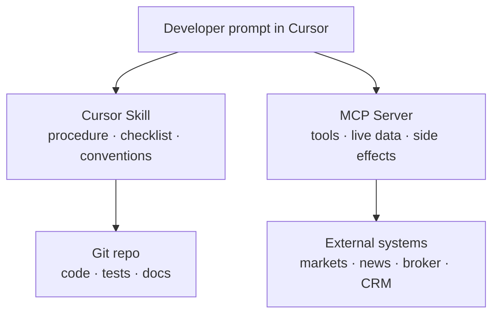

# Cursor Skills vs MCP: Procedure vs Capability

**Date:** June 14, 2026  
**Author:** Xing @ [XingAI](https://xingai.app)  
**Project:** XingAI Platform  
**Tags:** `cursor` `skills` `mcp` `agents` `ai-engineering` `tooling`  
**Also available:** [中文](2026-06-14-cursor-skills-vs-mcp-when-to-use-which.zh.md)

**Related reading:** [MCP Phased Rollout](2026-05-12-mcp-phased-rollout.md) (when to ship MCP servers) · [MCP Architecture Best Practices](2026-06-03-mcp-architecture-best-practices.md) (how to connect them safely) · [Prompt vs Context vs Harness Engineering](2026-05-20-prompt-context-harness-engineering.md) (where both fit in the stack)

---

We now maintain **10 Cursor Skills** in [`xingai-engineering-system`](https://github.com/xingaiapp/xingai-engineering-system) and plan **MCP servers** for Invest AI data and (eventually) broker access. New teammates ask the same question:

> “Should this be a Skill or an MCP?”

They solve different problems. Confusing them leads to either **markdown that cannot fetch prices** or **servers that encode team habits nobody can read in git**.

## The Short Version

| | **Cursor Skill** | **MCP (Model Context Protocol)** |
|---|------------------|----------------------------------|
| **What it is** | A versioned `SKILL.md` workflow the agent reads before acting | A runtime protocol: tools + resources the agent can call |
| **Core question** | *How should we build this the XingAI way?* | *What can the agent touch outside the repo?* |
| **Lives in** | Git (`cursor/skills/…`, copied to `~/.cursor/skills/`) | Running process (MCP server) + client config |
| **Changes when** | You edit markdown and merge a PR | You deploy/restart a server, rotate credentials |
| **Best for** | Repeatable engineering playbooks | Live APIs, databases, brokers, calendars |
| **Failure mode** | Stale instructions if nobody updates the skill | Wrong scope, leaked keys, production side effects |

**Skills teach procedure. MCP grants capability.**

## What a Cursor Skill Actually Is

A Skill is not a plugin binary. It is **structured instructions** the agent is told to read when a task matches.

Our [`project-init`](https://github.com/xingaiapp/xingai-engineering-system/tree/main/cursor/skills/project-init) skill, for example, does not run code. It tells the agent:

- Read `AGENTS.md` and existing rules first  
- Ship mobile chrome, i18n, legal pages, SEO baseline  
- Match conventions from other XingAI repos  

Other skills in the same repo cover **web design**, **worker/cache boundaries**, **API error shapes**, **CI setup**, **testing baselines**, **worktree safety**, **loading UX**, **multi-agent POCs**, and **bilingual system-design docs**.

Properties that make Skills work well:

1. **Git-reviewed** — diffs are readable; juniors learn the standard from the PR.  
2. **Stable** — no network port, no OAuth rotation, no uptime pager.  
3. **Composable** — `project-init` points to `xingai-web-design` instead of duplicating 200 lines.  
4. **Human-legible** — when the agent drifts, you fix prose, not reverse-engineer a binary.

Skills are closest to **Harness Engineering** in our [May 20 post](2026-05-20-prompt-context-harness-engineering.md): they shape *how* work runs repeatedly, not *what data* is true right now.

## What MCP Actually Is

MCP standardizes **tool discovery and invocation** for agents. An MCP server exposes named tools (`get_quote`, `list_holdings`, …). The client lists them, the model chooses, the server executes—with auth and audit at the boundary.

We wrote about MCP twice already:

- **Phased rollout** — Financial and News MCP first; Broker MCP last, with paper trading and human confirmation gates.  
- **Architecture** — Four connection patterns, scope filtering on `tools/list` *and* `tools/call`, no long-lived backend keys inside the agent prompt.

MCP answers **Context Engineering** questions: *What fresh facts can the model see?* *Through which credential?* *With what blast radius?*

A Skill cannot replace that. No amount of markdown fetches a live AAPL quote.

## Where People Mix Them Up

### Mistake 1: “We’ll document the API in a Skill instead of MCP”

Fine for **how to call** your internal REST API during development. Not fine as the **production integration layer**. The agent still needs a governed tool boundary, rate limits, and scoped credentials—MCP (or an equivalent tool gateway).

### Mistake 2: “We’ll put our coding standards in an MCP server”

You *could* expose `read_coding_standard` as a tool. You probably should not. Standards belong in **rules + skills** in git, reviewed like code. MCP adds latency, ops, and auth complexity where markdown suffices.

### Mistake 3: “Skills and MCP compete for the same slot”

They stack. A Skill should say *when* to invoke MCP, *which* server profile, and *what never to do* (e.g. “never call Broker MCP without user confirmation”). MCP should stay dumb about XingAI hero-section tokens.

## Decision Guide

Use a **Skill** when:

- The output is **code or docs in the repo**  
- The workflow repeats across products (`ci-cd-setup`, `testing-baseline`)  
- You want **bilingual doc structure**, mobile chrome, or ADR format enforced  
- Failure should **not** hit production APIs  

Use **MCP** when:

- The agent needs **fresh external state** (prices, filings, calendar, holdings)  
- Actions have **side effects** (orders, tickets, writes)  
- You must **scope credentials** per user, per agent, or per environment  
- You want **swap providers** without rewriting the agent (yfinance → Polygon behind the same tool name)  

Use **both** when:

- A product feature spans **implementation standards** and **live tools**  
  - Example: Invest AI dashboard — Skill defines disclaimer layers and worker boundary; MCP supplies market data.

## How We Apply This at XingAI

**Engineering system (Skills-heavy)**  
[`xingai-engineering-system`](https://github.com/xingaiapp/xingai-engineering-system) holds rules + skills. Product repos symlink or copy them. Founder AI’s Opportunity Radar did not invent a new init flow—it reused web-design and testing patterns from skills.

**Invest AI (MCP-heavy roadmap)**  
Live finance data and (later) execution belong in MCP servers with phased risk, as in [ADR-003](https://github.com/xingaiapp/xingai-invest-ai/blob/main/docs/adr/003-mcp-phased-rollout.md). The agent should not scrape broker HTML because a Skill forgot to mention rate limits.

**Founder AI / Opportunity Radar (mostly Skills today)**  
Signal collection uses ordinary HTTP fetchers in app code today—not MCP. That is intentional for V1: fewer moving parts. If we expose “scan big-tech feeds” as a **shared agent tool** across products, MCP becomes attractive; until then, Skills + typed collectors stay simpler.

## Practical Checklist Before You Build

**If you chose Skill, confirm:**

- [ ] Would a senior engineer follow the same steps without AI? (If yes, good Skill candidate.)  
- [ ] Is the content stable for weeks, not seconds?  
- [ ] Does it reference other skills instead of copying them?  
- [ ] Is it in `xingai-engineering-system/cursor/skills/` with a clear `description` frontmatter?

**If you chose MCP, confirm:**

- [ ] Is there a non-MCP fallback for dev/test?  
- [ ] Are tools filtered by scope on list **and** call?  
- [ ] Are secrets on the server, not in the Skill or system prompt?  
- [ ] Does rollout phase match risk (read-only before write, paper before live)?

## Closing Frame

Prompt engineering asks *how the model should talk*.  
Context engineering asks *what it should know*.  
Harness engineering asks *how we ship and replay safely*.

**Skills are harness artifacts in markdown.**  
**MCP is context + capability with a network boundary.**

Pick Skills for **team procedure in git**. Pick MCP for **the outside world with credentials**. When you need both—and most serious agent products do—let Skills point at MCP, not replace it.

---

**Author:** Xing @ XingAI  
**Published:** June 14, 2026  
**Tags:** cursor, skills, mcp, agents, ai-engineering, tooling
