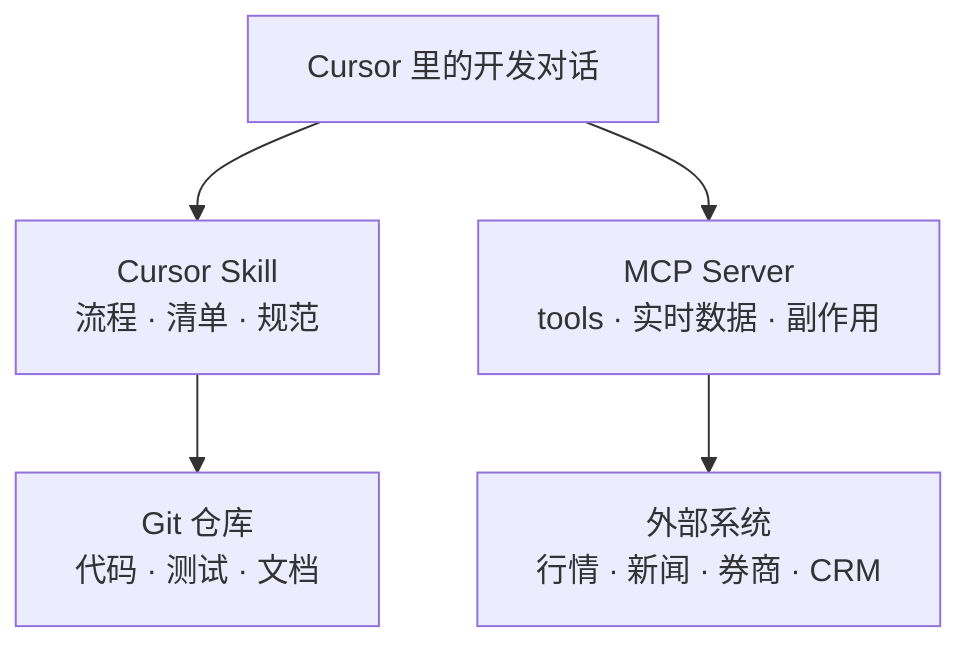

# 中文 · Cursor Skills 与 MCP：流程 vs 能力

**日期：** 2026-06-14  
**作者：** Xing @ [XingAI](https://xingai.app)  
**项目：** XingAI Platform  
**标签：** `cursor` `skills` `mcp` `agents` `ai-engineering` `tooling`  
**语言：** [English](2026-06-14-cursor-skills-vs-mcp-when-to-use-which.md) · 中文

**相关阅读：** [MCP 分阶段上线](2026-05-12-mcp-phased-rollout.zh.md) · [MCP 架构最佳实践](2026-06-03-mcp-architecture-best-practices.zh.md) · [Prompt / Context / Harness 工程](2026-05-20-prompt-context-harness-engineering.zh.md)

---

我们在 [`xingai-engineering-system`](https://github.com/xingaiapp/xingai-engineering-system) 里维护 **10 个 Cursor Skills**，Invest AI 则规划 **MCP Server** 接入行情、新闻和（远期）券商。新人常问：

> 「这应该做成 Skill 还是 MCP？」

两者解决的问题不同。混用会导致：**写一堆 markdown 却拉不到实时报价**，或者 **搭一个 Server 却把团队规范塞进去、git 里谁也看不懂**。

## 一句话对照

| | **Cursor Skill** | **MCP（Model Context Protocol）** |
|---|------------------|-----------------------------------|
| **是什么** | 代理执行前阅读的版本化 `SKILL.md` 工作流 | 运行时协议：可调用的 tools + resources |
| **核心问题** | *我们该怎么按 XingAI 方式做？* | *代理能碰仓库外的什么？* |
| **存放位置** | Git（`cursor/skills/…`，可同步到 `~/.cursor/skills/`） | 常驻进程（MCP Server）+ 客户端配置 |
| **变更方式** | 改 markdown、走 PR | 部署/重启服务、轮换凭证 |
| **适合** | 可重复的工程 playbook | 实时 API、数据库、券商、日历 |
| **典型失败** | Skill 过时没人更新 | 权限过大、密钥泄露、误触生产 |

**Skill 教流程。MCP 给能力。**

## Cursor Skill 到底是什么

Skill 不是二进制插件，而是 **结构化说明**：任务匹配时，代理应先读再动手。

例如 [`project-init`](https://github.com/xingaiapp/xingai-engineering-system/tree/main/cursor/skills/project-init) 并不执行代码，它要求代理：

- 先读 `AGENTS.md` 与现有 rules  
- 移动端壳、i18n、法律页、SEO 基线要齐  
-  conventions 对齐其他 XingAI 仓库  

同仓库里还有 **Web 设计**、**Worker/Cache 边界**、**API 错误格式**、**CI**、**测试基线**、**Worktree 安全合并**、**长任务 Loading UX**、**Multi-Agent POC**、**双语系统设计文档** 等 Skills。

Skill 适合的原因：

1. **可 Code Review** — diff 是人话，新人从 PR 学标准。  
2. **稳定** — 不占端口、不绑 OAuth、不触发 on-call。  
3. **可组合** — `project-init` 引用 `xingai-web-design`，避免复制 200 行。  
4. **可维护** — 代理跑偏时改 prose，不用反编译插件。

Skill 更接近我们 [5 月 20 日文章](2026-05-20-prompt-context-harness-engineering.zh.md) 里的 **Harness Engineering**：规定 *怎么反复做*，不保证 *此刻行情真假*。

## MCP 到底是什么

MCP 统一 Agent 的 **工具发现与调用**。Server 暴露 `get_quote`、`list_holdings` 等；客户端列出工具，模型选择，Server 执行——鉴权与审计在边界完成。

我们已有两篇 MCP 文章：

- **分阶段上线** — 先 Financial / News MCP；Broker MCP 最后，经 paper trading 与用户确认。  
- **架构** — 四种连接模式；`tools/list` 与 `tools/call` 双重 Scope；密钥不进 system prompt。

MCP 回答 **Context Engineering**：*模型能看到哪些新事实？* *用什么凭证？* *误操作半径多大？*

再长的 Skill 也拉不动实时 AAPL 报价。

## 常见混淆

### 误区 1：「用 Skill 写 API 文档，就不做 MCP 了」

开发阶段说明 **怎么调内部 REST** 可以。生产集成层仍需要工具网关：限流、Scope、凭证轮换——MCP 或等价物。

### 误区 2：「把编码规范做成 MCP Server」

技术上可以暴露 `read_coding_standard`。通常不该。**规范放 rules + skills + git**。为 markdown 多一层 Server，只会增加延迟和运维。

### 误区 3：「Skill 和 MCP 二选一」

应该叠加。Skill 写清：**何时**调 MCP、**哪个** Profile、**禁止**什么（例如未确认不得调 Broker MCP）。MCP 不必知道 XingAI Hero 的 design token。

## 怎么选

**用 Skill，当：**

- 产出是 **仓库里的代码或文档**  
- 流程跨产品重复（`ci-cd-setup`、`testing-baseline`）  
- 要固定 **双语文档结构**、移动壳、ADR 格式  
- 失败 **不应** 打到生产 API  

**用 MCP，当：**

- Agent 需要 **外部最新状态**（价、公告、日历、持仓）  
- 操作有 **副作用**（下单、工单、写入）  
- 必须按用户/Agent/环境 **隔离凭证**  
- 希望 **换数据源** 不改 Agent（yfinance 换 Polygon，工具名不变）  

**两者一起，当：**

- 功能同时涉及 **实现规范** 与 **实时工具**  
  - 例：Invest AI — Skill 管免责声明与 Worker 边界；MCP 供行情。

## XingAI 怎么用

**工程系统（偏 Skill）**  
[`xingai-engineering-system`](https://github.com/xingaiapp/xingai-engineering-system) 集中 rules + skills。产品仓引用或拷贝。Founder AI 的 Opportunity Radar 没有另起炉灶 init 流程，而是复用 web-design、测试等 Skill。

**Invest AI（偏 MCP 路线图）**  
实时金融数据与（后续）执行走 MCP，分阶段控风险，见 [ADR-003](https://github.com/xingaiapp/xingai-invest-ai/blob/main/docs/adr/003-mcp-phased-rollout.md)。不应靠 Skill 里「记得限流」去 scrape 券商页面。

**Founder AI / Radar（当前偏 Skill + 普通 HTTP）**  
V1 信号采集是应用内 fetcher，不是 MCP——有意减少组件。若未来「扫大厂 RSS」成为跨产品共享 Agent 工具，再考虑 MCP；在此之前 Skills + 类型化 collector 更简单。

## 开工前清单

**选 Skill 时：**

- [ ] 资深工程师不用 AI 也会按同样步骤做吗？  
- [ ] 内容稳定周期是「周」而不是「秒」？  
- [ ] 是否引用其他 Skill，而不是复制粘贴？  
- [ ] 是否放在 `xingai-engineering-system/cursor/skills/` 且 frontmatter 描述清晰？

**选 MCP 时：**

- [ ] 开发/测试是否有非 MCP 降级路径？  
- [ ] list 与 call 是否都做 Scope 过滤？  
- [ ] 密钥是否在 Server 侧，而非 Skill 或 system prompt？  
- [ ] 上线阶段是否匹配风险（先只读、再 paper、再 live）？

## 收束

Prompt 工程管 *怎么说*。  
Context 工程管 *知道什么*。  
Harness 工程管 *如何稳定交付与回放*。

**Skill 是 markdown 形式的 Harness。**  
**MCP 是带网络边界的能力与上下文。**

团队流程放 **Skill + git**；外部世界与凭证放 **MCP**。 serious Agent 产品往往两者都要——让 Skill **指向** MCP，而不是 **替代** MCP。

---

**作者：** Xing @ XingAI  
**发布：** 2026-06-14  
**标签：** cursor, skills, mcp, agents, ai-engineering, tooling
