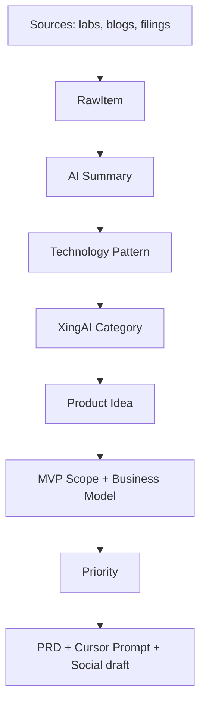

# XingAI Opportunity Radar — June 24, 2026: The Agent Stack Converges

**Date:** June 24, 2026  
**Author:** Xing @ [XingAI](https://xingai.app)  
**Project:** XingAI Platform / [XingAI Founder](https://github.com/xingaiapp/xingai-founder)  
**Tags:** `opportunity-radar` `agents` `governance` `memory` `rag` `invest-ai` `product-strategy`  
**Also available:** [中文](2026-06-24-xingai-opportunity-radar-agent-stack.zh.md)

**Related reading:** [Cursor Skills vs MCP](2026-06-14-cursor-skills-vs-mcp-when-to-use-which.md) · [MCP Architecture Best Practices](2026-06-03-mcp-architecture-best-practices.md) · [Prompt vs Context vs Harness Engineering](2026-05-20-prompt-context-harness-engineering.md)

---

## Bottom line

Big Tech’s June releases are not random feature drops. They line up on one stack:

```text
Agent Toolkit / Runtime
+ Agentic RAG
+ Memory System
+ Multimodal Agent
+ Agent Governance
+ Research-to-Product
```

**What XingAI should ship next:**

1. **XingAI Opportunity Radar** — product discovery engine for the whole portfolio  
2. **Research-to-Startup Agent** — paper/blog → idea → PRD → Cursor prompt  
3. **Agent Governance Dashboard** — audit, permissions, human approval (before any broker MCP writes)

---

## What changed this week

| Source | Signal (June 2026) | XingAI read |
|--------|-------------------|-------------|
| [OpenAI](https://openai.com/news/) | GPT-5 cited for a 3-year immunology problem (Jun 23); stronger ChatGPT memory (Jun 4) | Research AI + **Memory OS** |
| [Google Research](https://research.google/blog/) | Earth AI, skin-condition models, **Gemini Enterprise Agentic RAG** (Jun 5) | Agentic search + health/decision surfaces |
| [Anthropic](https://www.anthropic.com/news/) | Claude Code in cyber-attack reporting (Jun 3); Project Glasswing ~150 orgs (Jun 2) | **Agent security / governance** is no longer optional |
| [Microsoft Research](https://www.microsoft.com/en-us/research/blog/category/research-blog/) | Data Formulator 0.7 — enterprise data → AI-ready workspace | Data decision agents |
| [NVIDIA Blog](https://blogs.nvidia.com/blog/nvidia-agent-toolkit-open-models-tools-skills-secure-runtime-ai-agents/) | **Agent Toolkit**: Nemotron + NemoClaw + OpenShell for trusted specialized agents | Agent runtime — maps directly to Invest AI + Founder |
| [NVIDIA Blog](https://blogs.nvidia.com/blog/telecom-ai-agents-dtw-ignite-2026/) | 24/7 telecom agents, long-running orchestration | **Long-running agent harness** |
| [IBM Research](https://research.ibm.com/blog/ai-agent-reliability-beeai) | BeeAI reliability, Granite enterprise agent stack | Enterprise control plane |
| [Meta AI](https://ai.meta.com/blog/future-of-ai-built-with-llama/) | Llama, open multimodal, personal assistant | Consumer multimodal agents |

The pattern: everyone is shipping **runtime + memory + retrieval + audit**, not just bigger models.

---

## Why Opportunity Radar is the meta-product

Most XingAI apps (Invest AI, SAT, Meal, Travel) need the same upstream loop:

```text
Sources → RawItem → AI Summary → Technology Pattern
       → XingAI Category → Product Idea → MVP Scope
       → Business Model → Priority → PRD + Cursor Prompt
```

Without a shared radar, each product team re-reads the same OpenAI blog post and builds a slightly different pipeline. **Opportunity Radar V1** is the harness that feeds every other app.

We already have pieces in [xingai-founder](https://github.com/xingaiapp/xingai-founder): source registry, collectors, radar scan, trilingual opportunity cache. The June 24 brief says: **don’t stop — finish Radar V1 as the default daily workflow.**

---

## Product opportunity map (condensed)

| Category | Opportunity | Potential | MVP | Effort | Priority |
|----------|-------------|----------:|-----|--------|----------|
| Platform | **XingAI Opportunity Radar** | Very high | Ingest → classify → idea → PRD/prompt | M, 2–3 wk | **Build Now** |
| Research AI | **Research-to-Startup Agent** | Very high | URL → summary → startup idea → PRD | M, 2–3 wk | **Build Now** |
| Invest AI | **AI Agent Economy Tracker** | High | Big Tech agent news → themes → tickers/ETFs | S, 1–2 wk | **Build Now** |
| Platform | **Agent Governance Dashboard** | Very high | Tool calls, audit, risk score, human approval | M, 1 mo | **Build Now** |
| SAT AI | **SAT Memory Coach** | Very high | Wrong answers → memory → personalized drill | S, 1–2 wk | **Build Now** |
| Meal AI | **Meal Memory Coach** | High | Diet/vitals/sleep → daily advice | S, 1–2 wk | **Build Now** |
| Travel AI | **Business Traveler Agent** | High | Timezone/budget → route/meals/work blocks | S, 1–2 wk | **Build Now** |
| Platform | **Personal AI Memory OS** | Very high | SQLite + vectors + goals (shared across apps) | M, 1 mo | **Build Now** |
| Research AI | Agentic RAG Builder | High | Multi-agent retrieval + “enough context?” gate | M, 3–4 wk | Watch |
| Invest AI | AI Infra Supply Chain Monitor | High | GPU/DC/agent runtime/HBM chain | M, 1 mo | Watch |
| Platform | Long-running Agent Harness | High | pause/resume/audit/sandbox | L, 2–3 mo | Watch |

Full table lives in the daily radar doc; this post focuses on **what to build and why today**.

---

## Top 5 Build Now (ranked)

| Rank | Project | Why now |
|-----:|---------|---------|
| 1 | **XingAI Opportunity Radar** | Feeds Research, Invest, SAT, Meal, Travel — one discovery engine |
| 2 | **Research-to-Startup Agent** | OpenAI + Google both productizing research workflows |
| 3 | **Agent Governance Dashboard** | Anthropic attack case + NVIDIA OpenShell = audit is table stakes ([Invest AI ADR-028](https://github.com/xingaiapp/xingai-invest-ai/blob/main/docs/adr/028-robinhood-mcp-execution-gates.md)) |
| 4 | **SAT Memory Coach** | Fastest path to ship memory on [sat.xingai.app](https://sat.xingai.app); value is obvious |
| 5 | **AI Agent Economy Tracker** | Direct tie to invest thesis: NVDA, MSFT, GOOG, META, IBM, AVGO, MU |

---

## Engineering takeaways

### 1. Governance before broker MCP

Robinhood’s [Agentic Trading MCP](https://robinhood.com/us/en/support/articles/agentic-trading-overview/) lets agents place orders in an Agentic account — including **without per-trade confirmation** if the user configures it that way. XingAI’s position: **read-first MCP, write only after human approval.** That’s not paranoia; it matches our decision-system brand and ADR-028 gates (G1–G7).

Skills teach procedure; MCP grants capability. See [Skills vs MCP](2026-06-14-cursor-skills-vs-mcp-when-to-use-which.md).

### 2. Memory is a platform, not a feature flag

OpenAI’s memory upgrade and our own SAT/Meal/Travel roadmap point to **Personal AI Memory OS** as shared infra: SQLite + embeddings + user goals + feedback loop. Ship it once; don’t rebuild memory per app.

### 3. Invest AI = agent economy + decision engine

NVIDIA’s agent toolkit news is a **theme**, not a single ticker. **AI Agent Economy Tracker** complements [Decision Engine](https://github.com/xingaiapp/xingai-invest-decision-engine) technical scores with “who is shipping agent runtime this week?” — macro narrative + micro scores.

### 4. Radar output must be actionable

Every radar run should end with:

- Priority (`Build Now` / `Watch` / `Long-Term`)  
- MVP scope (S/M/L)  
- **Cursor prompt or skill hook ID** — not just a LinkedIn draft  

Otherwise it’s news clipping, not engineering.

---

## Recommended V1 pipeline (ship this)



**Today’s call:** keep building **Opportunity Radar V1** in Founder until this pipeline is one button.

---

## What we are not doing this week

- Long-running telecom-style 24/7 agents in production (Watch — need harness first)  
- Physical/multimodal consumer agent (Long-Term)  
- Auto-trading via MCP (blocked by ADR-028 until governance UI exists)

---

## Sources

- [OpenAI News](https://openai.com/news/)
- [Google Research Blog](https://research.google/blog/)
- [Anthropic — AI-enabled cyber threats](https://www.anthropic.com/news/AI-enabled-cyber-threats-mitre-attack)
- [Microsoft Research Blog](https://www.microsoft.com/en-us/research/blog/category/research-blog/)
- [NVIDIA — Agent Toolkit](https://blogs.nvidia.com/blog/nvidia-agent-toolkit-open-models-tools-skills-secure-runtime-ai-agents/)
- [NVIDIA — Telecom AI agents](https://blogs.nvidia.com/blog/telecom-ai-agents-dtw-ignite-2026/)
- [IBM — BeeAI reliability](https://research.ibm.com/blog/ai-agent-reliability-beeai)
- [Meta — Future of AI with Llama](https://ai.meta.com/blog/future-of-ai-built-with-llama/)
- [Robinhood — Agentic Trading overview](https://robinhood.com/us/en/support/articles/agentic-trading-overview/)
