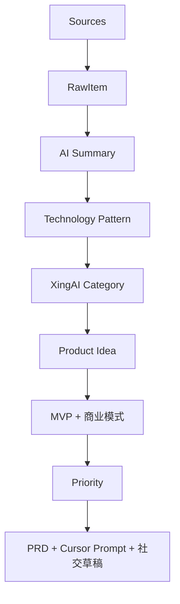

# 中文 · XingAI Opportunity Radar｜2026-06-24：Agent 技术栈收敛

**日期：** 2026-06-24  
**作者：** Xing @ [XingAI](https://xingai.app)  
**项目：** XingAI Platform / [XingAI Founder](https://github.com/xingaiapp/xingai-founder)  
**标签：** `opportunity-radar` `agents` `governance` `memory` `rag` `invest-ai` `product-strategy`  
**语言：** [English](2026-06-24-xingai-opportunity-radar-agent-stack.md) · 中文

**相关阅读：** [Cursor Skills vs MCP](2026-06-14-cursor-skills-vs-mcp-when-to-use-which.zh.md) · [MCP 架构最佳实践](2026-06-03-mcp-architecture-best-practices.zh.md) · [Prompt / Context / Harness 工程](2026-05-20-prompt-context-harness-engineering.zh.md)

---

## 结论

六月大厂发布不是散点功能，而是同一条技术栈在收敛：

```text
Agent Toolkit / Runtime
+ Agentic RAG
+ Memory System
+ Multimodal Agent
+ Agent Governance
+ Research-to-Product
```

**XingAI 接下来最该做的三件事：**

1. **XingAI Opportunity Radar** — 全产品线的发现引擎  
2. **Research-to-Startup Agent** — 研究/博客 → 创业想法 → PRD → Cursor Prompt  
3. **Agent Governance Dashboard** — 审计、权限、人工确认（先于任何券商 MCP 写操作）

---

## 本周信号

| 来源 | 信号（2026 年 6 月） | XingAI 启发 |
|------|---------------------|-------------|
| [OpenAI](https://openai.com/news/) | GPT-5 帮助免疫学 3 年难题（6/23）；ChatGPT 记忆增强（6/4） | Research AI + **Memory OS** |
| [Google Research](https://research.google/blog/) | Earth AI、皮肤 AI、**Gemini Enterprise Agentic RAG**（6/5） | Agentic 搜索 + 健康/决策 |
| [Anthropic](https://www.anthropic.com/news/) | Claude Code 与网络攻击案例（6/3）；Glasswing ~150 组织（6/2） | **Agent 安全 / 治理** 成刚需 |
| [Microsoft Research](https://www.microsoft.com/en-us/research/blog/category/research-blog/) | Data Formulator 0.7：企业数据 → AI workspace | 数据决策 Agent |
| [NVIDIA Blog](https://blogs.nvidia.com/blog/nvidia-agent-toolkit-open-models-tools-skills-secure-runtime-ai-agents/) | **Agent Toolkit**：Nemotron + NemoClaw + OpenShell | Agent Runtime → Invest AI + Founder |
| [NVIDIA Blog](https://blogs.nvidia.com/blog/telecom-ai-agents-dtw-ignite-2026/) | 电信 24/7 Agent、长时编排 | **Long-running Harness** |
| [IBM Research](https://research.ibm.com/blog/ai-agent-reliability-beeai) | BeeAI 可靠性、Granite 企业 Agent 栈 | 企业控制面 |
| [Meta AI](https://ai.meta.com/blog/future-of-ai-built-with-llama/) | Llama、开放多模态、个人助手 | 消费级多模态 Agent |

共性：**Runtime + 记忆 + 检索 + 审计**，而不只是更大模型。

---

## 为什么 Opportunity Radar 是「元产品」

Invest AI、SAT、Meal、Travel 都需要同一套上游流程：

```text
Sources → RawItem → AI Summary → Technology Pattern
       → XingAI Category → Product Idea → MVP Scope
       → Business Model → Priority → PRD + Cursor Prompt
```

没有统一 Radar，每个产品都会重复读同一篇 OpenAI 博客，各建半套流水线。[xingai-founder](https://github.com/xingaiapp/xingai-founder) 里已有 source registry、collectors、radar scan、三语 opportunity 缓存。**6 月 24 日的判断：继续 Build Now，把 Radar V1 做成默认日课。**

---

## 产品机会（精简）

| 分类 | 机会 | 潜力 | MVP | 工作量 | 优先级 |
|------|------|-----:|-----|--------|--------|
| Platform | **XingAI Opportunity Radar** | 极高 | 抓取 → 分类 → 想法 → PRD | M，2–3 周 | **Build Now** |
| Research AI | **Research-to-Startup Agent** | 极高 | URL → 总结 → 创业想法 → PRD | M，2–3 周 | **Build Now** |
| Invest AI | **AI Agent Economy Tracker** | 高 | 大厂 Agent 新闻 → 主题 → 标的 | S，1–2 周 | **Build Now** |
| Platform | **Agent Governance Dashboard** | 极高 | 工具调用、审计、风险分、人工批 | M，1 月 | **Build Now** |
| SAT AI | **SAT Memory Coach** | 极高 | 错题 → 记忆 → 个性化练习 | S，1–2 周 | **Build Now** |
| Meal AI | **Meal Memory Coach** | 高 | 饮食/体征/睡眠 → 建议 | S，1–2 周 | **Build Now** |
| Travel AI | **Business Traveler Agent** | 高 | 时区/预算 → 路线/餐饮/办公 | S，1–2 周 | **Build Now** |
| Platform | **Personal AI Memory OS** | 极高 | SQLite + 向量 + 目标（跨 App） | M，1 月 | **Build Now** |
| Research AI | Agentic RAG Builder | 高 | 多 Agent 检索 + 上下文够吗 | M，3–4 周 | Watch |
| Invest AI | AI Infra 供应链 Monitor | 高 | GPU/数据中心/HBM 链 | M，1 月 | Watch |
| Platform | Long-running Agent Harness | 高 | 暂停/恢复/审计/沙盒 | L，2–3 月 | Watch |

---

## 今日 Top 5 Build Now

| 排名 | 项目 | 为什么现在 |
|-----:|------|-----------|
| 1 | **XingAI Opportunity Radar** | 同时喂 Research、Invest、SAT、Meal、Travel |
| 2 | **Research-to-Startup Agent** | OpenAI + Google 都在把 research workflow 产品化 |
| 3 | **Agent Governance Dashboard** | Anthropic 安全案例 + NVIDIA OpenShell → 审计是标配（[Invest AI ADR-028](https://github.com/xingaiapp/xingai-invest-ai/blob/main/docs/adr/028-robinhood-mcp-execution-gates.zh.md)） |
| 4 | **SAT Memory Coach** | 最快在 sat.xingai.app 验证 memory 价值 |
| 5 | **AI Agent Economy Tracker** | 对接投资主线：NVDA、MSFT、GOOG、META、IBM、AVGO、MU |

---

## 工程判断

### 1. 治理先于券商 MCP

Robinhood [Agentic Trading 概述](https://robinhood.com/us/en/support/articles/agentic-trading-overview/) 允许 Agent 在 Agentic 账户下单；用户也可配置为**无需逐笔确认**。XingAI 立场：**MCP 默认只读，写操作必须人工批准** — 与决策系统品牌一致，也符合 ADR-028 的 G1–G7 门控。

Skills 教流程；MCP 给能力。见 [Skills vs MCP](2026-06-14-cursor-skills-vs-mcp-when-to-use-which.zh.md)。

### 2. Memory 是平台层，不是每个 App 各做一套

OpenAI 记忆升级 + SAT/Meal/Travel 路线图 → **Personal AI Memory OS** 应共享：SQLite + 向量 + 用户目标 + 反馈闭环。

### 3. Invest AI = Agent 经济叙事 + 决策引擎

NVIDIA Agent Toolkit 是**主题**，不是单票。**AI Agent Economy Tracker** 与 [Decision Engine](https://github.com/xingaiapp/xingai-invest-decision-engine) 技术分互补：本周谁在 ship agent runtime？

### 4. Radar 输出必须能开工

每次扫描应产出：优先级、MVP 规模、**Cursor Prompt 或 Skill ID** — 不只是 LinkedIn 草稿。

---

## 建议 V1 流水线



**今日建议：继续在 Founder 里 Build Now — Opportunity Radar V1，直到上述流程一键跑通。**

---

## 本周不做

- 生产环境 24/7 长跑 Agent（先 Watch，要有 Harness）  
- 物理/多模态消费 Agent（Long-Term）  
- MCP 自动下单（ADR-028 门控 + 治理 UI 未就绪前禁止）

---

## 来源

- [OpenAI News](https://openai.com/news/)
- [Google Research Blog](https://research.google/blog/)
- [Anthropic — AI-enabled cyber threats](https://www.anthropic.com/news/AI-enabled-cyber-threats-mitre-attack)
- [Microsoft Research Blog](https://www.microsoft.com/en-us/research/blog/category/research-blog/)
- [NVIDIA — Agent Toolkit](https://blogs.nvidia.com/blog/nvidia-agent-toolkit-open-models-tools-skills-secure-runtime-ai-agents/)
- [NVIDIA — Telecom AI agents](https://blogs.nvidia.com/blog/telecom-ai-agents-dtw-ignite-2026/)
- [IBM — BeeAI reliability](https://research.ibm.com/blog/ai-agent-reliability-beeai)
- [Meta — Future of AI with Llama](https://ai.meta.com/blog/future-of-ai-built-with-llama/)
- [Robinhood — Agentic Trading overview](https://robinhood.com/us/en/support/articles/agentic-trading-overview/)
